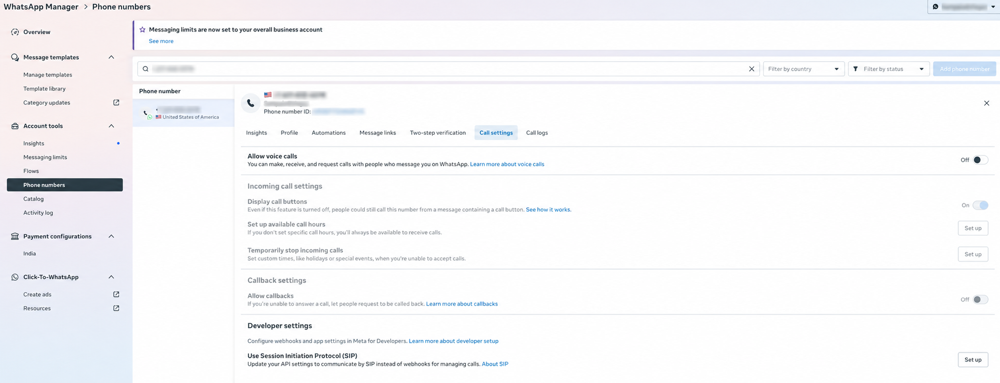
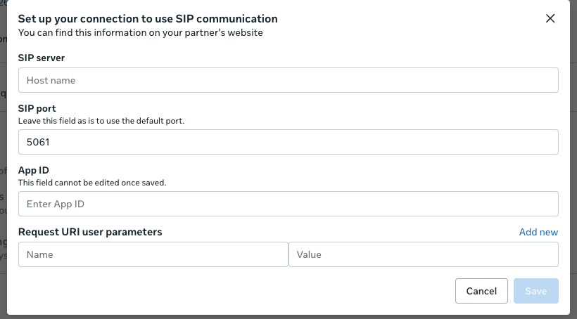
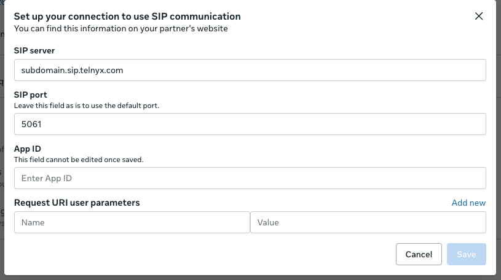

# Manually configure WhatsApp Calling with Telnyx

This guide walks you through manually configuring the SIP connection for WhatsApp Calling in WhatsApp Manager. You will open your business phone number’s call settings and set its SIP server to the hostname associated with your Telnyx SIP or Programmable Voice application.

The setup uses the format `<subdomain>.sip.telnyx.com`, where `<subdomain>` matches the subdomain already configured for your Telnyx application. Have that subdomain ready before following the steps below.

## Before you begin

Have access to your phone number in WhatsApp Manager, the subdomain configured for your Telnyx SIP or Programmable Voice application, and the Meta App ID for your WhatsApp integration. You will use that subdomain in the SIP server address.

## 1. Open WhatsApp Manager

Go to [WhatsApp Manager](https://business.facebook.com/latest/whatsapp_manager/phone_numbers/) and select the business account that contains your phone number.

## 2. Open the phone number call settings

Select the phone number you want to edit, then click **Call settings**.



## 3. Edit the SIP connection

Under **Developer settings**, find **Use Session Initiation Protocol (SIP)** and click the pencil icon to edit the connection. If the section shows **Set up** instead, click **Set up**.

The **Set up your connection to use SIP communication** dialog opens.



## 4. Enter your Telnyx SIP server

In **SIP server**, enter:

```text
<subdomain>.sip.telnyx.com
```

Replace `<subdomain>` with the subdomain configured for your Telnyx SIP or Programmable Voice application. For example, if your configured subdomain is `support`, enter `support.sip.telnyx.com`.

Enter only the hostname, without `https://` or the angle brackets. The value `subdomain.sip.telnyx.com` in the screenshot is an example; replace it with your own hostname.



## 5. Enter the Meta App ID and save

In **App ID**, enter the **Meta App ID** for the app used by your WhatsApp integration. You can find it in your app dashboard in [Meta for Developers](https://developers.facebook.com/apps/). This is separate from your Telnyx application ID, WhatsApp Business Account ID, and phone number ID.

Check the App ID carefully before saving. As indicated in the dialog, **this field cannot be edited once saved**.

Click **Save** to apply the change. Reopen the SIP connection settings and confirm that **SIP server** shows your intended hostname.
