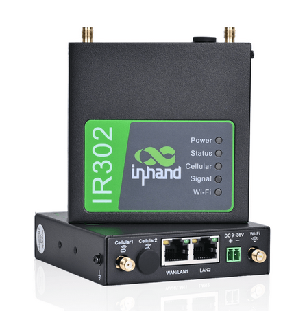

# Using Telnyx SIM with InRouter300 Series Cellular Routers

Step-by-step guide to configuring InRouter300 Series routers with a Telnyx SIM for reliable IoT and industrial… See Telnyx guidance and requirements.

The **InRouter300 Series (IR300)** from InHand Networks is a reliable and robust industrial 4G LTE router designed for IoT, industrial automation, and remote networking applications. This guide provides step-by-step instructions to configure the **IR300 Series Cellular Router** with a **Telnyx SIM card**, ensuring seamless connectivity.

---

## **1. Prerequisites**

Before starting the configuration, ensure you have the following:

* **InRouter300 Series Router (e.g., IR302)**
* **Active Telnyx SIM Card** with a valid data plan
* **Computer or Laptop** with an Ethernet port
* **Ethernet Cable** to connect the router
* **Power Adapter** for the router
* **Default Router Credentials**:

  + **IP Address:** `http://192.168.2.1`
  + **Username:** `adm`
  + **Password:** `123456` (default, unless changed)

---

## **2. Physical Setup**

1. **Insert the Telnyx SIM card** into the **SIM slot** of the IR300 router.
2. Connect your computer to the **LAN port** of the router using an Ethernet cable.
3. Power on the router and wait for it to boot up completely.
4. Open a web browser and enter `http://192.168.2.1` in the address bar.
5. Log in using the default credentials (`adm` / `123456`).

---

## **3. Configuring the Cellular Network with Telnyx APN**

## **3.1 Navigate to Cellular Settings**

1. After logging in, go to **Network > Cellular**.
2. Locate the **SIM Profiles** section.

## **3.2 Configure APN Settings for Telnyx**

1. Select **SIM Slot 1** (or SIM Slot 2 if using a secondary SIM).
2. Enter the following APN settings:

   * **APN:** `data00.telnyx`
   * **Username:** *(Leave blank)*
   * **Password:** *(Leave blank)*
3. Click **Apply** to save the changes.

## **3.3 Enable Dual SIM Setup (Optional)**

If using a dual SIM setup for redundancy:

1. Enable **Dual SIM Mode**.
2. Configure the second SIM card with the appropriate APN settings for its carrier.
3. Set **Failover Mode** to ensure automatic switching in case of connection failure.

---

## **4. Verifying Connectivity**

1. Navigate to **Status > Network Connection**.
2. Check if the router has obtained an **IP address** from the Telnyx network.
3. Ensure the **Signal Strength** and **Network Registration** status indicate a successful connection.
4. Test connectivity by opening a website or pinging an external server.

---

## **5. Additional Configuration (Optional)**

## **5.1 Setting Up Static IP Address**

If Telnyx provides a static IP, configure it under **Network > WAN Settings**:

1. Change the **Connection Type** to `Static IP`.
2. Enter the provided **IP Address, Subnet Mask, and Gateway**.
3. Click **Apply** and restart the router.

## **5.2 Enabling VPN for Secure Communication**

For enhanced security, configure **VPN settings** under **VPN > Settings**:

1. Select a VPN protocol (**IPSec, OpenVPN, or PPTP**).
2. Enter authentication details from your VPN provider.
3. Save the settings and establish the VPN connection.

## **5.3 Configuring Firewall Rules**

To enhance security:

1. Navigate to **Security > Firewall**.
2. Enable firewall protection and configure custom rules to allow/block specific traffic.
3. Save and apply changes.

---

## **6. Backing Up Configuration for Future Use**

Once the router is fully configured, it is recommended to create a backup:

1. Navigate to **System > Config Management**.
2. Click **Backup** to generate a `.dat` configuration file.
3. Save the file for future use or deployment on additional routers.

To restore settings on another router:

1. Go to **System > Config Management**.
2. Click **Browse**, select the `.dat` file.
3. Click **Import** and restart the router.

---

## **7. Troubleshooting Common Issues**

### **7.1 No Internet Connectivity**

* Ensure the **Telnyx SIM card** is active and has a valid data plan.
* Double-check the **APN settings** (`data00.telnyx` with no username/password).
* Restart the router and check **Status > Network Connection**.
* Try inserting the SIM into another device to verify its functionality.

### **7.2 Poor Signal Strength**

* Reposition the router to an area with better reception.
* Attach an external **4G LTE antenna** if available.

### **7.3 Configuration Not Saving**

* Ensure changes are **Applied** and **Saved** before rebooting the router.
* Try resetting the router to factory settings and reconfigure from scratch.

---

##

By following this guide, you can successfully configure your **InRouter300 Series Cellular Router** with a **Telnyx SIM card** for reliable and secure internet connectivity. The setup ensures optimal performance, redundancy, and security for industrial and IoT applications.

​

**Happy Networking!** 🚀

---

Related Articles

[How to set up a Telnyx SIM Card](https://support.telnyx.com/en/articles/3269600-how-to-set-up-a-telnyx-sim-card)[Adding the Telnyx SIM APN to your device](https://support.telnyx.com/en/articles/3269973-adding-the-telnyx-sim-apn-to-your-device)[SIM Connectivity Logs](https://support.telnyx.com/en/articles/5666594-sim-connectivity-logs)[Using Telnyx SIM with Ubiquiti UniFi LTE Pro](https://support.telnyx.com/en/articles/10164784-using-telnyx-sim-with-ubiquiti-unifi-lte-pro)[Using Telnyx SIM with Teltonika 4G/LTE Routers](https://support.telnyx.com/en/articles/10511646-using-telnyx-sim-with-teltonika-4g-lte-routers)

Did this answer your question?

😞😐😃
