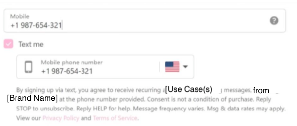

# 10DLC Opt in Form

If you are utilizing a digital form for your 10dlc opt in then it should look similar to this, See Telnyx guidance and requirements.

If you are utilizing a digital form for your 10dlc opt in then it should look similar to this, although there are infinite ways to do it:

​
1) Notice it has all the required disclaimers:

*By providing your phone number, you agree to receive SMS [Use Case(s)] from [Brand Name]. Message frequency may vary. Standard Message and Data Rates may apply. Reply STOP to opt out. Reply HELP for help. We will not share mobile information with third parties for promotional or marketing purposes.*

2) Sms consent checkbox is specific, explicit, and optional:
It is not buried in terms and conditions or combined with other consents like "I agree to the terms and conditions" and it is not a mandatory field.

3) The subscriber knows what to expect.

4) It is not in the image but the sms opt in check box should be unchecked by default.

5) If it is a Political or Charity Use Case and Donations will be solicited, then add "Donations may be solicited" to the opt in disclaimers.

6) If it is a Marketing Use Case, then add something like "You are opting into marketing texts" to the opt in disclaimers.

If you have a non digital opt in then please look at this for guidance:

<https://support.telnyx.com/en/articles/10562019-guide-to-10dlc-message-flow-field>

---

Related Articles

[How to create a 10DLC campaign](https://support.telnyx.com/en/articles/6339152-how-to-create-a-10dlc-campaign)[10DLC Campaign Compliance Requirements](https://support.telnyx.com/en/articles/9940291-10dlc-campaign-compliance-requirements)[Guide to 10DLC Message Flow Field](https://support.telnyx.com/en/articles/10562019-guide-to-10dlc-message-flow-field)[10DLC Error (806)](https://support.telnyx.com/en/articles/10744086-10dlc-error-806)[10DLC for Chiropractors](https://support.telnyx.com/en/articles/11421359-10dlc-for-chiropractors)

Did this answer your question?

😞😐😃
