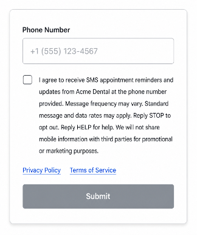

# 10DLC Opt in Form

If you are using a digital web form for your 10DLC opt-in, it must meet specific compliance requirements to ensure subscribers give clear, explicit consent to receive SMS messages from your brand. This article covers what your form must include and provides an example of a compliant design.

## Required Elements

Your opt-in form must include all of the following:

## 1. Phone Number Field

- May be mandatory or optional — if mandatory, the SMS consent checkbox must be optional so that submitting the form does not force SMS opt-in

- Clearly labeled as a phone number input

## 2. SMS-Specific Consent Checkbox

- Must be unchecked by default

- Must be separate from any "I agree to Terms and Conditions" consent — it cannot be combined with other agreements

- Must be specific and explicit — the label must state what the subscriber is agreeing to (not just "Text me" or "Contact me")

- Must not be buried inside Terms and Conditions or a privacy policy

- Must be an optional field — the subscriber must be able to submit the form without checking the SMS consent box

## 3. Full Disclaimer Text

The following disclosures must appear with the checkbox:

*By providing your phone number, you agree to receive SMS [use case(s)] from [Brand Name]. Message frequency may vary. Standard Message and Data Rates may apply. Reply STOP to opt out. Reply HELP for help. We will not share mobile information with third parties for promotional or marketing purposes.*

Each required element:

- Brand name — the subscriber must know who is texting them

- Use case(s) — what type of messages they will receive (e.g., "appointment reminders," "order updates," "promotional offers")

- Message frequency — "Message frequency may vary"

- Cost disclosure — "Standard Message and Data Rates may apply"

- Opt-out — "Reply STOP to opt out"

- Help — "Reply HELP for help"

- No third-party sharing — "We will not share mobile information with third parties for promotional or marketing purposes"

## 4. Links to Privacy Policy and Terms of Service

- A link to a compliant Privacy Policy and Terms of Service must be accessible from the form — either displayed directly on the form or via hyperlinks within the disclaimer text

- Links must be functional and lead to actual policy pages (not placeholders)

## 5. Submit Button

- Form must have a clear submit/action button

- The form must be fully functional upon submission — meaning it actually processes the opt-in and records consent

## Example Compliant Form

Below is an example of a properly configured opt-in form. Note:

- The checkbox is unchecked by default

- The consent text is specific — it names the brand and the type of messages

- All required disclaimers are present

- Privacy Policy and Terms of Service links are included

## Use Case-Specific Additions

Depending on your campaign use case, additional disclaimer language is required:

## Marketing Use Cases

Add explicit marketing consent language to the disclaimer, such as:

*You are opting into marketing texts from [Brand Name].*

For marketing campaigns, the consent checkbox label should make clear that promotional content is included.

## Political or Charity Use Cases

If donations will be solicited, add:

*Donations may be solicited.*

## Common Mistakes to Avoid

| **Mistake** | **Why It's Non-Compliant** |
| --- | --- |
| Checkbox checked by default | Consent must be affirmative — the user must actively check the box |
| Consent combined with T&C agreement | SMS consent must be standalone, not bundled with terms acceptance |
| "Text me" or vague checkbox label | Does not tell the subscriber what they are agreeing to — must specify message type and brand |
| Missing required disclaimers | All CTIA-mandated disclosures must be present (frequency, cost, STOP/HELP, no sharing) |
| No Privacy Policy or ToS link | A link to a compliant Privacy Policy and Terms of Service must be accessible from the form |
| SMS checkbox is mandatory | The subscriber must be able to submit the form without being forced into SMS opt-in |
| Form behind a login wall | The opt-in form must be at a publicly accessible URL — not gated behind authentication |
| Form is not functional | The form must actually process submissions and record consent upon submission |

## Form Placement and Accessibility

- The opt-in form must be at a publicly accessible URL (not behind a login)

- If the form is not on your website's main page, provide the specific URL where the opt-in occurs in your campaign registration

- Clearly specify the location on the page (e.g., "Customers opt in through the contact form at the bottom of our homepage")

- Pop-up forms are acceptable — note in your message flow that a pop-up form will appear

- If the form is a pop-up or behind a login, include a screenshot of the form in your message flow submission (uploaded to a public image host such as Imgur or Google Drive with a shareable link)

## Non-Digital Opt-In

If you are using a non-digital opt-in method (verbal consent, paper form, or inbound keyword), see our Guide to 10DLC Message Flow Field for templates and guidance on documenting each opt-in type.

[Guide to 10DLC Message Flow Field](https://support.telnyx.com/en/articles/10562019-guide-to-10dlc-message-flow-field?q=keywor)

## Related Articles

[- 10DLC Campaign Compliance Requirements](https://support.telnyx.com/en/articles/9940291-10dlc-campaign-compliance-requirements)

- [Guide to 10DLC Message Flow Field](https://support.telnyx.com/en/articles/10562019-guide-to-10dlc-message-flow-field)

- [10DLC Keywords and Confirmation Messages](https://support.telnyx.com/en/articles/10645338-10dlc-keywords-and-confirmation-messages)

- [10DLC Error (806)](https://support.telnyx.com/en/articles/10744086-10dlc-error-806)
