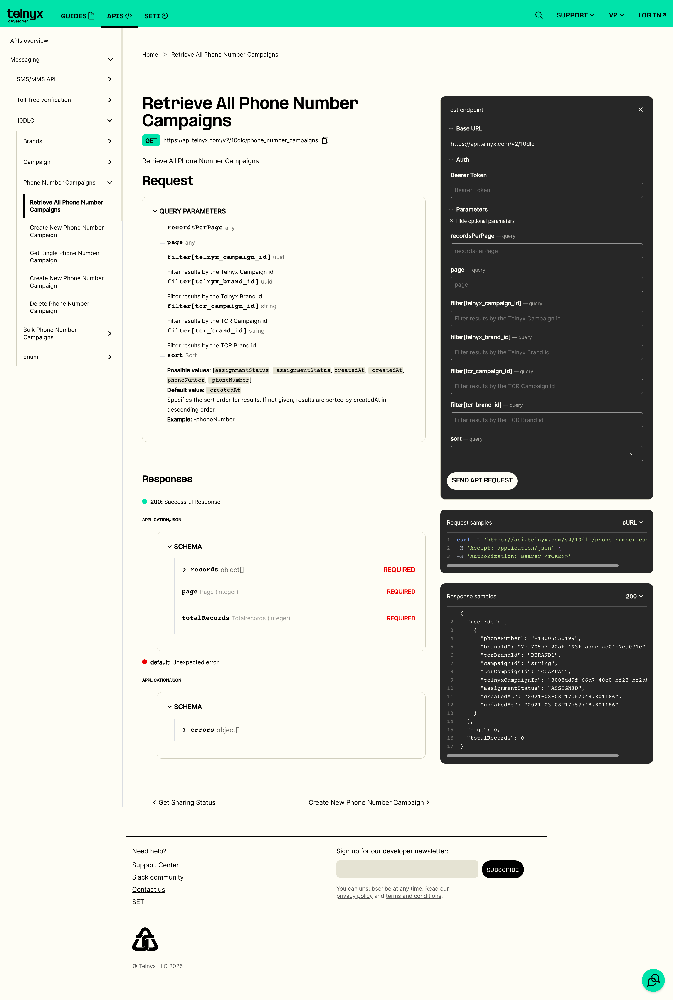

10DLC Number Assignment Status | Telnyx Help Center

[Skip to main content](#main-content)

# 10DLC Number Assignment Status

Having deliverability issues with a number recently assigned to an approved 10DLC campaign?

K

Written by Klane Pedrie

April 11, 2025

Even if you have taken the step of assigning a number to a 10DLC campaign does not mean you are ready to start sending right away.

The number assignment process can take any where from a few minutes to a few days. The normal timeline is around 2 hours.

You can check a number assignments status by using

<https://developers.telnyx.com/api/messaging/10dlc/get-all-phone-number-campaigns>

1. Open the test endpoint black box
2. Enter your api key for the bearer token. The api key is located on the homepage of your Telnyx account.
3. Enter your search parameters. Easiest is to use the Telnyx or TCR Campaign id that you assigned the number to.
4. If the status next to the number in question is `ASSIGNED` then the number is successfully assigned.
5. If it is assigned but you still had deliverability issues then check the timestamp of the undelivered message against the timestamp for the last update on the assigned number. Normally you will see that it was all messages that were sent prior to the assignment process being complete.
6. If you still have deliverability issues then reach out to [support@telnyx.com](mailto:support@telnyx.com).

---

Related Articles

[10DLC Shared Campaigns](https://support.telnyx.com/en/articles/5617538-10dlc-shared-campaigns)[How to create a 10DLC campaign](https://support.telnyx.com/en/articles/6339152-how-to-create-a-10dlc-campaign)[Assigning DID to a 10DLC Campaign Fails](https://support.telnyx.com/en/articles/8269151-assigning-did-to-a-10dlc-campaign-fails)[Telnyx 10DLC Process](https://support.telnyx.com/en/articles/10646301-telnyx-10dlc-process)[10DLC Campaign Suspended](https://support.telnyx.com/en/articles/10723378-10dlc-campaign-suspended)

Did this answer your question?

😞😐😃
