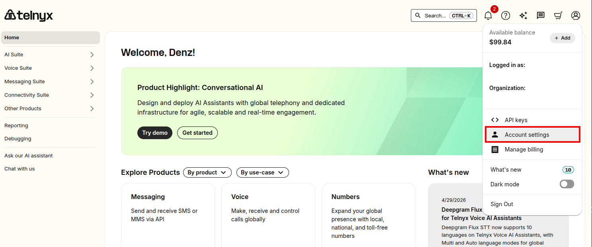
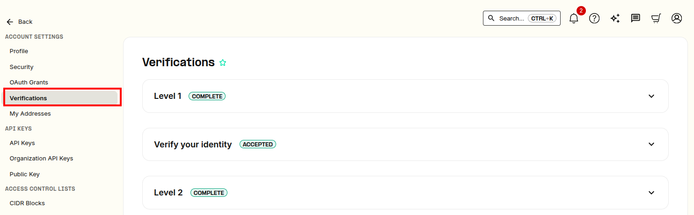
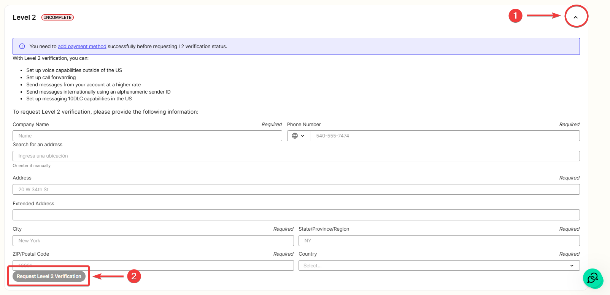
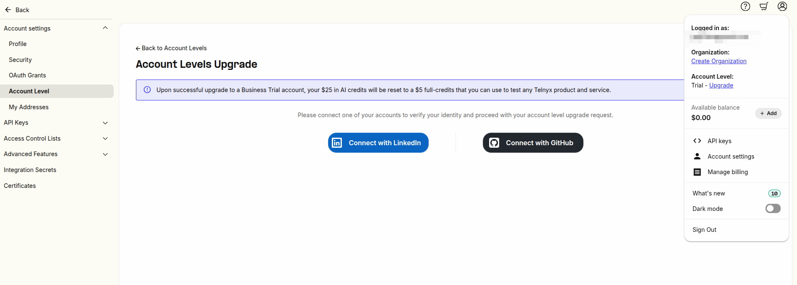
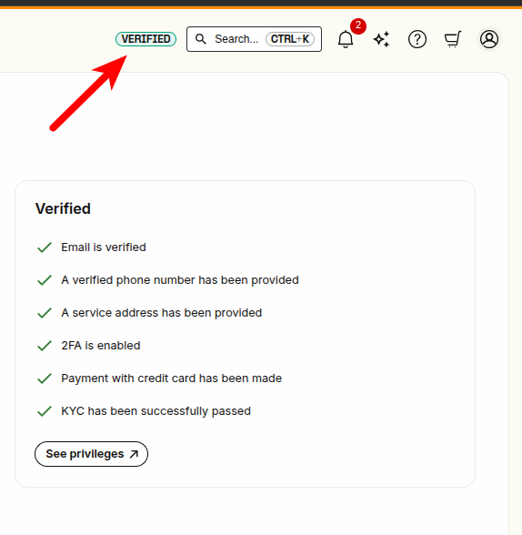

Account Verification | Telnyx Help Center

[Skip to main content](#main-content)

# Account Verification

This article explains how to get verified so that you can unlock all features of the Telnyx Mission Control Portal

Written by Telnyx Sales

Updated over 2 weeks ago

Table of contents

Telnyx uses a **tiered account verification system** to prevent abuse and ensure responsible use of communication services. There are now **two possible frameworks** your account may fall under:

* The **Level 1 / Level 2 framework** (Legacy)
* The **Trial-Paid-Verified-Enterprise (TPVE) framework**

---

## Legacy Framework: Level 1 & Level 2 Verification

You are using the **legacy framework** if you see the **“Verifications” tab** in your account settings.

## Level 1 Capabilities

Most users are **automatically Level 1 verified** after confirming their email. Level 1 allows you to:

* Buy a local number in your **home country**
* Assign a **connection or messaging profile** to a number
* Set up **messaging** and **voice capabilities (US only)**
* Create a **multi-user organization**
* Outbound messages will be limited to **50 per day** at this level.

## Level 2 Capabilities

Level 2 removes many restrictions and unlocks advanced features:

* Buy **international numbers**
* Enable **international calling and call forwarding**
* Increase **message send rates**

  + Account-wide: from **600 to 3000**
  + Toll-free: from **6 to 1200**
* Use **alphanumeric sender ID** for international messaging
* Submit orders for **hosted SMS** and **10DLC**
* Order SIM cards internationally or with a **freemail address**
* Removes:

  + [Payment](https://support.telnyx.com/en/articles/4280500-billing-setup-billing-groups#h_67a40ebfdb) address restrictions
  + [Payment](https://support.telnyx.com/en/articles/4280500-billing-setup-billing-groups#h_67a40ebfdb) top-up limits

---

## How to Apply for Level 2

**Pre-requisites:**

* Account is Level 1 verified
* Contact number + company name added under **Account Settings > Profile**
* A payment method is on file

**Steps:**

1. Go to **[Account Settings > Verifications](https://portal.telnyx.com/#/account/my-account/verifications)**

   1. <https://portal.telnyx.com/#/account/my-account/verifications>
2. Expand the **“Level 2”** section
3. Fill out the form and click **Request Level 2 Verification**

* A Telnyx team member may reach out to clarify use case or verify details.
* It may take **up to 48 hours** for approval or rejection.
* Only **organization owners** can access this section.
* If verification was unsuccessful, please review this [article](https://support.telnyx.com/en/articles/8269305-appeal-level-2-verification-status) for next steps.

The [Account/Verifications](https://portal.telnyx.com/#/account/my-account/verifications) section is located under "Account Settings". In the top right corner, click on your profile icon. Then in the dropdown menu, click "Account Settings"

You will be brought to a new page in the portal. On the left navigation bar, click on Account Settings > Verifications.

Then follow the instructions from there! Most users will already be Level 1 verified when they've confirmed their email address on signup.

---

## TPVE Framework

**New signups from June 2025 onward may be presented with a revised account levels section in place of traditional legacy verification system.**

You are using the **TPVE framework** if you see the **“[Account Levels](https://portal.telnyx.com/#/account/account-levels)” page** instead of a Verification's tab. Access it here: <https://portal.telnyx.com/#/account/account-levels> and the direct link to upgrade: <https://portal.telnyx.com/#/account/account-levels/upgrade>

This framework categorizes accounts into:

1. **[Trial](https://developers.telnyx.com/docs/account-setup/levels-and-capabilities/trial)** – Default for new signups
2. **[Paid](https://developers.telnyx.com/docs/account-setup/levels-and-capabilities/paid)** – Once a payment method is added
3. **[Verified](https://developers.telnyx.com/docs/account-setup/levels-and-capabilities/verified)** – After business verification
4. **Enterprise** – For high-volume customers

   1. Discuss with our sales team [here](https://telnyx.com/contact-us).

For full capabilities of each level, refer to the docs:

* [Account Levels Developer Docs](https://developers.telnyx.com/docs/account-setup/levels-and-capabilities)
* [V2 APIs Access Table](https://us-west-1.telnyxstorage.com/telnyx-support-kb-collaterals/api.telnyx.com.html)
* [S3 APIs Access Table](https://us-west-1.telnyxstorage.com/telnyx-support-kb-collaterals/telnyxstorage.com.html)

## Key TPVE Characteristics

* Account level is shared **across the organization**
* Privileges (e.g., API access, message limits) are **defined by level**
* The interface clearly shows your current level and upgrade options

---

Related Articles

[Billing Setup & Billing Groups](https://support.telnyx.com/en/articles/4280500-billing-setup-billing-groups)[Easy Text Marketing and Telnyx Integration](https://support.telnyx.com/en/articles/6986625-easy-text-marketing-and-telnyx-integration)[Appeal Level 2 Verification Status](https://support.telnyx.com/en/articles/8269305-appeal-level-2-verification-status)[Phone Number Ordering Restrictions](https://support.telnyx.com/en/articles/10715715-phone-number-ordering-restrictions)[How to Set Up WhatsApp on Telnyx](https://support.telnyx.com/en/articles/13986485-how-to-set-up-whatsapp-on-telnyx)

Did this answer your question?

😞😐😃

Table of contents
