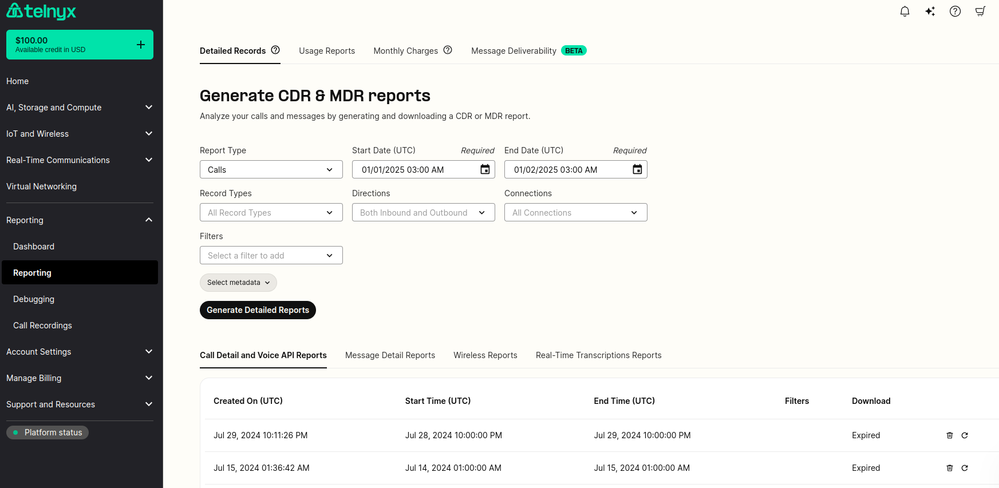
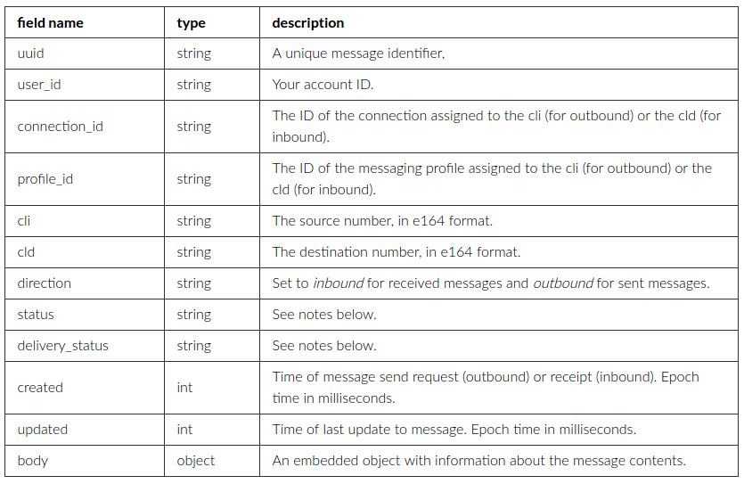
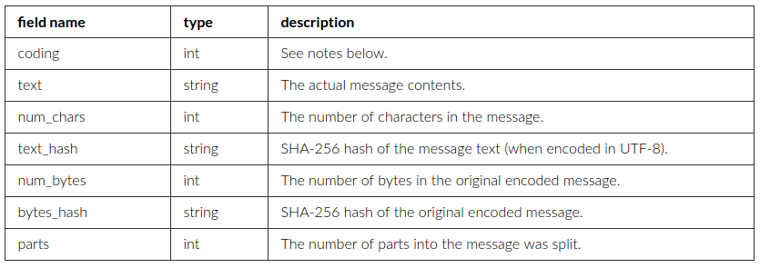
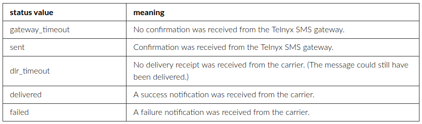
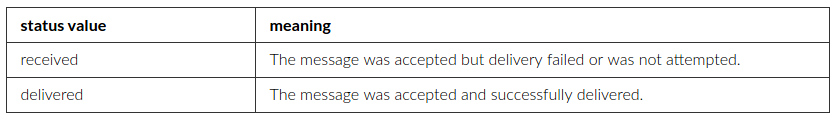
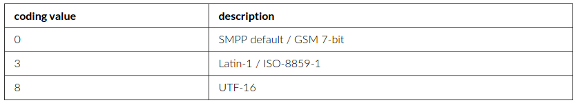
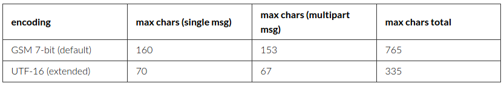

Understand Telnyx SMS MDR Report Log | Telnyx Help Center

[Skip to main content](#main-content)

# Understand Telnyx SMS MDR Report Log

You can check your MDR (message detail record) for every message sent or received.

Written by Telnyx Sales

January 2, 2025

Table of contents

# What is an MDR?

For every sent or received message, an MDR (message detail record) will be written. You can access and generate these report logs under **Reports** (left hand side navigation bar) -> **Reporting** in your Mission Control Portal Account as seen below.

## What are the different fields of information available?

MDRs are stored as JSON objects. These are the most important fields contained in each MDR:

The embedded **body** object contains the following fields:

For privacy reasons, a message’s body text is only stored for up to 10 days before it is wiped from our system. At that point, the hash fields can be used to identify messages.

## Status

For **sent messages**, the possible status values are:

For received messages, the possible status values are:

The delivery\_status field is used to give further details about the delivery confirmation (outbound) or delivery attempt (inbound).

## Message coding

The coding field is an integer representing the message’s encoding. It will typically have one of the following values:

When you send messages, the encoding is determined on the basis of the characters in the message body. If possible, GSM 7-bit is used; otherwise, UTF-16 is used.

## Message parts

Long messages must be divided into parts for transmission. The size of each part depends on the encoding.

For outbound messages, there is a maximum message size of 10 parts.

Don't forget that billing takes place on the number of message parts.

`rate` = price per message + carrier fee for one part.  
​`cost` = rate \* message parts.

Billing and Rate Limiting are applied based on the number of parts per message.

---

Related Articles

[How to Download Reports at Telnyx](https://support.telnyx.com/en/articles/1130708-how-to-download-reports-at-telnyx)[How to Leverage Webhooks](https://support.telnyx.com/en/articles/4334722-how-to-leverage-webhooks)[Telnyx SIP Response Codes](https://support.telnyx.com/en/articles/4409457-telnyx-sip-response-codes)[FAQs about MMS at Telnyx](https://support.telnyx.com/en/articles/4450150-faqs-about-mms-at-telnyx)[Bot-to-Bot Support API: Ask Telnyx Knowledge Agent](https://support.telnyx.com/en/articles/15455646-bot-to-bot-support-api-ask-telnyx-knowledge-agent)

Did this answer your question?

😞😐😃

Table of contents
