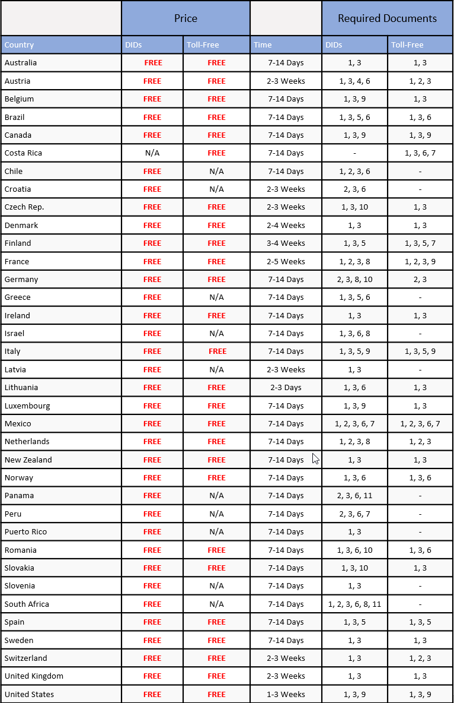
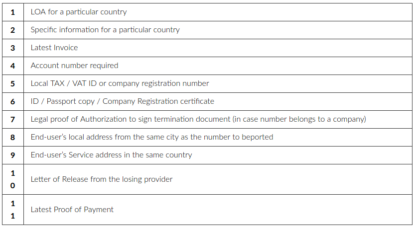

# International Number Porting - Required Documents

Telnyx offers detailed insights and resources for number portability across multiple international regions. See Telnyx guidance and requirements.

## Submitting International Port Requests via Telnyx Portal

To check the portability status of international numbers, please submit your port request via your Telnyx Portal account along with the below documentation (dependent upon the country).

Upon submission, you will be required to provide an LOA and invoice. Once portability have been confirmed across coverage and carrier, the porting team will then get back to you with the next steps required to port the number(s) along with any other documentation requirements needed.

Check out the video walkthrough: ordering international numbers

## List of Required Documents per Country:

*N/A - Porting service not available*

## Required Documents List:

