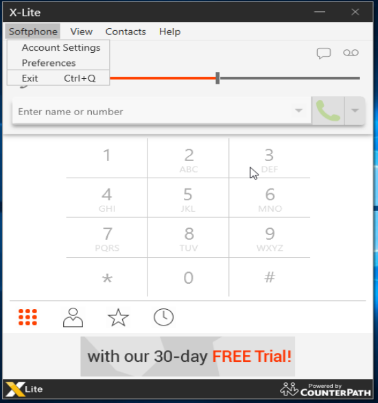
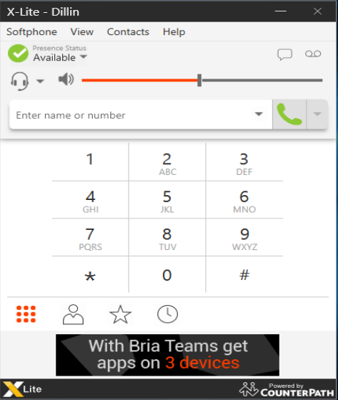

# Configuring Bria Solo (a.k.a X-Lite)

Learn how to configure Bria Solo/X-Lite to work with your Telnyx Mission Control… See Telnyx guidance and requirements.

[Jump to Instructions](#h_47881453c0)

[Bria Solo](https://www.counterpath.com/) (also known as X-Lite) is a softphone client, created by counterpath and developed for both Windows and Mac operating systems to help users transition to VoIP.

|  |
| --- |
| ***Note:*** *Bria Solo/X-Lite can be used on **Windows** or **Mac OS** platforms only.* |

For Bria Solo documentation, see:

* Bria Solo/X-Lite [technical documentation](https://www.counterpath.com/x-lite/)
* Bria Solo/X-Lite [support](https://support.counterpath.com/hc/en-us/categories/360002425273-Bria-Solo)

---

## Instructions for Configuring Bria Solo with Telnyx

In this activity you will:

1. [Set up a SIP account on Bria Solo](#h_f7029d69dd)

**Video Walkthrough**

Coming soon! Check back frequently as we are updating our documentation.

**Pre-Requisites:**

* Have already created a [credentials-based connection](https://portal.telnyx.com/#/app/connections) on your Telnyx Mission Control Panel account, have assigned this connection to a DID and outbound profile in order to make or receive calls
* Have [configured your Telnyx Mission Control Portal](https://support.telnyx.com/en/articles/1176636-get-started-with-a-mission-control-account)

## 1. Set up a SIP account on Bria Solo

1. Open Bria Solo/X-Lite.
2. From the main menu, choose **Softphone > Account Settings**.

   
3. From the Accounts window, you'll need to fill out the following fields:

   1. **Account Name section:**

      * **Account Name:** Used to identify the account. Make it something meaningful to you.
      * **Protocol:** This is read-only and will always be SIP.
   2. **Allow this Account For section:**

      * **Calls** (Windows) or **Used for Call** (Mac): Check box for account be used for outbound calls
      * **IM/Presence** (Windows) or **Presence** (Mac): Check box for account to be used to share your online presence and send IMs
   3. **User Details section:**

      * **User ID:** The account ID for the softphone. Provided by Telnyx
      * **Domain:** sip.telnyx.com
      * **Password:** The password for the softphone. Provided by Telnyx
      * **Display Name:** The name displayed in the Bria title bar. This is the name remote parties will see
      * **Authorization Name:** Complete this field ONLY if Telnyx gave you an authorization name. Typically this won't be the case unless you need to allow user IDs that are easy to guess. In that case, the Authorization name will be used in place of the User ID to register the SIP account
   4. **Domain Proxy section:**

      * **Register with domain and receive calls:** If checked, you are opting to receive incoming calls. If your service level does not include the ability to receive incoming calls, CLEAR this field. Otherwise, it may prevent the account from registering
      * **Send outbound via:** Select this field if Telnyx requires that traffic be directed to proxies that are discovered via the domain. If you select this field, you must also complete the Address field with IP address provided by Telnyx.
   5. **Dial Plan section:**

      * This contains information about the numbers used by Telnyx. This is provided by Telnyx and is read-only

   
4. Hit **OK** to register the softphone with sip.telnyx.com. If everything is correct, you'll see that the account has been enabled successfully.

   

That's it, you've now completed the configuration of your X-Lite softphone client and can now make and receive calls by using Telnyx as the SIP provider.

[Back to Top](#h_47881453c0)

---

## Additional Resources

Review our [getting started guide](https://support.telnyx.com/en/articles/1176636-get-started-with-a-mission-control-account) to make sure your Telnyx Mission Control Portal account is set up correctly.

Additionally you can check out:

* Counterpath's [help section](https://www.counterpath.com/x-lite/) for extra support with Bria Solo.
* Counterpath's [support](https://support.counterpath.com/hc/en-us/categories/360002425273-Bria-Solo) for Bria Solo/X-Lite

---

Related Articles

[Configuring Linphone with Telnyx](https://support.telnyx.com/en/articles/1130674-configuring-linphone-with-telnyx)[NCH Express Talk](https://support.telnyx.com/en/articles/5807457-nch-express-talk)[Grandstream Wave Lite (iPhone)](https://support.telnyx.com/en/articles/6184748-grandstream-wave-lite-iphone)[Grandstream Wave Lite (Android)](https://support.telnyx.com/en/articles/6184897-grandstream-wave-lite-android)[Grandstream GDS3710: Wave Lite (iOS)](https://support.telnyx.com/en/articles/6187411-grandstream-gds3710-wave-lite-ios)

Did this answer your question?

😞😐😃
