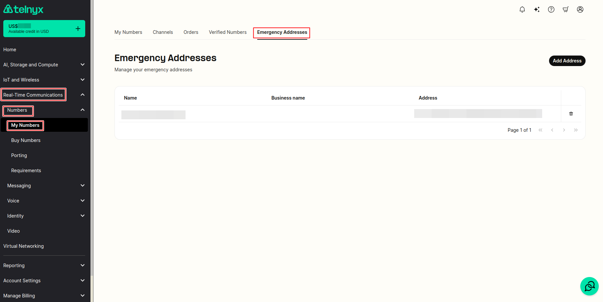

# Register E911 addresses

Learn how to register E911 addresses in the Account section of Telnyx Mission Control. See Telnyx guidance and requirements.

## Steps for registering E911 addresses for emergency calling

1. Under **Real-Time Communications** on the left side bar, click on **My Numbers** tab under **Numbers** section.
2. Then click on the [Emergency Address](https://portal.telnyx.com/#/numbers/emergency-addresses) sub tab on the new page.
3. Click **Add Address** on the right hand side.

   1. A form will pop up where you can fill out.

      1. First Name
      2. Last Name
      3. Or Business Name
   2. You can auto search for the address by typing the location using the auto complete "search for an address" field.
   3. Otherwise, you can manually set:

      1. Country
      2. State/Province/Region
      3. City
      4. ZIP / Postal Code
      5. Street Address
      6. Extended Address

**NOTE: Failure to register an address and enable emergency services with the address on numbers that make emergency calls, will be considered unregistered, and will incur a penalty of $100.**

---

Related Articles

[E911 Setup Guide](https://support.telnyx.com/en/articles/1130683-e911-setup-guide)[Bulk Edit Numbers - Emergency Services](https://support.telnyx.com/en/articles/2819213-bulk-edit-numbers-emergency-services)[Addresses Overview](https://support.telnyx.com/en/articles/4294429-addresses-overview)[Invoice Overview](https://support.telnyx.com/en/articles/6987563-invoice-overview)[Zambia DID Requirements](https://support.telnyx.com/en/articles/10058901-zambia-did-requirements)

Did this answer your question?

😞😐😃
