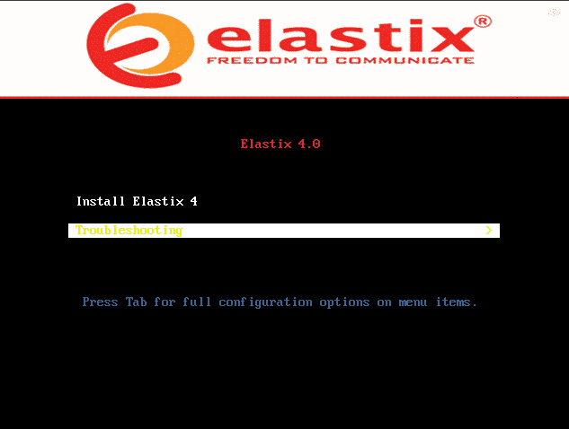
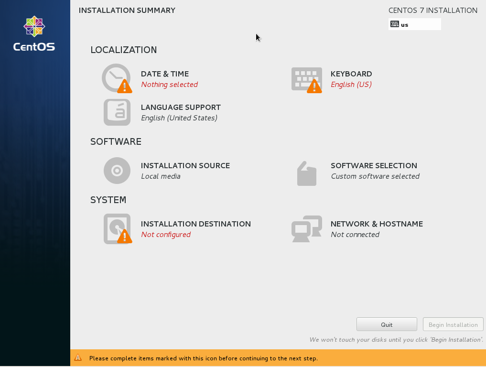
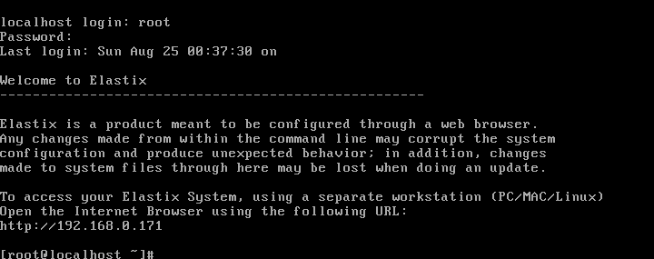
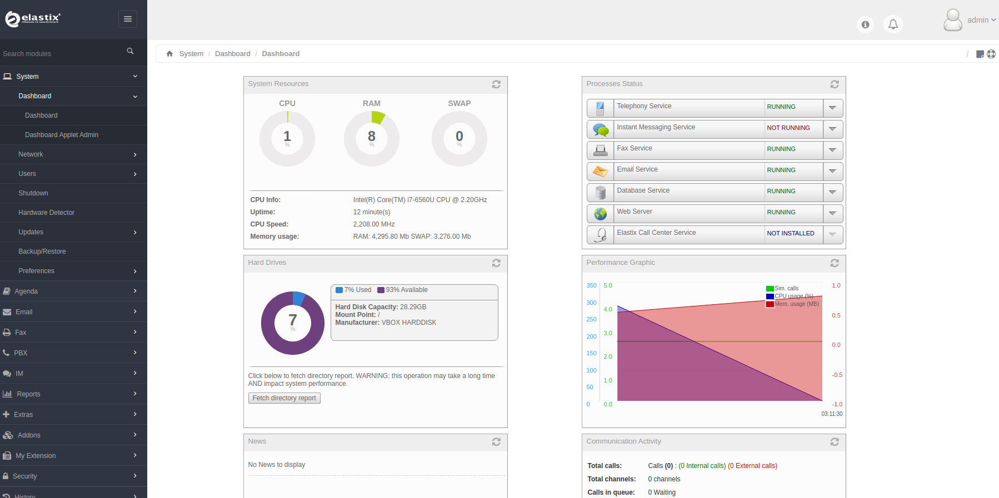
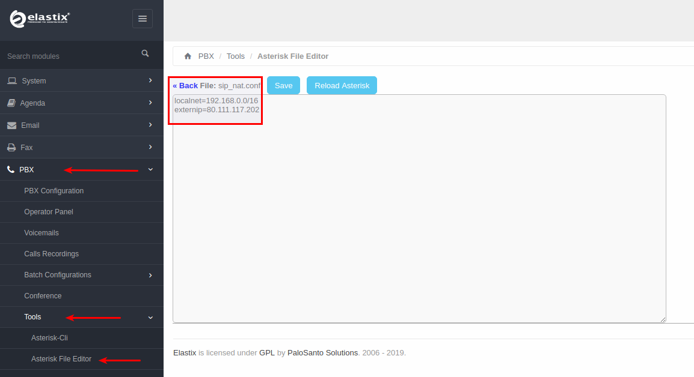
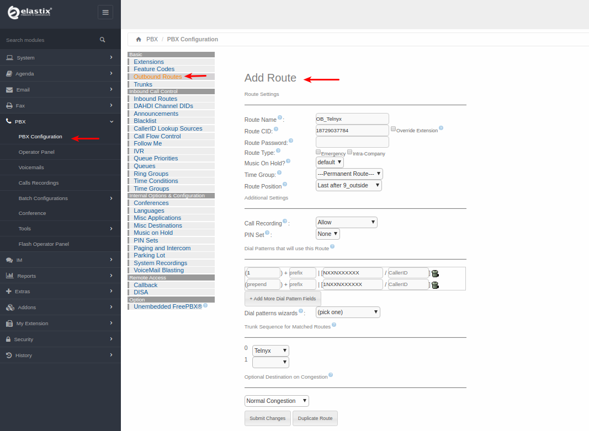

Configuring an Elastix 4 PBX Trunk | Telnyx Help Center

[Skip to main content](#main-content)

# Configuring an Elastix 4 PBX Trunk

In this article we will explain how to configure an Elastix 4 PBX Credentials Trunk with Telnyx.

C

Written by Customer Success

October 18, 2023

Table of contents

[Jump to Instructions](#h_4c1a32624c)

With [Elastix](https://www.3cx.com/) you can build the ideal PBX for your business whatever its size or requirements; you choose how to deploy depending on what you and your business needs from its communications platform. Whether you want an on-premise Linux PBX, to install on Windows, or you prefer to self host your phone system in YOUR cloud with your own cloud account, the choice is yours.

Additional documentation:

* [Elastix admin guide](https://www.3cx.com/docs/manual/)
* [Elastix user guide](https://www.3cx.com/user-manual/)
* [Elastix support](https://www.3cx.com/support/)

---

# Instructions for Configuring Elastix

In this activity you will:

1. [Install Elastix 4](#h_80adb3f251)
2. [Create a Telnyx SIP trunk](https://support.telnyx.com/en/articles/3284164-elastix-5-credentials-trunk#h_7ee5612075)
3. [Create inbound rules](https://support.telnyx.com/en/articles/3284164-elastix-5-credentials-trunk#h_165e1f85b4)
4. [Create outbound rules](https://support.telnyx.com/en/articles/3284164-elastix-5-credentials-trunk#h_35f616006a)

**Pre-requisites**

* Ensure that your [Telnyx Mission Command Portal is configured properly](https://support.telnyx.com/en/articles/1176636-get-started-with-a-mission-control-account)
* [Purchase a DID](https://portal.telnyx.com/#/app/numbers/search-numbers)
* [Set up your Telnyx SIP connection](https://portal.telnyx.com/#/app/connections)
* [Provision your number](https://portal.telnyx.com/#/app/numbers/my-numbers) (Assign it to a SIP connection)
* [Create an outbound voice profile](https://portal.telnyx.com/#/app/outbound)
* Create a [credentials-based connection](https://portal.telnyx.com/#/app/connections) on your Telnyx Mission Control Portal
* RECOMMENDED: [Enable TLS to encrypt your traffic](https://support.telnyx.com/en/articles/1130711-does-telnyx-encrypt-communication)
* Download Elastix 4 ISO from [our dropbox.](https://www.dropbox.com/sh/rzrdrpu0ocumu95/AABJeNgKkOkDCYLkSrsIuD3Aa?dl=0) (V4 is no longer available through the provider)

  + Take note of any username/password combination you set during this activity. You'll need them at a later stage.

**Video walkthrough**

Setting up your Telnyx SIP portal account so you can make and receive calls:

Configuring Elastix 4

## 1. Install Elastix 4

As the provider no longer supports Elastix, we will provide you with an installation guide.

1. Run the Elastix installer.

   
2. Once you reach the Centos installation summary, provide the following information:

   1. **Date and Time** according to your time zone
   2. **Install Destination** (Select the Hard drive we created for this virtual machine)
   3. **Keyboard**
   4. **Network and Hostname** - make sure to turn this *on***.**

      
3. Once you've entered the appropriate configuration settings, click **Begin Installation** at the bottom.
4. You'll then be prompted to configure the user settings.

   
5. Make sure you enter a root password and create a user. You will need these for later on so please remember them.
6. While you complete these two options, the installation will continue as normal until it finishes.
7. Now enter your SQL root password and admin password which are used to login to the graphical user interface.

   

   
8. Now your virtual machine will reboot and you should now be able to login as root and Web GUI admin.

   
9. To access your Elastix system, copy the URL which is displayed for you in the above picture. Input this URL into your browser to access the GUI.

   
10. Once you enter your username and password, you'll be brought to the Elastix system.

[Back to Top](#h_4c1a32624c)

## 2. Add a SIP trunk

In this section, you'll configure your Elastix 4 PBX to work with Telnyx. You can follow these steps, or use the [video walkthrough](#h_9f0dbb7c3d).

1. Log into your Elastix GUI. You'll be on the homepage.

   
2. From the left-hand navigation, go to **PBX > Tools > Asterisk File Editor** and filter for the *sip\_nat.conf* file.
3. Enter in your own local network subnet and your external IP in the fields labeled:

   1. localnet=
   2. externip=
4. Click **Save** and then click **Reload Asterisk.**

   
5. Now make your way to **PBX > PBX Configurations > Extensions > Add SIP Extension** and enter the following information. Anything not specified can be left blank unless it's a requirement of yours.

   1. **User Extension:** The extension you wish to use for this trunk
   2. **Display Name:** Enter a name that makes sense.
   3. **Outbound CID:** The [number](https://portal.telnyx.com/#/app/numbers/my-numbers) you purchased with Telnyx that you want to assign for this extension. Please remember to use the user extension and password along with the internal IP of your Elastix server so you can then register this SIP extension.
   4. **Asterisk Dial Options:** *tr*
   5. **Queue State Detection:** *Use state*
   6. **Secret:** Your Telnyx account password for this extension
   7. **DTMFmode:** *RFC 2833*
   8. **NAT:** *No- RFC 3581*

      
6. Click **Submit**, then **Apply Config**.
7. From the left-hand navigation, stay on **PBX > PBX Configurations** and click on **Trunks**.
8. Add the following settings to you trunk details:  
   ​  
   ​**Outgoing SIP Settings for the trunk:**

   1. **Username:** Your Telnyx account username
   2. **Secret:** Your Telnyx account password
   3. **Host:** *sip.telnyx.com*
   4. **Type:** *friend*
   5. **Insecure:** *port, invite*
   6. **Qualify:** *Yes*
   7. **Disallow:** *All*
   8. **Allow:** *ulaw & alaw*

   **Inbound sip Settings for the trunk:**

   1. **Username:** Your Telnyx account username
   2. **Secret:** Your Telnyx account password
   3. **Fromdomain:** *sip.telnyx.com*
   4. **Host:** *sip.telnyx.com*
   5. **Type:** *friend*
   6. **Insecure:** *port,invite*
   7. **Qualify:** *Yes*
   8. **Disallow:** *All*
   9. **Allow:** *ulaw*
   10. **DTMFmode:** *RFC 2833*
   11. **NAT:** *force\_rport,comedia*
   12. **Registration string:** your\_username:your\_password@*sip.telnyx.com*
   13. **Dialed number manipulation rules:** prepend:*1*; match pattern: *NXXNXXXXXX*  
       prepend: blank; match pattern: *1NXXNXXXXXX*  
       ​  
       ​***Note:*** *The above dial patterns are for dialing 10 and 11 digit destinations, your own dial patterns may differ.*

       
9. Click **Submit** and **Apply Config**.

[Back to Top](#h_4c1a32624c)

## 3. Configure outbound rules

In this section, you'll configure the outbound calling rules that will manage your outgoing calls.

1. From the left-hand navigation, make your way to **PBX > PBX Configurations** and click on **Outbound Routes**, then **Add Route** and provide the following information:

   1. **Route Name:** Choose a name that makes your route easily identifiable.
   2. **Route CID:** The [number](https://portal.telnyx.com/#/app/numbers/my-numbers) you purchased with Telnyx that you want to assign to this route.
   3. **Dial Patterns:** Enter your dial patterns here. Use as many as necessary.
   4. **Trunk Sequence:** *Telnyx*
   5. If you require configuration of any additional fields, you can configure these as needed.

      
2. Click **Submit** and **Apply Config** to configure the trunk settings.

[Back to Top](#h_4c1a32624c)

## 4. Configure inbound rules

In this section, you'll configure the inbound calling rules that will manage your incoming calls.

1. From the left-hand navigation, make your way to **PBX > PBX Configurations** and click on **Inbound Routes**, then **Add Incoming Route** and provide the following information:

   1. **Description:** A description of your route that makes it easily identifiable
   2. **[DID Number](https://telnyx.com/resources/sip-did):** The [number](https://portal.telnyx.com/#/app/numbers/my-numbers) you purchased with Telnyx that you want to assign to handle inbound calls.
   3. **Extensions:** Any extensions that you need to register for your inbound calling.
   4. If you require configuration of any additional fields, you can configure these as needed.

      
2. Click **Submit** and **Apply Config.**

That's it, you've now completed the configuration of Elastix 4 IP-PBX Trunk and can now make and receive calls by using Telnyx as your SIP provider!

##

[Back to Top](#h_4c1a32624c)

---

## Additional Resources

Review our [getting started with guide](https://support.telnyx.com/en/articles/1176636-get-started-with-a-mission-control-account) to make sure your Telnyx Mission Control Portal account is set up correctly.

Additionally, you can check out:

* [Elastix admin guide](https://www.3cx.com/docs/manual/)
* [Elastix user guide](https://www.3cx.com/user-manual/)
* [Elastix support](https://www.3cx.com/support/)

---

Related Articles

[Configuring an Elastix 4 PBX IP Trunk](https://support.telnyx.com/en/articles/1130622-configuring-an-elastix-4-pbx-ip-trunk)[How to configure a Thirdlane PBX](https://support.telnyx.com/en/articles/1130631-how-to-configure-a-thirdlane-pbx)[Configuring a FreePBX V13 Credentials Trunk](https://support.telnyx.com/en/articles/1130648-configuring-a-freepbx-v13-credentials-trunk)[Xorcom PBX: SIP Trunk](https://support.telnyx.com/en/articles/5754127-xorcom-pbx-sip-trunk)[How to configure Yeastar P-series](https://support.telnyx.com/en/articles/13375115-how-to-configure-yeastar-p-series)

Did this answer your question?

😞😐😃

Table of contents
