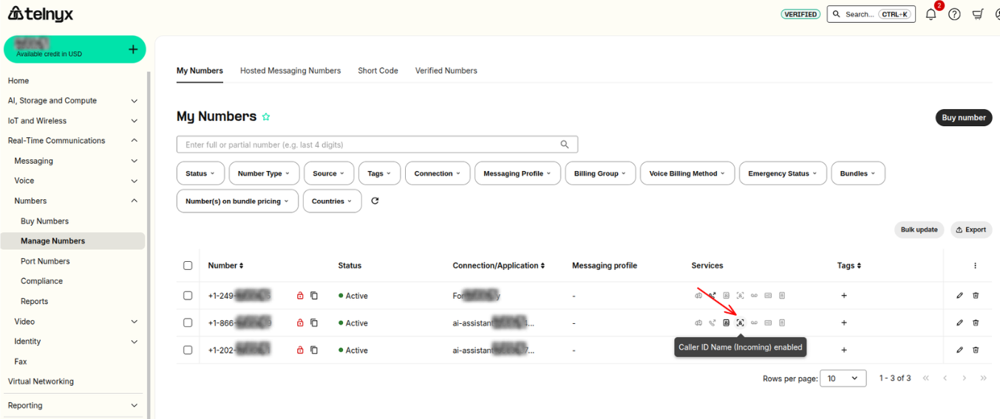
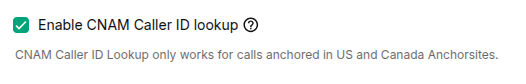

# Set up Inbound Caller ID Name (incoming)

In this article we will walk you through setting up caller ID name for your numbers. See Telnyx guidance and requirements.

This feature is located on the Real-Time Communications column in your [numbers section](https://portal.telnyx.com/#/app/numbers/my-numbers) of your Mission Control Portal account.
​
Enabling this feature on your DID will allow for Telnyx to DIP the CNAM databases, to determine if there is a name associated with the callers number on your inbound calls. If there is, we'll pass this along in our SIP INVITES to your connection.
​

## **Guide to Configuring Inbound Caller ID Name**

1. On the number you want to enable inbound CNAM, click on the business card icon.

2. Visit the section with **CNAM Caller ID Lookup** and toggle the option to enable the setting.

3. Accept the MRC (Monthly Recurring Charge) for this feature and click save changes at the bottom.

---

Related Articles

[Configuring an AVAYA IP trunk with Telnyx](https://support.telnyx.com/en/articles/1130627-configuring-an-avaya-ip-trunk-with-telnyx)[Caller ID Outbound vs CNAM](https://support.telnyx.com/en/articles/1130720-caller-id-outbound-vs-cnam)[Bulk Edit Numbers - Voice Settings](https://support.telnyx.com/en/articles/2807846-bulk-edit-numbers-voice-settings)[Caller ID Number Policy](https://support.telnyx.com/en/articles/3546251-caller-id-number-policy)[Your Number Lookup Guide](https://support.telnyx.com/en/articles/4366901-your-number-lookup-guide)

Did this answer your question?

😞😐😃
