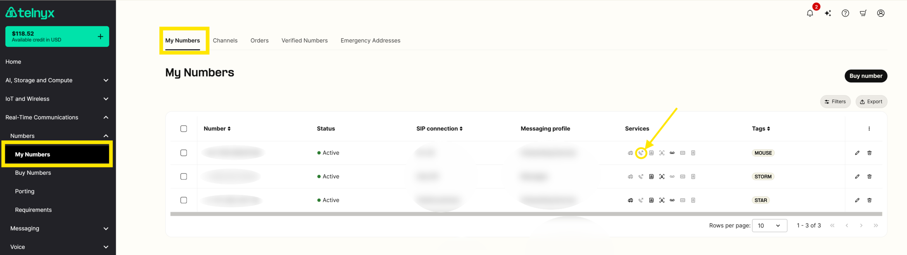

Call Forwarding | Telnyx Help Center

[Skip to main content](#main-content)

# Call Forwarding

In this article we will walk you through enabling call forwarding on your Telnyx account.

Written by Telnyx Sales

April 10, 2026

Table of contents

# How to Enable Call Forwarding

Call Forwarding is a setting on your [numbers](https://portal.telnyx.com/#/app/numbers/my-numbers), which when activated can allow you to always call forward to a particular number you want to set or only forward on cases where there are failures establishing a call to the SIP Connection associated to the number.

1. On the number you want to have call forwarding enabled, click on the handset icon under the services column.  
​

You will be brought to the "voice" sub tab and you can scroll down to the forwarding section.

2. Toggle on the forwarding setting which will turn to green. Then Input the desired number to which the call should be forwarded.  
​

3. Choose the mode you want forwarding enabled, be it **Always** or **On-Failure**.  
​  
If you set the forwarding to **"On-Failure":** This failover is automatically triggered under a few specific conditions:

* **Unregistered PBX or Endpoint:** This is the most common trigger. If your PBX, SIP server, or softphone loses its connection to our network, whether due to a localized internet outage, a power failure, or a misconfiguration, our system will recognize the endpoint as "offline" and immediately forward the call to your backup destination.
* **Active Do Not Disturb (DND):** If the receiving device or softphone/ PBX has a "Do Not Disturb" feature enabled, the device actively rejects the incoming connection attempt from the network. Our system interprets this rejection as a failure and triggers the forwarding rules.
* **Manually Declined Calls:** Similar to DND, if an end-user actively hits the "decline" or "reject" button on their softphone/ handset/ PBX when a call comes in, the endpoint signals a failure to connect, prompting the network to seamlessly push the call to the failover number.
* **Important Note on Unanswered Calls:** If a call successfully connects to your PBX or softphone and simply rings without anyone picking up, this is *not* considered a failure. Because the network successfully delivered the call to the active endpoint, "On-Failure" forwarding will not be triggered if the call just rings out.

If you set the forwarding to **"Always":** This setting bypasses your primary SIP connection entirely. All incoming calls will be immediately and unconditionally Forwarded directly to your designated forwarding number, regardless of whether your PBX is currently online, registered, or active.  
​

4. Click save changes are the end of the page and accept the monthly recurring charge (MRC) for enabling this feature. That's it, forwarding will be enabled now and you'll see the icon light up on your my numbers page. If you hover over the icon it will tell you whether it's enabled or not.

## How to disable or deactivate call forwarding

Go back into the voice settings of the number, simply toggle off the forwarding setting and save changes. Your forwarding will now be disabled on the number.

## Notes

* Call forwarding from a Telnyx number to another Telnyx number is always considered off-net and will be charged according to your rate deck which can be downloaded from your [outbound voice profile](https://portal.telnyx.com/#/app/outbound-profiles) settings. This is due to forwarded calls being sent outbound to the PSTN.
* The MCR charge for enabling Call forwarding does not take account that you are still charged on a per minute basis for both the inbound call and the forwarded outbound call.

  + Make sure to check your csv rate deck file, available [here](https://portal.telnyx.com/#/pricing/voice), to determine the per charges that will apply depending on the destination number that you forward to.
  + The only case where you do not incur per minute charges is on the inbound leg if the number receiving the calls is set to channel billing instead of pay per minute.
* Call forwarding is not possible to enable on numbers that are assigned to voice or fax applications, only SIP Connections. If you run into any errors when you are using the automatic forwarding via the portal then you need to set the SIP Connection Id for the number you are forwarding from to EMPTY before you start forwarding. If you need to keep the number assigned to a Call Control or TeXML application then you must forward programmatically. TeXML is the easiest following [these instructions](https://developers.telnyx.com/docs/development/programmable-voice/texml-bin-quickstart) and you can substitute <SIP> for <NUMBER>. For Call Control or Voice API you can use the answer and transfer commands to achieve forwarding.

**Constraints due to Local Regulation**

In some countries, such as Venezuela, local regulations require that calls originating from outside the country but displaying a local Caller ID (CLI) be masked.  
 Due to this regulation, when Telnyx receives such calls, it may not be able to forward them.

Telnyx is actively working on implementing a solution to address this scenario, which arises due to regulatory requirements that are beyond Telnyx's control.

---

Related Articles

[Cisco: Configure a Cisco CME IP Trunk](https://support.telnyx.com/en/articles/1130612-cisco-configure-a-cisco-cme-ip-trunk)[Configuring Linphone with Telnyx](https://support.telnyx.com/en/articles/1130674-configuring-linphone-with-telnyx)[Troubleshooting Call Completion](https://support.telnyx.com/en/articles/5025298-troubleshooting-call-completion)[How to Configure a SIP Trunk](https://support.telnyx.com/en/articles/8096455-how-to-configure-a-sip-trunk)[TeXML Bin Simple Voicemail and Call Forwarding](https://support.telnyx.com/en/articles/13386198-texml-bin-simple-voicemail-and-call-forwarding)

Did this answer your question?

😞😐😃

Table of contents
