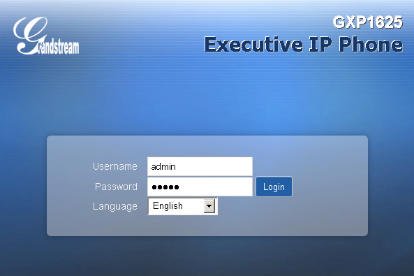
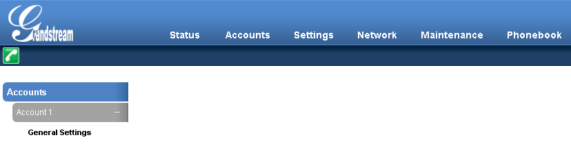
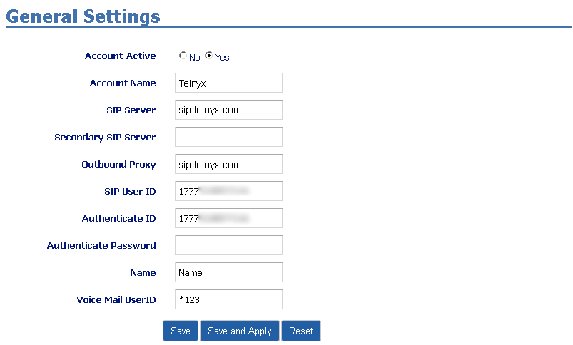
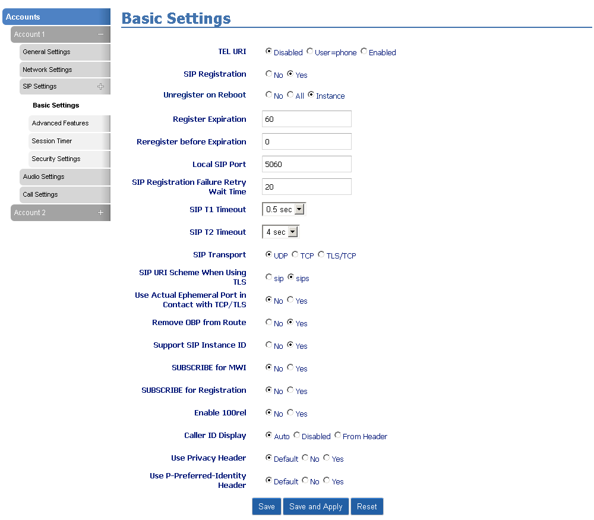

# Configuring Grandstream GXP16XX with Telnyx

In this article we will explain how to configure Grandstream GXP1620/GXP1625 and GXP1630 with the Telnyx Mission… See Telnyx guidance and requirements.

C

[Jump to Instructions](#h_b1174ea24e)

The [Grandstream GXP1620/GXP1625 IP phones](https://www.grandstream.com/products/ip-voice-telephony-gxp-series-ip-phones/gxp-series-basic-ip-phones/product/gxp1620/gxp1625) are geared specifically for small to mid-sized businesses and feature effective and essential functionalities to create an easy-to-use experience for a user with light to medium call volume. Its focus on essential features and standard call support makes the GXP1620/25 a versatile and dependable phone.

Additional documentation:

* [Product datasheet (English)](https://www.grandstream.com/hubfs/Product_Documentation/datasheet_gxp1620_1625_english.pdf?hsLang=en)
* [Grandstream firmware updates](https://www.grandstream.com/support/firmware)
* [GXP16XX product documentation](https://www.grandstream.com/hubfs/Product_Documentation/gxp16xx_administration_guide.pdf)
* [Grandstream FAQ](https://blog.grandstream.com/faq)
* [Grandstream user forum](https://forums.grandstream.com/)
* [Grandstream Learning Center](https://www.grandstream.com/learning-center)

---

## Instructions for configuring your Grandstream GXP 1625

In this activity you will:

1. [Log into your Grandstream UI](#h_79bca1329c)
2. [Create a SIP trunk](#h_eceaea9c8f)
3. [Configure codec preferences](#h_a10b5e6922)

**Pre-requisites**

* Ensure that your [Telnyx Mission Command Portal is configured properly](https://support.telnyx.com/en/articles/1176636-get-started-with-a-mission-control-account)
* [Purchase a DID](https://portal.telnyx.com/#/app/numbers/search-numbers)
* [Set up your Telnyx SIP connection](https://portal.telnyx.com/#/app/connections)
* [Provision your number](https://portal.telnyx.com/#/app/numbers/my-numbers) (Assign it to a SIP connection)
* [Create an outbound voice profile](https://portal.telnyx.com/#/app/outbound)
* Create an [IP connection](https://portal.telnyx.com/#/app/connections) on your Telnyx Mission Control Portal
* Ensure your Grandstream device is running [the latest firmware](https://www.grandstream.com/support/firmware)
* RECOMMENDED: [Enable TLS to encrypt your traffic](https://support.telnyx.com/en/articles/1130711-does-telnyx-encrypt-communication)

**Video Walkthrough**

Setting up your Telnyx SIP portal account so you can make and receive calls:

|  |
| --- |
| ***Note:*** *Video walkthrough for Grandstream GXP/Telnyx configuration coming soon. Check back as we update our docs.* |

## 1. Log into your Grandstream web UI

All the configuration you'll need to do will take place on the web UI, which acts as an interface between you and your Grandstream device. You can access the web UI via the device's IP address. We'll find that, then use it to log in.

1. The IP address used to access the web UI depends on where the user’s computer is connected.

   1. If the computer is connected to *the same switch/router that the UCM6200 series WAN port is connected*, then browse to the IP address that is displayed on the UCM6200 series LCD. This address is the *WAN IP*.
   2. If the computer is connected *to the LAN side of the UCM6200 series*, then users would browse to the default IP of the UCM6200 series which is *192.168.2.1*.
2. If connected successfully, the UCM6200 series login page. Out of the box, your device will have the following default credentials:

   1. **Username**: *admin*
   2. **Password**: *admin*
      ​*HOWEVER: Units manufactured starting January 2017 have a unique random password printed on the sticker located on the back of the unit.*

      

[Back to Top](#h_b1174ea24e)

## 2. Create a SIP trunk

In this section, we're going to create a new [SIP trunk](https://telnyx.com/products/sip-trunks) that will connect your Grandstream device with your Telnyx account.

1. From the top navigation, select **Accounts**.
2. From here, select **Accounts 1**, then **General Settings** in left-hand navigation.

   
3. Provide the following information to configure this account.

   1. **SIP Server:** *sip.telnyx.com*
   2. **Outbound Proxy:** *sip.telnyx.com*
   3. **SIP User ID:** Your Telnyx SIP account username
   4. **Authenticate ID:** Your Telnyx SIP account password

      
4. Now select **Network Settings** from **Accounts 1** in left-hand navigation and provide the following:

   1. **DNS Mode:** *A Record*
   2. **NAT Traversal:** *Keep-Alive*
5. Next, select **SIP Settings > Basic Settings** from **Accounts 1** in left-hand navigation and make sure the following are set according to your encryption/transport settings in your Telnyx Mission Control Portal:

   1. **Local SIP Port:** *5060* if you have not enabled TLS encryption. If you have, choose *5061*
   2. **SIP Transport:** *UDP* or *TCP* if you have not enabled TLS encryption. If you have, choose *TLS/TCP*.

      

## 3. Configure codec preferences

In this section, you'll select the codecs you'll use for audio calling.

1. Select **Audio Settings** from **Accounts 1** in left-hand navigation to set your codec preferences. You can choose any Telnyx-supported [audio codecs](https://telnyx.com/resources/codecs-affect-voip-sound-quality):

   1. ulaw(g711u)
   2. alaw(g711a)
   3. g722
   4. g729

That's it, you've now completed the configuration of your Grandstream and can now make and receive calls by using Telnyx as your SIP provider!

[Back to Top](#h_b1174ea24e)

## Troubleshooting

## 1. Outgoing call issues

Are you able to receive incoming calls but outgoing calls are failing with a *No response* error? Try this:

1. Login into your device's settings and head to **Accounts > Account X > SIP > Custom SIP Header** and disable the following:

   * **Use X-Grandstream-PBX Header**
   * **Use P-Access-Network-Info Header**
   * **Use P-Emergency-Info Header**
2. Go to **Accounts > Account X > SIP > Audio Settings**, and choose codec *G729A/B* as preferred Vocoder and the rest with *PCMU*.

[Back to Top](#h_b1174ea24e)

---

## Additional Resources

Review our [getting started with guide](https://support.telnyx.com/en/articles/1176636-get-started-with-a-mission-control-account) to make sure your Telnyx Mission Control Portal account is set up correctly.

Additionally, you can check out:

* [Product datasheet (English)](https://www.grandstream.com/hubfs/Product_Documentation/datasheet_gxp1620_1625_english.pdf?hsLang=en)
* [Grandstream firmware updates](https://www.grandstream.com/support/firmware)
* [GXP16XX product documentation](https://www.grandstream.com/hubfs/Product_Documentation/gxp16xx_administration_guide.pdf)
* [Grandstream FAQ](https://blog.grandstream.com/faq)
* [Grandstream user forum](https://forums.grandstream.com/)
* [Grandstream Learning Center](https://www.grandstream.com/learning-center)

---

## Can't find what you're looking for? Click the chat bubble at your lower right hand corner and start a chat!

---

Related Articles

[Grandstream HT802: Telnyx Setup](https://support.telnyx.com/en/articles/5725071-grandstream-ht802-telnyx-setup)[Grandstream GXP: Telnyx Setup](https://support.telnyx.com/en/articles/5815720-grandstream-gxp-telnyx-setup)[Grandstream GXP21XX](https://support.telnyx.com/en/articles/5819218-grandstream-gxp21xx)[Grandstream GXP1700: SIP Trunk](https://support.telnyx.com/en/articles/6184520-grandstream-gxp1700-sip-trunk)[Grandstream GXV3370](https://support.telnyx.com/en/articles/6187576-grandstream-gxv3370)

Did this answer your question?

😞😐😃
