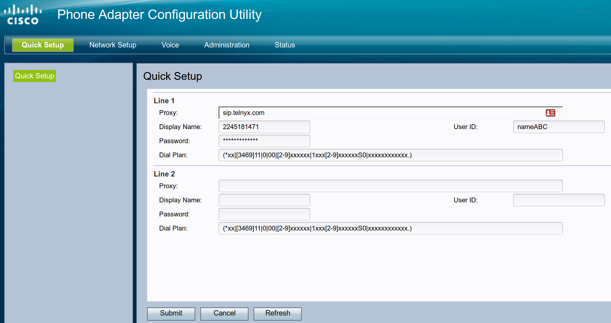
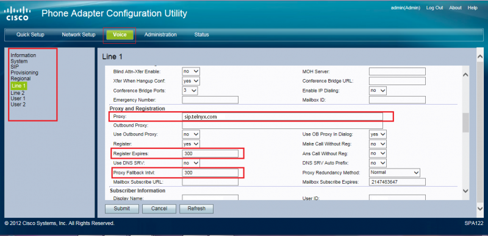
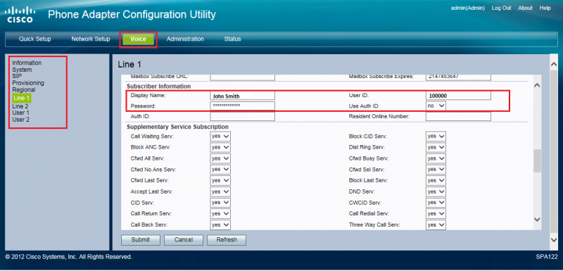
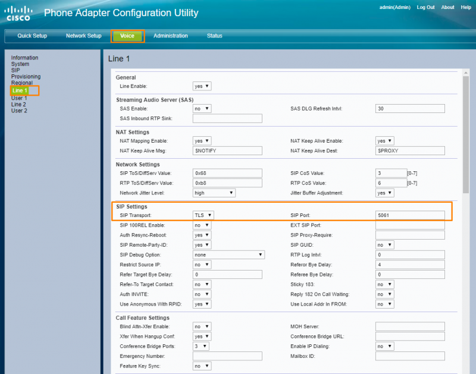

# Configuring your Cisco SPA112/122 ATA

In this guide you will learn to configure your Cisco SPA112 ATA with Telnyx. See Telnyx guidance and requirements.

[Jump to Instructions](#h_e427ce039a)

|  |
| --- |
| ***IMPORTANT:*** *This product has reached its end-of-sale date, with end-of-life announcements shared by Cisco in 2019. Cisco will continue to provide basic customer support until 2025, with the last service contract renewal scheduled for 2024. For more information, please see [Cisco's SPA end-of-life documentation](https://www.cisco.com/c/en/us/products/collateral/unified-communications/small-business-voice-gateways-ata/eos-eol-notice-c51-743206.html) for more details.* |
| ***Note:*** *Issues have been reported with using Firefox to configure this device. Consider using Chrome or IE for configuration.* |

The Cisco SPA 112/122 is a compact broadband device that is compatible with international voice and data standards. It has been a popular choice for small-business VoIP solutions throughout its life with features that both connect employees and serve customers across the highly secure network Cisco has become known for.

Further documentation:

* [https://www.cisco.com/c/en/us/support/unified-communications/spa122-ata-router/model.html](https://app.intercom.com/) - Cisco SPA 112/122 product documentation
* [https://www.cisco.com/c/en/us/products/collateral/unified-communications/small-business-voice-gateways-ata/eos-eol-notice-c51-743206.html](https://app.intercom.com/) - Cisco SPA 112/122 end-of-life documentation

---

## Instructions for configuring Cisco SPA 112/122 to work with your Telnyx Mission Control Portal

In this walkthrough, you will:

1. [Access the Cisco SPA 112/122 configuration page](#h_02156861e5)
2. [Access the Cisco SPA 112/122 Phone Adapter Configuration Utility](#h_0fb8d2f1ee)
3. [Configure your Telnyx Mission Control Portal to work with your Cisco SPA](#h_1c593194ad)
4. [Configure the voice line](#h_9793ae42c9)
5. [Verify Subscriber Information and Codecs](#h_e0e51b8fdb)
6. [Set up a dialplan](#h_a2de31e9ef)
7. [OPTIONAL: Audio Optimization](#h_7be4eb68bc)
8. [OPTIONAL: Encrypt your SIP traffic by enabling TLS](#h_0263010e2a)

**Pre-Requisites**

* It is STRONGLY recommended that your device has the latest firmware updates:

  + SPA112 | ([Download latest](https://software.cisco.com/download/home/283998771/type))
  + SPA122 | ([Download latest](https://software.cisco.com/download/home/283998793/type))
* You have a [number](https://support.telnyx.com/en/articles/4380325-search-and-buy-numbers) in your account.
* You have [configured a connection.](https://support.telnyx.com/en/articles/1177115-how-to-setup-a-did-to-sip-connection)
* You have [assigned that number to the connection.](https://support.telnyx.com/en/articles/1177115-how-to-setup-a-did-to-sip-connection)
* You have [configured an outbound profile.](https://support.telnyx.com/en/articles/4320411-more-about-outbound-voice-profiles)
* You have assigned your connection to the outbound profile.

## 1. Accessing the Cisco SPA 112/122 configuration page

This section will help you connect your device to your network and navigate through your router to the Cisco device settings.

1. Physically hook the device to your network through your router.
2. Open a web browser (Chrome or IE, NOT Firefox as it has known issues) and enter 192.168.0.1 (or possibly 192.168.1.1). Refer to your router's instructions if you need more information.
3. Your own router will likely as for a username/password combination. Enter these when asked.

   1. If you have not set this, your router is probably still set up with its default username and password. It is HIGHLY recommended you change this.
4. In your router's menu, find the page showing a list of devices that are connected to your router, as well as their internal IP addresses. For information on how to find this page, consult your router's documentation or call your ISP for assistance.
5. In the connected devices list, find the Cisco SPA 112 or Cisco SPA 122 device. It should contain the words "SPA112" or "SPA122"
6. Click on the IP address corresponding to this device, or copy it and paste it into your browser and hit enter to navigate to this address. This will take you to the device's Configuration Utility.

|  |
| --- |
| ***Note:*** *For SPA 122, one address may not take you to the Configuration Utility, or may take you to the utility, but with some functions disabled. If this happens, try the other address.* |

## 2. Access the Cisco SPA 112/122 Phone Adapter Configuration Utility

1. When you open the Cisco Phone Adapter Configuration Utility, you'll be asked to log in. For your first login, you'll use a set of default credentials that come standard with the device:

   * **Username:** admin
   * **Password:** admin

   ***IT IS STRONGLY RECOMMENDED THAT YOU CHANGE THESE AS SOON AS POSSIBLE.***
2. You'll now configure some connection settings in your Telnyx Mission Control Portal. Keep the Cisco Phone Adapter Configuration Utility window open. You'll be coming back here soon.

## 3. Configure your Telnyx Mission Control Portal to work with your Cisco SPA

1. Log into your Telnyx Mission Control Portal.

   [Log in here](https://portal.telnyx.com/#/app/connections)
2. Change the inbound settings of the connection on the **Inbound** tab on the **Connection Options** screen to the following:

   1. **Number Format (DNIS):** SIP Username

      

      The Cisco SPA112 ATA, as well as other ATAs, require you to have inbound calls sent to the username configured on the device in the SIP settings.
      ​
      The easy way to set this up is to have the phone number as the username of the trunk, however Telnyx doesn't support phone numbers as connection usernames.
      ​
      Instead, we suggest you have inbound calls sent to the alphanumeric username of the connection instead of the number. This will send calls to your ATA through the username associated with your connection and completes your trunk configuration on the Telnyx side.
3. Click **Save**.

## 4. Configure your Cisco SPA Settings

1. Click on the **Voice** tab, then the **SIP** sub-tab. Modify the settings as follows:

   * **STUN enable:** Yes
   * **STUN server:** stun.telnyx.com
   * **STUN test enable:** Yes

   
2. Click **Submit**.
3. Return to the Cisco Phone Adapter Configuration Utility.
4. Click on the **Quick Setup** tab. Modify the settings as follows:

   * **Proxy:** sip.telnyx.com
   * **Display Name:** your\_DID (i.e.: 12245181471)
     ​*Note that Some versions of the Cisco ATA software would send the Display Name in the registration, this is incorrect as our systems would think this is actually the username. If you are having issues registering with these settings remove the Display Name and leave it blank. You then need to configure a caller ID override on the outbound settings of your connection in the portal to make sure you send a valid Caller ID.*
   * **User ID:** your\_user\_name (ie. usernam12345) the same username from the connection on your portal.
   * **Password:** your\_password (ie. nameabcpass) the same password from the connection on your portal.
   * **Dial Plan:** See [Dial Plan for Linksys ATAs](https://support.telnyx.com/en/articles/5721953-linksys-dialplan-for-linksys-atas).

   
5. Click **Submit**.
6. To configure the Caller ID override, [see this guide](https://support.telnyx.com/en/articles/1130720-caller-id-outbound-vs-cnam#h_60493e0dd1).
7. Click on the **Quick Setup** tab.

## 5. Configure the voice line

1. From the Cisco Phone Adapter Configuration Utility, click on the **Voice** tab.
2. In the left menu, click **Line 1**. (If you're looking to configure a different line, select this one instead.)
3. Find the **General** section and set:

   1. **Line Enable**: yes
4. If your environment uses NAT, Find the **NAT Settings** section and set:

   1. **NAT Mapping Enable**: yes
   2. **NAT Keep Alive Enable**: yes
      ​
      ​*If your environment doesn't use NAT, keep these settings disabled.*
5. Find the **SIP Settings** section and set:

   1. **SIP Port**: 5060

   
6. If you are looking to configure T.38 on your device, stay on the **Voice** tab and find the **Audio Configuration** section. (If you are not, skip to step 7) Set:

   1. **Fax Enable T38:** yes
7. Find the **Proxy and Registration** section and set:

   1. **Proxy:** sip.telnyx.com
   2. **Register Expires:** 300
   3. **Proxy Fallback Intvl:** 300
   4. **Register:** yes
   5. **Use DNS SRV:** no
   6. **DNS SRV Auto Prefix:** no

   
8. Click **Submit**.

## 6. Verify Subscriber Information and Codecs

1. From the **Voice** tab, find the **Subscriber Information** section and ensure that your display name looks as expected and:

   1. **User ID:** Your SIP username
   2. **Password:** Your SIP password

   
2. Find the Audio Configuration section. From here, you can verify or change the [audio codec](https://telnyx.com/resources/codecs-affect-voip-sound-quality) that you will use for your calls. The preferred codec is g711u or g729.

   

## 7. Dialplan

1. Find the Dial Plan section and ensure the dial plan showing here matches the one you set in step 3.6.

## 8. OPTIONAL: Audio Optimization

Cisco's default settings (SIP T1 = 0.5 sec, RTP packet size 0.030 on most Sipura adapters) could possibly cause retransmission over high latency-connections, which can cause issues with audio becoming choppy or breaking up. To mitigate this:

1. From the **Voice** tab, find the **SIP Timer Values (sec)** section and set:

   1. SIP T1: 1
2. Find the **RTP Parameters** section and set:

   1. **RTP Packet Size:** 0.02
   2. **RTP Port Min:** 10000
   3. **RTP Port Max:** 20000

   

## 9. OPTIONAL: Encrypt your SIP traffic by enabling TLS

1. From the Cisco Phone Adapter Configuration Utility, click on the **Status** tab.
2. In the **System Information** section, ensure your device is on the [latest firmware](https://www.cisco.com/c/en/us/support/docs/smb/unified-communications/cisco-small-business-voice-gateways-and-atas/smb2676-firmware-upgrade-on-spa112-and-spa122.html).
3. To enable TLS for your line, return to the **Voice** tab and go to the **Supplementary Service Settings** section. Set:

   1. **Secure Call Setting:** yes

   
4. To configure the transport and port, scroll to the **SIP Settings** section and set:

   1. **SIP Transport:** TLS
   2. **SIP Port:** 5061

   
5. In order to use secure calling, Cisco requires you to have a CA certificate. You will need to import this. On the lefthand menu, click on the **Provisions** link.
6. Scroll to the **CA Settings** section and set:

   1. **Custom CA URL:** <https://crt.sh/?id=1199354>

   
7. Click **Submit**. The device will reboot in order to enable TLS.

## NOTES

|  |
| --- |
| ***Note:*** *During secure calls, you will year a couple of beeps now and then. If you want to disable this notification, you can do so from **Voice > Regional** and find the **Call Progress Tones** section. From here, you can clear the **Secure Call Indication Tone** field. To re-enable it, repopulate this field with 397@-19,507@-19;15(0/2/0,.2/.1/1,.1/2.1/2)*  [Call progress tones portal.](https://downloads.intercomcdn.com/i/o/417526166/4fa5b1d256d1a00ecb04e6dc/800px-SPA_Regional_Tone.png?expires=1783506600&signature=0a376b9fe30ecebb144e3991eb72aed82c8da8e625dd47b057339d014fb9d302&req=cCEgE8t4nIdZFb4f3HP0gLLeH44odxS5VpX3kQINwEki3uDxLrwrZIJxi2WA%0AgBI%3D%0A) |

---

## Additional Resources

* [Cisco SPA 112/122 product documentation](https://www.cisco.com/c/en/us/support/unified-communications/spa122-ata-router/model.html)
* [Cisco SPA 112/122 end-of-life documentation](https://www.cisco.com/c/en/us/products/collateral/unified-communications/small-business-voice-gateways-ata/eos-eol-notice-c51-743206.html)
* [Cisco Linksys Star Codes](https://app.intercom.com/a/apps/ltcafuzd/articles/articles/5724344/show)
* [Dial Plan for Linksys ATAs](https://app.intercom.com/a/apps/ltcafuzd/articles/articles/5721953/show)

---

---

Related Articles

[Configuring a Cisco CUBE/CUCM IP Trunk](https://support.telnyx.com/en/articles/1130606-configuring-a-cisco-cube-cucm-ip-trunk)[Cisco: Configure a Cisco CME IP Trunk](https://support.telnyx.com/en/articles/1130612-cisco-configure-a-cisco-cme-ip-trunk)[Configuring a Cisco CME Credentials Trunk](https://support.telnyx.com/en/articles/1130668-configuring-a-cisco-cme-credentials-trunk)[Configuring a Cisco CUBE/CUCM SIP Trunk](https://support.telnyx.com/en/articles/1130673-configuring-a-cisco-cube-cucm-sip-trunk)[Cisco: 68xx/88xx Setup](https://support.telnyx.com/en/articles/5820309-cisco-68xx-88xx-setup)

Did this answer your question?

😞😐😃
