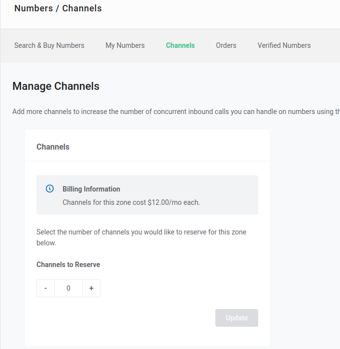
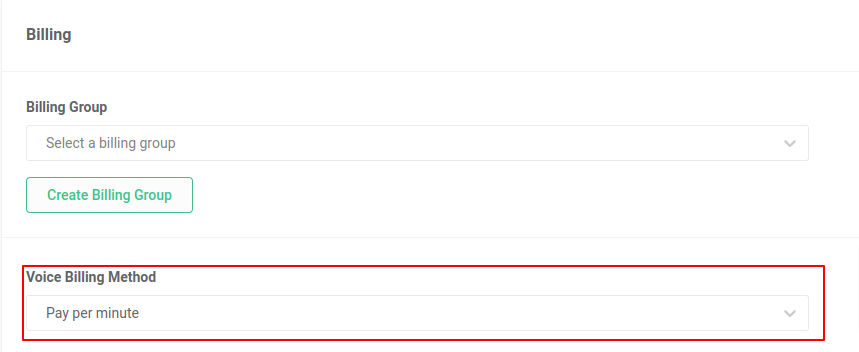

Channel Billing and how to use it | Telnyx Help Center

[Skip to main content](#main-content)

# Channel Billing and how to use it

Learn how Telnyx channel billing works with a few detailed example scenarios.

Written by Dillin

October 18, 2023

Table of contents

# **What is Channel Billing?**

Channel billing is an alternative billing method that allows you to pay a flat fee for unlimited inbound minutes. Instead of being billed based on your inbound minutes of usage, you select the number of concurrent calls you would like to be able to support for your inbound traffic and pay per channel.

Each channel allows for one concurrent (or simultaneous) inbound call. You can use as many inbound minutes as you want with no additional charges; however, you can only support one call at a time per channel provisioned. For example;  
​  
​**Please Note:** Channel billing is only applicable for standard DID's. Toll free or international DID's only have the option for ***pay per minute***.  
​

## **Example Channel Billing**

You have the following setup with 3 numbers and 2 channels all set to channel billing.

### **Numbers:**

[555-111-1111](https://app.intercom.io/#) (channel billing)

[555-222-2222](https://app.intercom.io/#) (channel billing)

[555-333-3333](https://app.intercom.io/#) (channel billing)

### **Channels Provisioned: 2**

Let's say you receive a call on your 1111 number and one of your peers answers the phone. You now have 1 concurrent/simultaneous call in progress. If you receive another call to any of your numbers it will ring and you will be able to answer the call per usual. When you answer this second call, you will now have 2 concurrent/simultaneous calls in progress. With only 2 channels provisioned, you have now maxed out your channels and cannot support any additional inbound calls. If someone were to dial your number while you have 2 simultaneous calls in progress, they will receive a busy tone and have to try you again later.

## Important Notes about Channel Billing

## **Channels can be shared across multiple numbers.**

Like in the example above, you do not need to have one channel for each number. When you enable channel billing for a number, it will share the total channels provisioned with all the other numbers with channel billing enabled. So, you could have 5 channels shared across 10 numbers and use unlimited inbound minutes on these 10 numbers with no additional charges. This means you can only support a maximum of 5 simultaneous calls across all 10 numbers at any time.

## **You can have more channels than numbers.**

You could also have more channels than numbers. For example, you may purchase a single phone number but want to be able to support multiple simultaneous calls to that number. If you purchased 5 channels and set a single number to channel billing, then that number would be able to receive up to 5 calls at the same time. If you then added another number to channel billing, you'd have 2 numbers which both have unlimited inbound minutes at no charge and you'd be able to support up to 5 simultaneous calls across both numbers.

## **You can set some numbers to pay per minute and others to channel billing on the same account.**

In certain use cases, it makes sense to have some numbers billed on channels while others set to pay per minute. This can be done by simply assigning the appropriate billing method for each number. All of the numbers set to pay per minute will be billed based on minutes of usage and will NOT affect your channel limit. Only those numbers set to channel billing will have unlimited usage and concurrent calls will be limited by the channels you have provisioned.

## **Setting Up Channel Billing**

Here is a guide on how to set up Channel Billing on the Telnyx Mission Control. Please note that you need to first add channels before you can set a number to channel billing.

Setting up channel billing on the Telnyx Mission Control portal is super easy. Once you've purchased the numbers you'd like to setup with channel billing you can simply follow the step-by-step guide below to setup channel billing in just a few clicks.

1. Login to your [Mission Control Portal](https://portal.telnyx.com/#/app/home) account
2. Navigate to the Channels tab within the "Numbers" section on the left hand navigation menu.

   
3. Use the plus (+) or minus (-) buttons to add or remove channels and click "Update".
4. Navigate to your number's settings page and scroll down to the billing section. You can now select "Channel" as an option in the drop-down for billing method.

   
5. Share channels across multiple numbers by enabling the channel billing method for all the numbers you'd like

Just like that, you're all setup with channel billing!

---

Related Articles

[Global Number Types](https://support.telnyx.com/en/articles/1458084-global-number-types)[Telnyx Dashboards](https://support.telnyx.com/en/articles/4307059-telnyx-dashboards)[SIP Connection: Inbound & Outbound Settings](https://support.telnyx.com/en/articles/4404448-sip-connection-inbound-outbound-settings)[Telnyx SIP Response Codes](https://support.telnyx.com/en/articles/4409457-telnyx-sip-response-codes)[Channel Billing](https://support.telnyx.com/en/articles/8428806-channel-billing)

Did this answer your question?

😞😐😃

Table of contents
