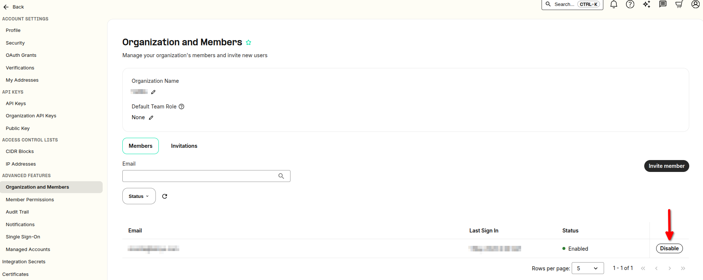
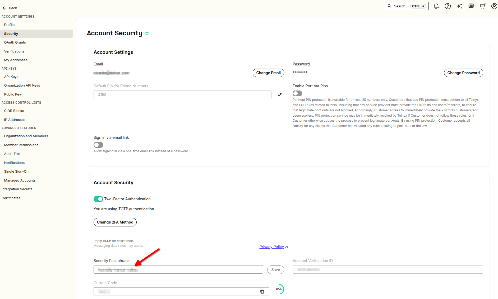

How do I cancel my account | Telnyx Help Center

[Skip to main content](#main-content)

# How do I cancel my account

Unfortunately things can change and you might need to cancel your account. Find out how to do so here.

Written by Telnyx Sales

May 1, 2026

Table of contents

# How do I cancel my account?

If you wish to remove a member from your organization, you can do it in the [Organization and Members](https://portal.telnyx.com/#/advanced-features/members) section:

If you wish to cancel your own account, please email [support@telnyx.com](mailto:support@telnyx.com) with the Security Passphrase for the account.

## What is the security passphrase?

A security passphrase, often simply referred to as a passphrase, is a sequence of words or other text used to control access to a computer system, program, or data. It functions similarly to a password in providing security, but it is generally longer and composed of multiple words, which can make it both more secure and easier to remember than a typical password.

## Where is the security passphrase?

The **Security Passphrase** is not the account password used to login. You can find the Security Passphrase in the [Account Security](https://portal.telnyx.com/#/account/my-account/security) section:​

​**NOTE**: These actions can only be approved from the email address of the **account owner**.

## How do I un-cancel / re-enable my account

To un-cancel or re-enable a cancelled account, please email [support@telnyx.com](mailto:support@telnyx.com) from the email address you'd like to activate again or if you are the organisation owner of a sub member who has been cancelled, please provide their email address.

---

Related Articles

[How do I test E911 service?](https://support.telnyx.com/en/articles/1130709-how-do-i-test-e911-service)[I Received a Port-Out Notification](https://support.telnyx.com/en/articles/2030667-i-received-a-port-out-notification)[How to setup your Account Settings](https://support.telnyx.com/en/articles/4280610-how-to-setup-your-account-settings)[How to Sign Up for a Telnyx account](https://support.telnyx.com/en/articles/5295540-how-to-sign-up-for-a-telnyx-account)[Telnyx Freemium Accounts](https://support.telnyx.com/en/articles/14327893-telnyx-freemium-accounts)

Did this answer your question?

😞😐😃

Table of contents
