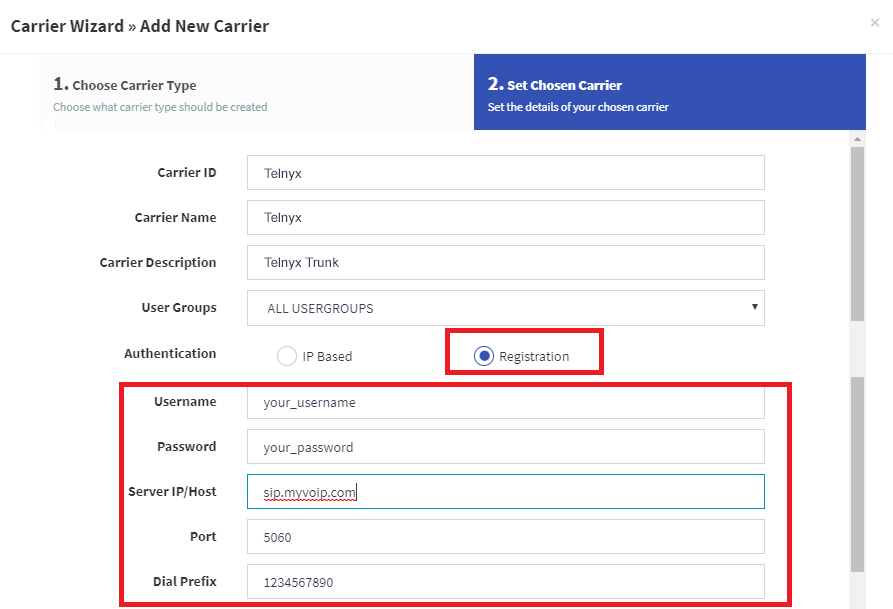
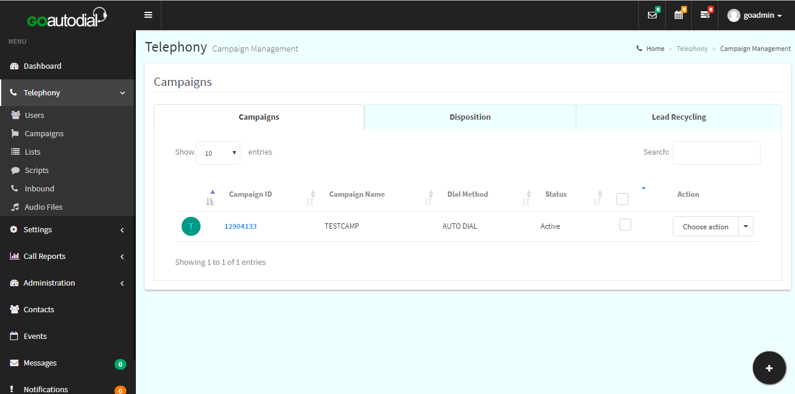
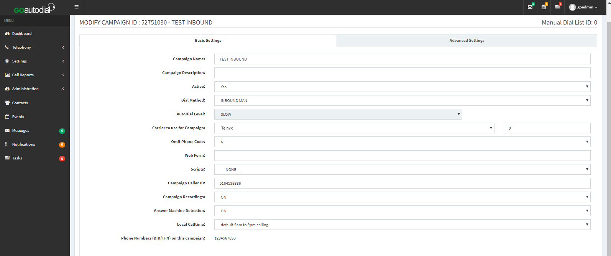
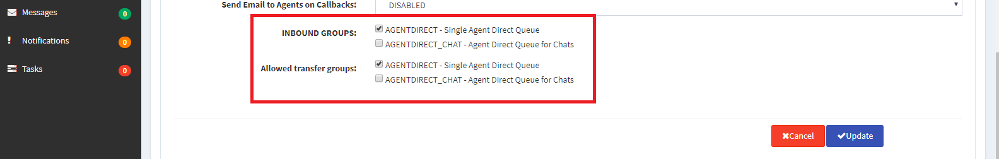
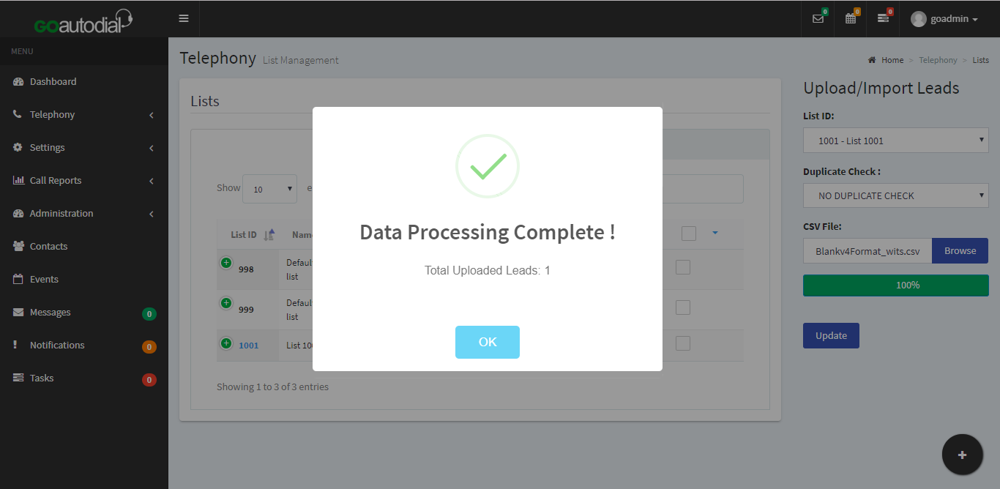

# Configuring a GoAutoDial PBX SIP Trunk

In this article we will walk you through configuring a GoAutoDial PBX user/pass trunk with Telnyx. See Telnyx guidance and requirements.

C


[Jump to Instructions](#h_45171fa155)

[GOautodial](https://goautodial.com/) is a free, enterprise-grade open source omni-channel contact center system designed and built for businesses of all sizes. It boasts inbound and outbound (predictive and preview), and blended dialing, WebRTC, real-time dashboard used to quickly track agent activities, reports, analytics, and more. It is REST-powered under the hood and was proudly built using trusted open-source tech.

Some more of the major GOautodial features include:

* Predictive, preview and manual dialing + inbound IVR and ACD
* Customer Relationship Manager (CRM)
* Ticketing system (under development)
* Instant messaging (under development)
* Social media (under development)

Additional documentation:

* [GOautodial documentation](https://goautodial.org/projects/goautodialce/wiki)
* [GOautodial forums](https://goautodial.org/projects/goautodialce/boards)
* [GOautodial github](https://goautodial.org/)
* [GOautodial system structure](https://goautodial.org/projects/goautodialce/wiki/GOautodial_System_Structure)
* [FAQ](https://goautodial.org/projects/goautodialce/wiki/FAQ)

---

## Instructions for Configuring GOautodial

In this activity you will:

1. [Configure a SIP trunk](#h_0548128ff3)
2. [Add account details and a dial plan](#h_88371e1982)
3. [Set up an outbound call campaign](#h_43c46e2528)
4. [Set up an inbound call campaign](#h_5748cafcf6)
5. [Import your list of call leads](#h_ae79f61a67)

**Pre-requisites**

* Ensure that your [Telnyx Mission Command Portal is configured properly](https://support.telnyx.com/en/articles/1176636-get-started-with-a-mission-control-account)
* [Purchase a DID](https://portal.telnyx.com/#/app/numbers/search-numbers)
* [Set up your Telnyx SIP connection](https://portal.telnyx.com/#/app/connections)
* [Provision your number](https://portal.telnyx.com/#/app/numbers/my-numbers) (Assign it to a SIP connection)
* [Create an outbound voice profile](https://portal.telnyx.com/#/app/outbound)
* Create a [credentials-based connection](https://portal.telnyx.com/#/app/connections) on your Telnyx Mission Control Portal
* RECOMMENDED: [Enable TLS to encrypt your traffic](https://support.telnyx.com/en/articles/1130711-does-telnyx-encrypt-communication)
* [Download](https://goautodial.org/projects/goautodialce/wiki/Goautodial_Getting_Started_Guidev4) and [install](https://goautodial.org/projects/goautodialce/wiki/Goautodial_Getting_Started_Guidev4) GOautodialer
* Work through GOautodialer's [Getting Started guide](https://goautodial.org/projects/goautodialce/wiki/Goautodial_Getting_Started_Guidev4) up to and including logging into the dashboard (You can stop here, as the steps that follow require Telnyx-specific settings)

**Video walkthrough**

Setting up your Telnyx SIP portal account so you can make and receive calls:

|  |
| --- |
| ***Note:*** *Video walkthrough for GOautodial/Telnyx configuration coming soon. Check back as we update our docs.* |

## 1. Configure a SIP trunk

The first section will walk you through configuring your Telnyx [SIP trunk](https://telnyx.com/products/sip-trunks) with GOautodial.

1. Log into your GOautodial dashboard page and, in the left-hand navigation, find **Settings** and expand it.
2. Click on **Carriers** to open the Carriers page and then click the **+** sign in the lower right corner to add a new carrier.

   
3. You will be asked to choose a carrier type. In this case, choose *Manual*.
4. In the Add New Carrier wizard, provide the following values:

   1. **Carrier ID:** *Telnyx*
   2. **Carrier Name:** *Telnyx*
   3. **Carrier Description:** You can use whatever makes the most sense to you. In this example, we simply named it *Telnyx Trunk*.
   4. **User Group:** *All User Groups*
   5. **Authentication:** *Registration* (As we are authenticating with a username and password)
   6. **Username:** Your Telnyx account username
   7. **Password:** Your Telnyx account password
   8. **Server IP/Host:** *sip.telnyx.com*
   9. **Dial Prefix:** The dial prefix setting will automatically dial a predefined number before every number you dial. For example: If your telephone system requires a 9 to dial an outside number, or a country-prefix to dial another country.
   10. **Codecs:** Set codec preferences here. Telnyx supports the following [audio codecs](https://telnyx.com/resources/codecs-affect-voip-sound-quality):

       1. ulaw(g711u)
       2. alaw(g711a)
       3. g722
       4. g729
   11. **DTMF Mode:** *RFC2833*
   12. **Protocol:** *SIP*
   13. **Port:** *5060* if you have not enabled TLS encryption. If you have, choose *5061*.
   14. **Active:** *Yes* (if you wish to activate the trunk now. Otherwise, you can activate it in the future by going back to your Carriers page and editing your trunk.

       

       

[Back to Top](#h_45171fa155)

## 2. Add account details and dial plan

In this section, we use the advanced configuration option to add a dial plan.

1. Still on the **Carrier** page, with your newly created trunk open, click **Advance Configuration** and confirm or provide the following:

   1. **Account Entry:**

      ```
      Account Entry: [telnyx]
      disallow=all
      allow=ulaw
      allow=alaw
      type=friend
      dtmfmode=rtc2833
      qualify=yes
      nat=yes
      host=sip.telnyx.com
      insecure=invite
      ```
   2. **Dialplan Entry:**

      ```
      exten => _X.,1,AGI(agi://127.0.0.1:4577/call_log)
      exten => _NXXNXXXXXX.,1,Dial(SIP/${EXTEN}@telnyx)
      exten => _1NXXNXXXXXX.,1,Dial(SIP/${EXTEN}@telnyx)
      exten => _6468688074,1,Dial(SIP/8001@default)
      exten => _16468688074,1,Dial(SIP/8001@default)
      ```

[Back to Top](#h_45171fa155)

## 3. Set up an outbound campaign

Today, manual cold calling is considered inefficient. Your call center's success is improved by setting up campaigns. Outbound campaigns effectively start conversations with leads, build brand awareness, and convert the target audience to loyal clients. It’s vital to create a detailed execution plan and hire the right reps to boost your dialing project’s effectiveness. In this section, you'll learn the mechanics of setting up your outbound campaign.

1. Log into your portal as an administrator. From the left-hand navigation, expand **Telephony** and click **Campaigns**.

   
2. Click the **+** to add a new campaign. When prompted for the **Campaign Type**, select *Outbound*.

   
3. Click the link in the **Campaign ID** column to check the campaign settings. you can also select or set preferred settings for your campaign. On the **Basic Settings** tab ensure that you set:

   1. **Dial Method:** You have some choices:

      1. *Manual, Auto\_Dial*
      2. *Predictive*
   2. **Auto Dial Level:** You have some choices:

      1. *Slow*
      2. *Normal*
      3. *Max*
      4. *High*
   3. **Carrier to use for this Campaign:** *Telnyx*. If this option isn't available, revisit section 1 to ensure that you have added Telnyx as a carrier.

      
4. Click **Update** once done.
   ​

[Back to Top](#h_45171fa155)

## 4. Set up an inbound campaign

Inbound marketing campaigns are concentrated efforts that align all of your marketing channels around a single message and goal. It starts with a marketing offer -- something valuable and relevant for your audience that you promote through your marketing channels. In this section, you'll learn the mechanics of setting up an inbound call campaign.

1. Log into your portal as an administrator. From the left-hand navigation, expand **Telephony** and click **Campaigns**.

   
2. Click the **+** to add a new campaign. When prompted for the **Campaign Type**, select *Inbound*.

   
3. Complete the fields in the **Campaign Wizard > Inbound** and ensure that:

   1. **Call Route:** *Ingroup (default)*

      
4. Once your campaign has been created, return to the Campaigns screen (**Telephony > Campaigns**) and click the link in the **Campaign ID** column to check the campaign settings. On the **Basic Settings** tab ensure that you set:

   1. **Carrier to use for this Campaign:** *Telnyx*. If this option isn't available, revisit section 1 to ensure that you have added Telnyx as a carrier.

      
5. Now click on the **Advanced Settings** tab and ensure that:

   1. **INBOUND GROUPS:** Select all options that you'll require

      1. **AGENTDIRECT:** *Single Agent Direct Queue*
      2. **AGENTDIRECT\_CHAT:** *Single Agent Direct Queue for Chats*
   2. **Allowed Transfer Groups:** Select all options that you'll require

      1. **AGENTDIRECT:** *Single Agent Direct Queue*
      2. **AGENTDIRECT\_CHAT:** *Single Agent Direct Queue for Chats*

      

|  |
| --- |
| ***Note:*** *Be sure to advise your agent to select always the ingroup on the **INBOUND CAMPAIGN** once they log in.*  [Inbound campaign icon interface.](https://downloads.intercomcdn.com/i/o/441361768/695af9b9562cacf4ce3e0dbc/Icampaign6.png?expires=1783506600&signature=ca8cc7c8aeacb19b0f81ce66f22fbd86ac8c72d81d383e95841bdc85a3236615&req=cCQmFc9%2FmodXFb4f3HP0gHzCv%2FiZ32pnXfBp%2FJeS81MRozDKHN1w9pfXLcus%0A47E%3D%0A)  [Inbound campaign contact information.](https://downloads.intercomcdn.com/i/o/441361947/1af926bf52418dcdd4ec8fcc/Icampaign7.png?expires=1783506600&signature=d84022b26bf62da59378cd16553bda2e820f2577a55908633e34d6ac6e11b4b9&req=cCQmFc9%2FlIVYFb4f3HP0gOMDJQ4pMltC2jzfZSNJ5wJnqA6xyQuk29YWopn6%0A6zI%3D%0A) |

[Back to Top](#h_45171fa155)

## 5. Import your list of call leads

Before your agents hit the phones, you'll need to make sure you've uploaded a properly formatted set of leads. This section will walk you through this activity.

1. Log into your GOautodial dashboard page and, in the left-hand navigation, find **Telephony** and expand it.
2. Click on **List** to open the List page and then click the **+** sign in the lower right corner to add a new list of leads.

   
3. Now you'll upload a .csv file containing your leads. Make sure that you've followed the lead file format illustrated in the following image and save as .csv comma delimited. (To view this image in full size, right-click on the image and select **Open Image in New Tab** from the context menu.)

   
4. Lead status will be posted after you have successfully uploaded your lead file, Click **OK** once this upload is complete.

   

That's it! You've now completed the basic setup activities required to link GOautodial with Telnyx.

|  |
| --- |
| ***Note:*** *There are a number of other activities that do not involve Telnyx that you will want to complete in order to maximize your GOautodial experience. You can find those exercises [here](https://goautodial.org/projects/goautodialce/wiki/Version_4_HOWTOS).* |

[Back to Top](#h_45171fa155)

---

## Additional Resources

Review our [getting started with guide](https://support.telnyx.com/en/articles/1176636-get-started-with-a-mission-control-account) to make sure your Telnyx Mission Control Portal account is set up correctly.

Additionally, you can check out:

* [GOautodial documentation](https://goautodial.org/projects/goautodialce/wiki)
* [GOautodial forums](https://goautodial.org/projects/goautodialce/boards)
* [GOautodial github](https://goautodial.org/)
* [GOautodial system structure](https://goautodial.org/projects/goautodialce/wiki/GOautodial_System_Structure)
* [FAQ](https://goautodial.org/projects/goautodialce/wiki/FAQ)

---

Related Articles

[Asterisk: Configure an Asterisk IP trunk](https://support.telnyx.com/en/articles/1130628-asterisk-configure-an-asterisk-ip-trunk)[How to configure a Thirdlane PBX](https://support.telnyx.com/en/articles/1130631-how-to-configure-a-thirdlane-pbx)[Configuring a Vicidial IP trunk with Telnyx](https://support.telnyx.com/en/articles/1130632-configuring-a-vicidial-ip-trunk-with-telnyx)[Configuring a GOautodial PBX IP Trunk](https://support.telnyx.com/en/articles/1130649-configuring-a-goautodial-pbx-ip-trunk)[Configuring an Elastix 4 PBX Trunk](https://support.telnyx.com/en/articles/1130654-configuring-an-elastix-4-pbx-trunk)

Did this answer your question?

😞😐😃
