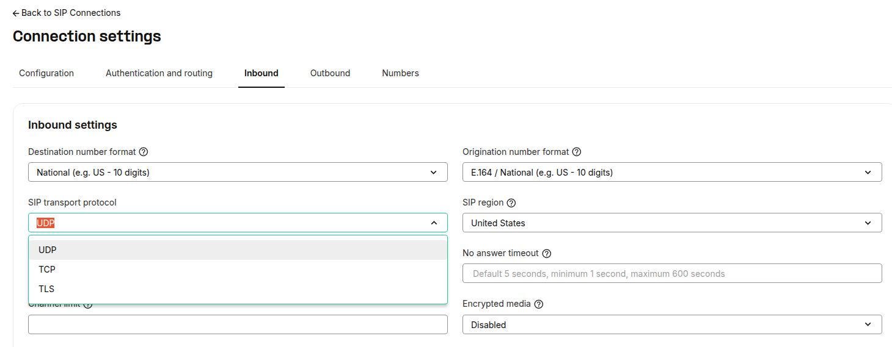

# SIP protocols that Telnyx uses

Wondering what SIP transport protocols are used at Telnyx? See Telnyx guidance and requirements Learn more about SIP protocols that Telnyx uses with Telnyx.

## What SIP transport protocols does Telnyx use?

Telnyx Mission Control supports the following SIP protocols:

* UDP
* TCP
* TLS

Please refer to [sip.telnyx.com](https://sip.telnyx.com/) for more detail.

---

Related Articles

[Gigaset A510: Telnyx Setup](https://support.telnyx.com/en/articles/5815209-gigaset-a510-telnyx-setup)[Fanvil A32i: Telnyx Setup](https://support.telnyx.com/en/articles/6056428-fanvil-a32i-telnyx-setup)[MicroSIP: Setup with Telnyx](https://support.telnyx.com/en/articles/6133145-microsip-setup-with-telnyx)[Grandstream GRP260x: SIP Trunk](https://support.telnyx.com/en/articles/6169513-grandstream-grp260x-sip-trunk)[Grandstream GRP2612: SIP Trunk](https://support.telnyx.com/en/articles/6184147-grandstream-grp2612-sip-trunk)

Did this answer your question?

😞😐😃
