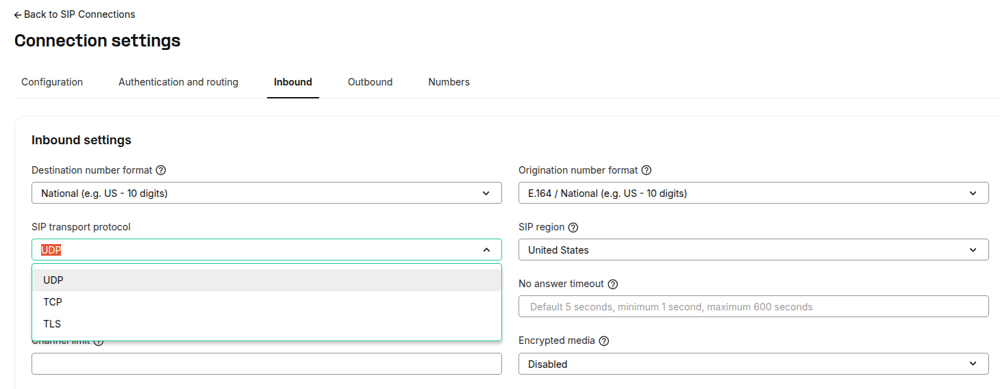

# SIP protocols that Telnyx uses

Wondering what SIP transport protocols are used at Telnyx? See Telnyx guidance and requirements Learn more about SIP protocols that Telnyx uses with Telnyx.

## What SIP transport protocols does Telnyx use?

Telnyx Mission Control supports the following SIP protocols:

* UDP
* TCP
* TLS

Please refer to [sip.telnyx.com](https://sip.telnyx.com/) for more detail.
