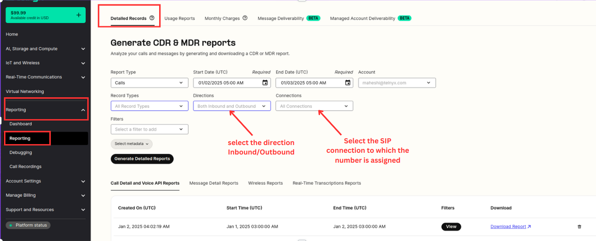
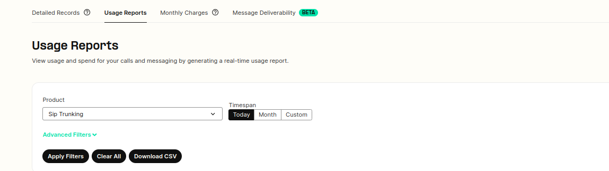

# How to Download Reports at Telnyx

As a Telnyx Customer, you are able to download your own CDR / MDR / Call Control and/or Usage Report whenever you want. See Telnyx guidance and requirements.

## **How to Download My Report Logs?**

You can generate the following report logs:

* Calls
* Messaging
* Voice API
* Fax API
* Wireless
* WebRTC
* Real-Time Transcriptions

To generate a these report logs, please log in to your portal [account](https://portal.telnyx.com/#/login/sign-in), go to the [Reporting](https://portal.telnyx.com/#/reporting/detailed-records) section and choose the related "Report Type".

Request a report for the specific time frame you are looking for.

## **What filters are available?**

Outside of specifying a time-frame, you have other filters available to narrow down certain reports:

* CLI (originating number)
* CLD (destination number)
* Tags (defined at the number for inbound calls or at the outbound voice profile for outbound calls)
* Billing Groups

If you are using managed accounts, you can select the managed account you want to generate a report for.

You have access to record types:

* Completed
* Incomplete
* Errors

As well as call type:

* Inbound
* Outbound

Or the specific connection, application or messaging profile you're interested in filtering report logs for.

## **How to Download Your Usage Report**

1. Usage reports can also be generated here by clicking the **[Usage Reports](https://portal.telnyx.com/#/app/reporting/usage-reports)** at the top of the Reporting section.

Step by step guide to Usage Reports can be viewed [here](https://support.telnyx.com/en/articles/4425016-reporting-usage-reports).

---

Related Articles

[Distinguish your outbound profiles & DIDs](https://support.telnyx.com/en/articles/1130721-distinguish-your-outbound-profiles-dids)[Reporting: Overview](https://support.telnyx.com/en/articles/4305547-reporting-overview)[Telnyx Dashboards](https://support.telnyx.com/en/articles/4307059-telnyx-dashboards)[Telnyx SIP Response Codes](https://support.telnyx.com/en/articles/4409457-telnyx-sip-response-codes)[Reporting: Detail Requests](https://support.telnyx.com/en/articles/4424926-reporting-detail-requests)

Did this answer your question?

😞😐😃
