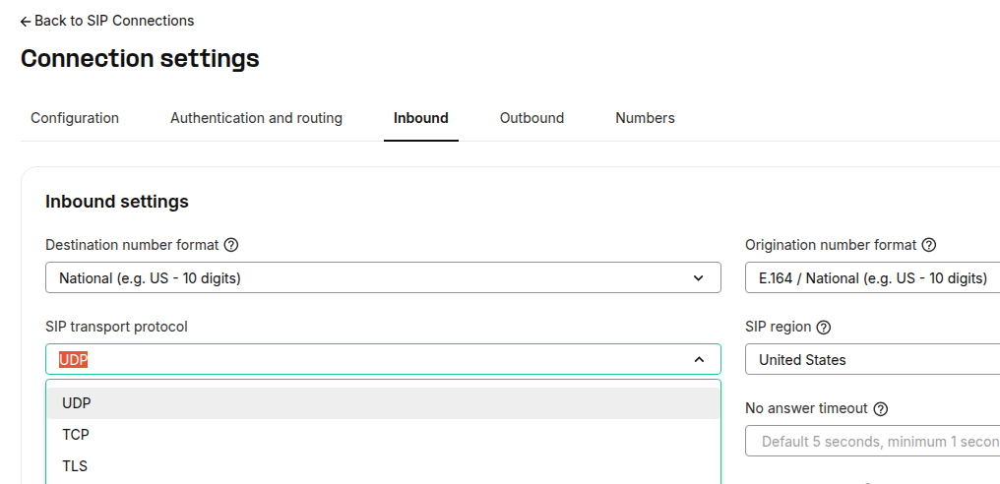
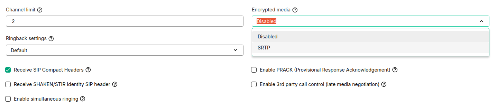

Does Telnyx encrypt communication? | Telnyx Help Center

[Skip to main content](#main-content)

# Does Telnyx encrypt communication?

Telnyx ensures secure calls with optional TLS signaling and SRTP media encryption.

Written by Telnyx Sales

January 29, 2026

Table of contents

# Does Telnyx encrypt communication?

By default, Telnyx does not encrypt calls. If your device supports TLS (Transport Layer Security) to encrypt signaling and SRTP to encrypt media, you can turn on these settings on your connection (see screenshots below) for end-to-end encryption.

Additionally, at Telnyx, we leverage our private network to pull your traffic off the public web and carry the media across our own fiber. By handling the media, we are able to ensure that your packets are exposed to as few public hops as possible.

For outbound calls, you can configure your device to use TLS and SRTP and make calls without further configuration on the Telnyx portal.

For inbound calls, you can enable TLS and SRTP in the [Connections page](https://portal.telnyx.com/#/voice/connections).

**Encrypting inbound signaling in the Telnyx portal:**  
On the Real-Time Communications tab, navigate to Voice -> SIP Trunking and to the Connection settings, and if IP/FQDN, you can encrypt the inbound signaling here:

**Encrypting media in the Telnyx portal:**  
​  
In the same section as above:

Read more about specific details of TLS [here](https://support.telnyx.com/en/articles/4404575-tls-and-srtp).

---

Related Articles

[Algo 8xxx: Telnyx Endpoints](https://support.telnyx.com/en/articles/5790092-algo-8xxx-telnyx-endpoints)[ScopTEL IP PBX](https://support.telnyx.com/en/articles/5803103-scoptel-ip-pbx)[Vtech VCS754: Telnyx Setup](https://support.telnyx.com/en/articles/5822901-vtech-vcs754-telnyx-setup)[MicroSIP: Setup with Telnyx](https://support.telnyx.com/en/articles/6133145-microsip-setup-with-telnyx)[BYOC: Telnyx & Genesys](https://support.telnyx.com/en/articles/8268122-byoc-telnyx-genesys)

Did this answer your question?

😞😐😃

Table of contents
