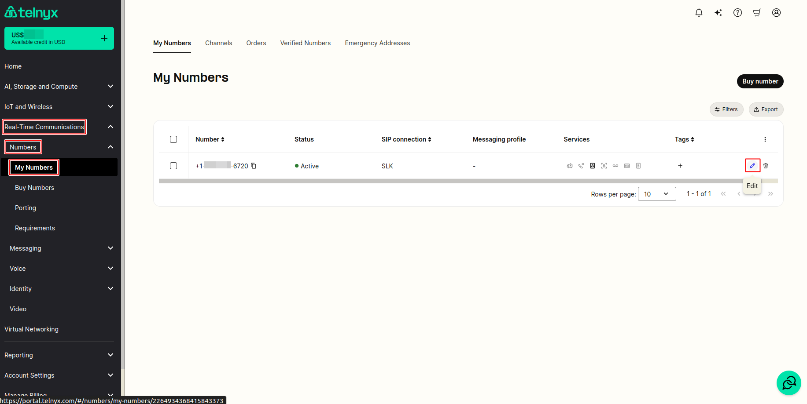
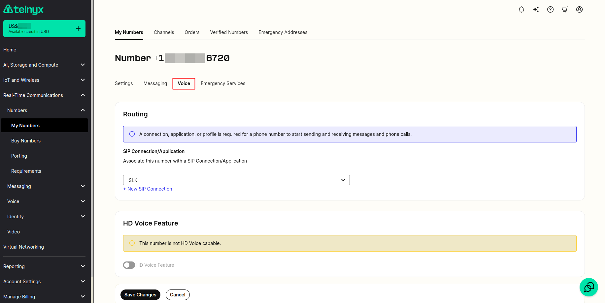
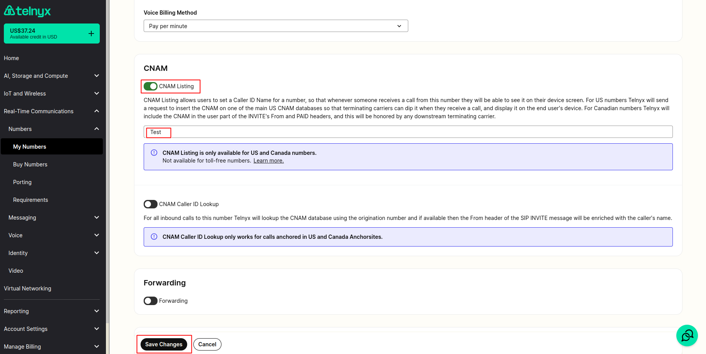
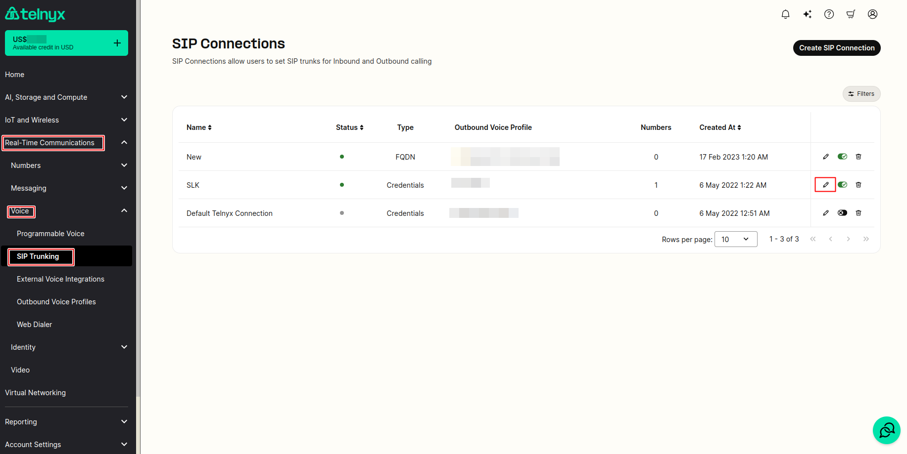
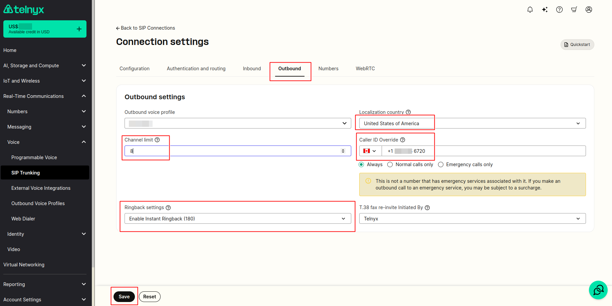

Caller ID Outbound vs CNAM | Telnyx Help Center

[Skip to main content](#main-content)

# Caller ID Outbound vs CNAM

Learn the differences between CID (Caller ID Number) and CNAM (Caller ID Name) and how to set it up with Telnyx.

Written by Telnyx Sales

December 31, 2025

Table of contents

# **What is Caller ID?**

There are two types of Caller ID: *Caller ID Number (CID)* and *Caller ID name (CNAM).*

* **CID** is a service that displays your phone number to the **phone of the individual you are calling** (on an outgoing call).

* **CNAM** is a service that displays the name associated with **your phone number to the phone of the individual you are calling** (on an outgoing call).

## How can I set up Caller ID with Telnyx?

### Inbound Caller ID Number

By default, Telnyx will provide the CLI (Calling Line Identification) number for all calls being received on a Telnyx number. Once a number is provisioned on our service, we will automatically include the caller ID number when sending you your inbound calls.

### Inbound Caller ID Name

Inbound Caller ID Name will allow you to have the name of the individual calling appear on your phone when receiving calls. You can activate this feature instantly via the Mission Control portal.

To set up outbound Caller ID Override you can do the following:

1. Under **Real-Time Communications** on the left side bar, click on **My Numbers** tab under **Numbers** section. And click on **Pencil** icon in front of the number you wish to make the changes.

   
2. Go to voice section of the number

   
3. You may then toggle on/off the **CNAM Listing** option to enable the feature and and then define the CNAM in the box. Once the CNAM text is defined, you may save the changes.

   

***Standard pricing for inbound caller ID name is $0.40/mo for each number - subject to change***

## Outbound Caller ID Number

When placing an outbound call via Mission Control, we will pass the caller ID number that you use with the call. That is, whatever CLI (calling line identification) you are sending with the call will be shown to the party receiving the call. If you do not provide a CLI, your call will go through with "anonymous" displayed to the receiving party.

Note: Telnyx Mission Control provides you with the ability to setup Caller ID Override at the connection level. This will enable you to set a default outbound caller ID number for all calls for a particular connection. This would ensure that even if you do not provide a CLI when placing an outbound call, we will make sure to set the CLI to the Caller ID Override number you provide.

## To set up outbound Caller ID Override you can do the following:

1. Under **Real-Time Communications** on the left side bar, click on **SIP Trunking** tab under **Voice** section. And click on **Pencil** icon in front of the SIP Connection/Trunk you wish to make the changes.

   
2. Select Outbound sub tab where all the changes should be taking place.

   2.1. Input the number you'd like displayed as your CLI in the "Caller ID Override" field.

   2.2. Select "Always" , "Normal Only" , or "Emergency Only" as per your preference.

   2.3. Then select the Localization Country - this allows the caller to use the international exit code of the chosen country, and also restricts national dialing solely to that country

   2.4. You may opt in for "Channel Limit" - this limits the total number of outbound calls made from this connection.

   2.5. You may opt in for "Expert Settings" - ex: Ringback

   2.6. And save the changes

   

## **Do you support caller ID spoofing on international routes?**

* For outbound calls to international destinations, calls will be rejected as we, and many of the downstream carriers, do not support international spoofing.
* You can typically expect a 503 error response under this scenario so that you can attempt to route advance on your side.

## Outbound Caller ID Name (CNAM Listing)

Outbound Caller ID Name, also referred to as CNAM or CNAM Listing, is what enables you to have your Caller ID Name displayed to the receiving party that you are calling. This is done by registering a Caller ID Name for a number. To set up outbound Caller ID Name (register CNAM), simply edit the settings of the number, click the box to "Enable CNAM Listing", and type in your 15-character Caller ID Name.

Do note that Toll Free numbers do not support CNAM so you'll find the checkbox greyed out.

*(Outbound caller ID name listing is free)*

## CNAM for USA & Canada

The way in which caller ID name (CNAM) works is different in the U.S. as it is in Canada.

## USA

In the U.S., there are several CNAM databases that have a record of every US number and the CNAM associated with the number. When a CNAM listing is enabled on a U.S. number, the CNAM details are inserted into the relevant database.

When a call is placed between two U.S. numbers, the carrier who receives the call will check one of the databases to get the CNAM associated with the number. The carrier will pass the call along with the CNAM to the called party.

## Canada

In Canada, there is no national CNAM database. Instead, the CNAM information is passed in the appropriate SIP headers. The SIP headers are:

* FROM
* P-ASSERTED-IDENTITY

---

## **SPECIAL NOTES**

* When enabling CNAM Listing on Telnyx owned numbers, In most cases **CNAM values get pushed to the database in the first 12 - 24 hours but can take up to 72 hours.**
* CNAM supports up to 15 alphanumeric characters and blanks spaces.  
  ​
* CNAM is not currently supported on our **toll free** or **international** numbers.

  + Toll Free numbers do not support or participate in the CNAM registry and database.
  + Some receiving carriers of your outbound calls may maintain a private database to pass through CNAM info, but it’s not guaranteed.
  + The best option is to use the **FROM/PAID** SIP headers, where you can include your own display name, although this may or may not get passed all the way through to the receiving party either.
  + [Branded calling](https://telnyx.com/resources/how-to-ensure-call-completion) is a solution that carriers are now beginning to implement which should help guarantee what name you want the receiving parties to see on their phone.   
    ​
* When enabling CNAM Listing on numbers belonging to our underlying carriers, it can take 3-5 working days to process to the industry databases.  
  ​
* Please remember, that it's up to the receiving carrier of your outbound calls to display CNAM on their subscribers phones. If the subscribers have not enabled this service with their carriers, then your CNAM may not display on their devices. By default, the destination carriers may display the **rate center, locality** of the callers number instead, where no CNAM value is found.   
  ​
* Please also note, that the industry wide CNAM service is not generally used by Wireless Carriers. So if you dial a wireless/mobile device, your CNAM may not display on their device. The only way around this is if the subscriber includes the name as a contact in their phone-book.

You can use the [number lookup tool](https://support.telnyx.com/en/articles/4366901-your-number-lookup-guide) from your account to verify when the CNAM Listing has been updated on your number.

---

Related Articles

[Set up Inbound Caller ID Name (incoming)](https://support.telnyx.com/en/articles/1130656-set-up-inbound-caller-id-name-incoming)[Caller ID Number Policy](https://support.telnyx.com/en/articles/3546251-caller-id-number-policy)[Your Number Lookup Guide](https://support.telnyx.com/en/articles/4366901-your-number-lookup-guide)[SIP Connection: Inbound & Outbound Settings](https://support.telnyx.com/en/articles/4404448-sip-connection-inbound-outbound-settings)[Xorcom PBX: SIP Trunk](https://support.telnyx.com/en/articles/5754127-xorcom-pbx-sip-trunk)

Did this answer your question?

😞😐😃

Table of contents
