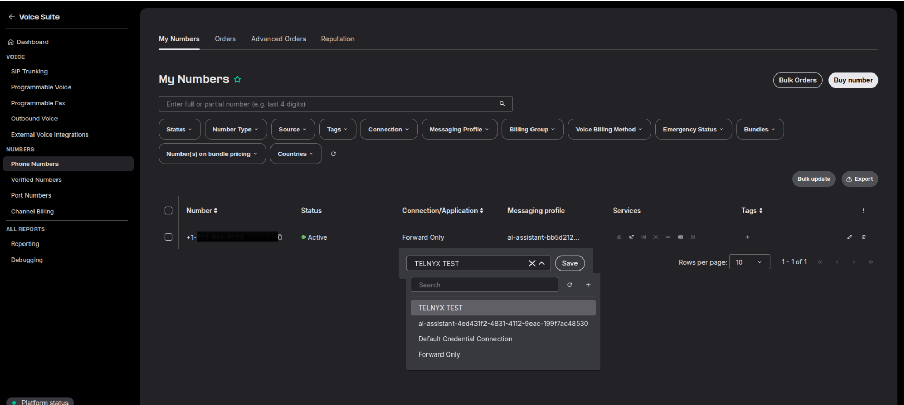
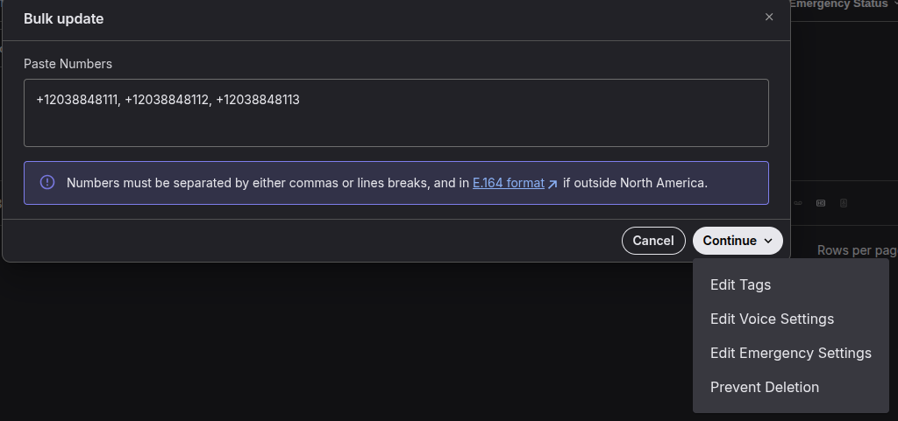
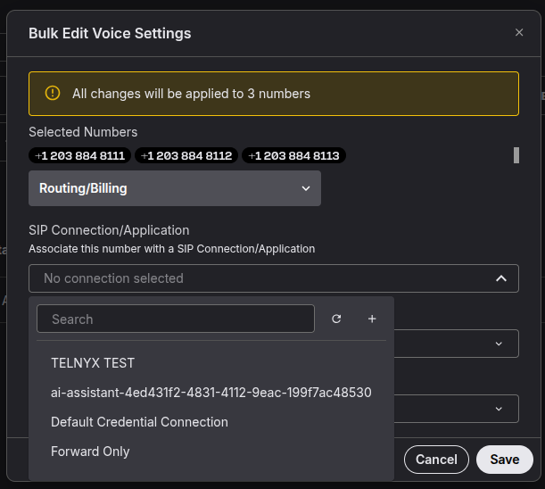
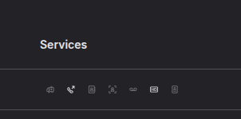

# How To Setup A DID to SIP Connection

This article explains how to assign a DID to a SIP Connection and expounds on the different DID features in Mission… See Telnyx guidance and requirements.

A DID is needed in order to receive inbound calls from our network. You'll have to assign a registered connection on a DID in order to receive inbound calls.

## Assigning a DID to a SIP Connection

Follow these steps to assign a single DID to a SIP Connection on the PHONE NUMBERS section of the NUMBERS page:

1. Hover over the box beneath the **SIP Connection/App** header and click the pencil icon
2. Select the connection you want to assign to the DID from the dropdown

## Assigning Multiple DIDs to a SIP Connection

## Follow these steps to assign multiple DIDs at once to a SIP Connection on the PHONE NUMBERS section of the NUMBERS page:

1. Select the check box to the left of the DIDs you want to edit
2. Click the "Bulk update" button
3. Paste all the numbers you want to update, clic on continue, Edit Voice Settings
4. Select the desired SIP Connection in the connection field
5. Click Save

## DID Services

There are 7 different services we offer on DIDs and information on each can be found in the links below:

* [e911](https://support.telnyx.com/en/articles/1130683-e911-setup-guide)
* [Call Forwarding](https://intercom.help/telnyx/en/articles/2807944-bulk-edit-numbers-call-forwarding)
* [Caller ID Name Listing](https://support.telnyx.com/en/articles/1130720-caller-id-outbound-vs-cnam)
* [Caller ID Name (Incoming)](https://support.telnyx.com/en/articles/1130720-caller-id-outbound-vs-cnam)
* [Inbound Call Recording](https://support.telnyx.com/en/articles/2807846-bulk-edit-numbers-voice-settings)
* [HD Voice](https://support.telnyx.com/en/articles/8394071-hd-voice-number-feature)
* [Inbound Call Screening](https://support.telnyx.com/en/articles/8037040-inbound-call-screening)

---

Related Articles

[SIP Connection: Number Formats](https://support.telnyx.com/en/articles/1130706-sip-connection-number-formats)[SIP Connection: Types](https://support.telnyx.com/en/articles/4245868-sip-connection-types)[My Numbers Page](https://support.telnyx.com/en/articles/4349113-my-numbers-page)[SIP Connection: Settings](https://support.telnyx.com/en/articles/4351104-sip-connection-settings)[Telnyx SIP Response Codes](https://support.telnyx.com/en/articles/4409457-telnyx-sip-response-codes)

Did this answer your question?

😞😐😃
