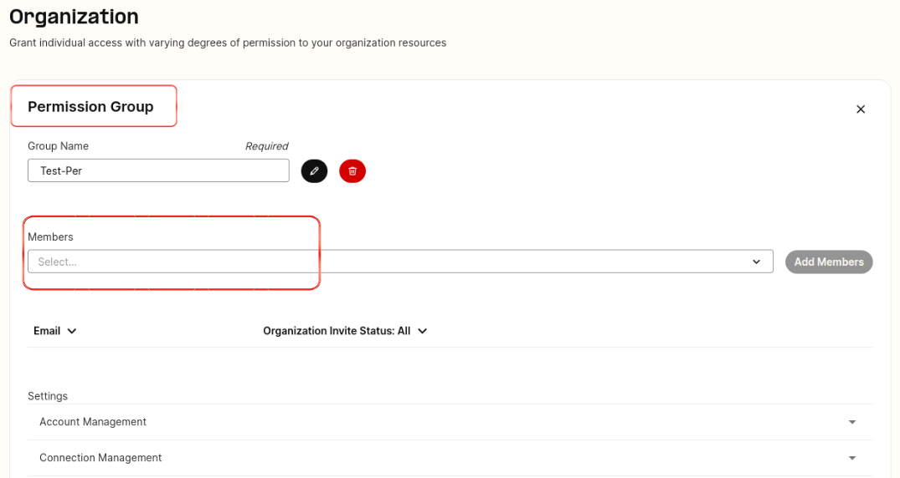
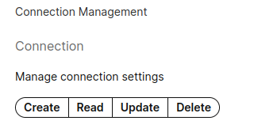
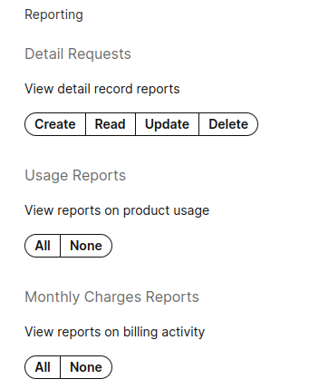
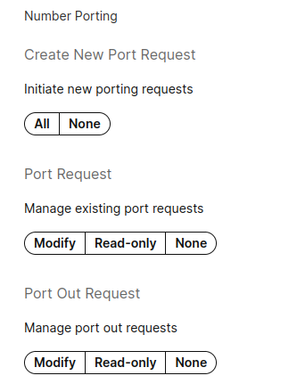
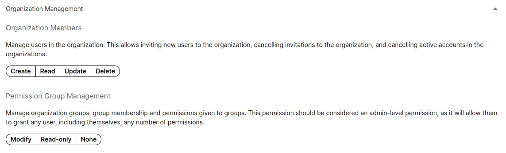
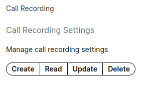
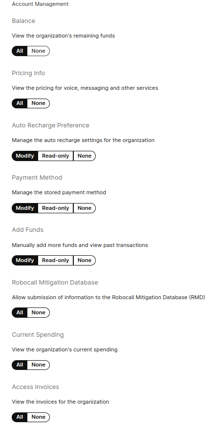

# Get Started with Organizations

This article explains how to create an organization so that you can delegate permissions to sub… See Telnyx guidance and requirements.

## **What are User Organizations?**

User organizations, also frequently just referred to as "organizations," is a feature that allows multiple user accounts to be tied together into one larger "umbrella" entity. An organization is always headed by a single account, the organization owner.

Sub-accounts, also known as sub-members or sub-users, are limited in their capabilities by a permissions system that controls what resources they can and cannot access on your account. An organization owner is fully privileged by default (and can essentially "do anything" with the account), including managing the permissions of the users in their organization.
​
The permissions are managed on a group-level, rather than an individual level, to ensure that it is easy to assign the same permissions to any number of sub-accounts as needed.

In all cases, user organizations are allowed only one net running balance and payment method - it is not meant to be a system for re-sellers to allow their customers access to their Telnyx account directly. Please check out our [managed accounts](https://support.telnyx.com/en/articles/4951492-managed-accounts) feature instead.

## **Configure User Organizations**

The [Organizations](https://portal.telnyx.com/#/app/advanced-features/organizations) section is located under "Account Settings" and "Advanced Features" in the sidebar of the Mission Control Portal.

[Go to Organizations in the portal](https://portal.telnyx.com/#/app/advanced-features/organizations)

## **Guide to setting up the User Organisation**

A non-organisation user may start an organisation once they are level 1 verified.

Once a user has created an organisation, they will be able to send email invitations to others to join the organisation as sub members.

They will also be able to see and manage any invitations they have sent that have not been accepted.

## How can I add users to my account - **Invitations?**

How can I add users to my account?

Invitations are sent to invite people to join an organization**.** A user, that you want to send an invite to join your organization, must not be signed up with Telnyx already in order for them to be invited. Once the user accepts, they become a sub-member of your organisation.

##

Invitations can be revoked once sent to prevent using them to sign up to join the organization. (Note that revoking an invitation does not prevent the person from signing up for Telnyx entirely, but if they do sign up, they will be a separate non-organization account like normal.)

**Please note there are limits surrounding invites to an organization.**

1. Invites are limited to 10 per hour, including deleted and revoked invites
2. You cannot have more than 10 invites open at any given time
3. An invitation can only be resent up to 5 times, and can only be resent every 5 minutes.

## **Groups & Permissions**

Once a sub member has accepted an invitation, you can then proceed to creating a permission group in which they can be added to. In this permission group, you define the permissions the user is allowed.
​
For example, the below permission group is called "billing permissions" and I have one member assigned to it. I will provide this member with billing permissions, so they can assist with payments, downloading invoices, pricing etc.

## What **permission sets are available?**

As an organization owner, you can delegate the exact permission set required to your sub member based on the tasks they can help complete on your behalf. The ideal case is that you create a permission group that's named after the permissions you want to make available.

These available permission sets, with a brief description of what they allow you to do, are shown below. The pictures include an example of what permissions are enabled with the green filled backgrounds.

### Account Management Permissions

Manage general account preferences such as balance, pricing, auto-recharge, payment method, adding funds, and invoices.

### Connection Management Permissions

Create, read, update and delete connections or applications.

## Numbers Permissions

Manage Bulk Number Updates, Channel Settings, Number (DID) Settings, Number Deletions, Number Purchasing and Telephone Data Integration settings.

## Outbound Permissions

Manage outbound profile settings by toggling Modify, Read-only and None options.

## Reporting Permissions

Enable access to generate Detail Requests, Usage Reports, and Monthly charge reports.

## Number Porting Permissions

Create new port requests, manage existing requests, and manage port out requests.

## Managed Accounts Permissions

Allow the ability to create managed accounts and impersonate them (login as).

## Networking Permissions

Manage Virtual Cross Connect Requests by providing permission to create, read or delete.

## Messaging Permissions

Managing messaging settings for a number through create, read, update and deleting messaging profiles.

## Organization Management Permissions

Manage users in the organization. This allows inviting new users to the organization, cancelling invitations to the organization, and cancelling active accounts in the organizations.

Manage organization groups, group membership and permissions given to groups. This permission should be considered an admin-level permission, as it will allow them to grant any user, including themselves, any number of permissions.

## Wireless Permissions

Managing sim card order, registering and decommissioning sim cards. Manage the changes and visibility of SIM cards including bulk actions. Manage private wireless gateways.

## Access Control List (ACL) Permissions

Manage Access Control Resources giving them the ability to create, read, update and delete any ACL entries.

## Call Recording Permissions

Manage call recording settings giving them the ability to create, read, update and delete call recordings.

---

## Example Permissions

In my example, I have provided my sub member with the following permissions.

The sub member, when logged in, will be able to view the accounts balance, pricing information, modify auto recharge preferences for payments, modify payment methods, add any funds and view start of month invoices for generated from the previous month.

## **Limitations on ownership**

A sub-account cannot "own" most things in the system, such as numbers, connections, outbound profiles, etc. Instead sub-accounts interact with things owned by the organization owner, which is exposed to these sub-users via the organization permission system.

A sub-account cannot have it's own payment information either, it instead performs all payments (if granted the permission to do so) on behalf of the organization owner.

## **Permission Denied Example**

When your sub account does not have the appropriate access or permissions, in this instance to view numbers, you will see this general error display.

* **Your organization owner has not yet granted you permissions for this feature of the application. Please contact your organization owner to discuss which permissions you should have on your sub account.**
* **You are not authorized to access the requested resource.**
  ​**​**

Whilst we try to cover and provide as many permission sets to as many features as possible, **sub members** have access to the following sections but may see **undesired results**. This is due to our migration to V2, in which not all our new V2 services are exposed to the organizations functionality. In time, this behaviour will change and sub members will be provided with the relevant permissions but for now, we **strongly recommend** that sub members leverage the **API key** of their **organization owners** account.

1. [API Keys](https://portal.telnyx.com/#/app/api-keys)
2. [Account](https://portal.telnyx.com/#/app/account/general)

   1. General
   2. Organizations
   3. Notifications
3. [Advanced Features](https://portal.telnyx.com/#/app/advanced-features)
4. [Debugging Tools](https://portal.telnyx.com/#/app/debugging/sip-call-flow-tool)
5. [Number Lookup](https://portal.telnyx.com/#/app/lookup)
6. [Telnyx Storage](https://support.telnyx.com/en/articles/8344129-get-started-with-telnyx-storage-guide#h_3a1098a2f9)

Sub members **do not** have access to the **verification** or **single sign on** pages as these can only ever required/configurable by the organisation owner. If a sub member attempts to paste the url of these links into the webpage, they will be met with an error.

## **Special Notes on User Organizations**

* You can only create one organization per account.
* If you have sent an invite to a member, you can delete the invitation which will disallow them from becoming apart of your organization but only if they have not accepted the invitation.
* You can only have 10 open invitations at any time, further attempts to add more members will result in the error "**You have too many active invitations. Please wait for one to be accepted or declined before sending another.**" Please make sure to remove any invitations which become stale or resend the invitation so the member can accept it.
* We recommend that you only send invitations to people you really want to have apart of your organization so you can delegate certain permissions to them via the permission groups you create.
* If they have accepted the invitation and signed up but you don't want them to continue to be apart of your organization please do not give them permissions in any permissions group or remove them from any permissions groups which you have included them in already.
* The organization owner should then contact [support@telnyx.com](mailto:support@telnyx.com) requesting that a user be blocked if they do not want that user to be apart of their organization anymore, as technically they would still have access to the above 5 points.
* You can't remove an individuals email that an invitation has been sent to, the revoked status is when you send an invitation but then delete it afterwards.
* They will still receive the email but if they sign up, they will not be apart of your organization. This is as long as you have deleted the invitation, otherwise, if they sign up they will be apart of your organization.

## **Technical Notes on User Organizations**

The way in which sub-users are given the ability to do things on behalf of an organization is through a granted permission, and permissions are always granted to groups. A single user can be in any number of groups, and will always have the net *MOST PERMISSIONS* possible based on all of the groups they are in.

Permissions come in two types: "category" and "entity" permissions. A category permission is a permission that grants access to a "whole category" of things. For example, a category permission for connections would give members of a group a set of permissions for *all* connections that belong to the organization. An entity permission is a permission that grants access to "just one" of something.

Please note that in the initial release of User Organizations *ONLY* category permissions will be present. Entity permissions will be added later in a subsequent release.

Permissions specify how something can be interacted with. The different permissions are:

**create permission:** the ability to add more of something

**read permission:** the ability to view something

**update permission:** the ability to change something

**delete permission:** the ability to remove/delete something

It is possible to grant permissions to modify something without giving the ability to read it. This will likely result in unintuitive behaviour for portal-using accounts, but it may make sense and be useful for direct API users.

As stated above, a user always has the most permissions possible based on all of the groups they are in. As an example, if a user is in a group that has category read permission for numbers, and in a group that has category update permission for numbers, they will have permission to both read and update all numbers for the organization.

## Can I transfer numbers and configurations to another account?

If you have existing numbers on your account that you want to transfer to another account instead, we recommend you submit a port in request for these numbers on the new account.

As for configurations, this is not possible. Once you have the port in requests setup on the new account, and prior to their activation, it's recommended that you set a maintenance outside of business hours to transfer (i.e recreate the configurations associated with the numbers) to the new account, in order to minimise downtime for yourself and your clients.

Note that if you have a SIP Connection on Account X and want to transfer it to Account Y, SIP Connections need to be unique in nature, so you will either need to setup expert authentication methods on the new SIP Connection on Account Y (so it's considered unique in our system) or remove the SIP Connection from Account X in order to be able to recreate it on Account Y.

## How can I invite a member which is an existing telnyx user?

Unfortunately you are unable to invite a member who already has an existing Telnyx account. The member would need to reach out to [support@telnyx.com](mailto:support@telnyx.com) and request that their account be cancelled and email freed up so you, as the organisation owner, can add them into your organisation.

​

---

Related Articles

[Configuring a FreePBX V13 Credentials Trunk](https://support.telnyx.com/en/articles/1130648-configuring-a-freepbx-v13-credentials-trunk)[Managed Accounts](https://support.telnyx.com/en/articles/4951492-managed-accounts)[MS Teams: Call2Teams & Telnyx](https://support.telnyx.com/en/articles/6133589-ms-teams-call2teams-telnyx)[Verified Numbers FAQ](https://support.telnyx.com/en/articles/6790265-verified-numbers-faq)[Get Started with Telnyx Storage & Inference Guide](https://support.telnyx.com/en/articles/8344129-get-started-with-telnyx-storage-inference-guide)

Did this answer your question?

😞😐😃
