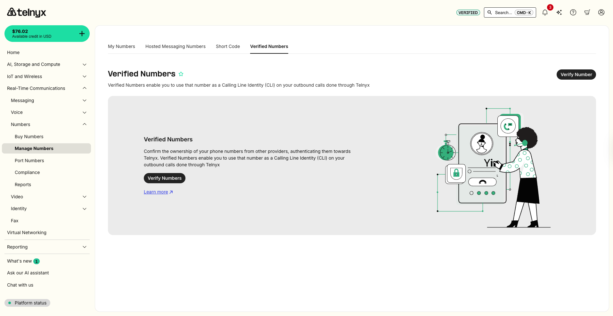

How to Verify Phone Numbers behind an IVR | Telnyx Help Center

[Skip to main content](#main-content)

# How to Verify Phone Numbers behind an IVR

Some phone numbers sit behind an IVR (interactive voice response) system and require dialing an extension to reach the right person. Telnyx now supports verifying numbers behind an IVR automatically through the API and the Mission Control Portal.

Written by Telnyx Engineering

January 29, 2026

Table of contents

## Background

## Standard Behavior

1. Verification call is initiated.
2. Telnyx calls the target phone number.
3. Call is answered.
4. Verification code is played.
5. User enters the code to complete verification.

## New Behavior (with IVR Extensions)

1. Verification call is initiated, including IVR navigation digits.
2. Telnyx calls the target phone number.
3. Call is answered by the IVR.
4. Telnyx waits, then dials the extension.
5. Extension answers the call.
6. Verification code is played.
7. User enters the code to complete verification.

​**Pre-requisites**

Before you begin, make sure you have:

* A [Telnyx Mission Control Portal](https://portal.telnyx.com/) account.
* A valid **Telnyx API key** (you can generate one in the Mission Control Portal).
* The phone number you want to verify, in **E.164 format** (e.g., +15741156782).

## Step 1: Prepare Your API Key

You’ll need to include your Telnyx API key in the `Authorization` header of your request:

```
Authorization: Bearer KEYXXXXXXXXXXXXXX
```

---

## Step 2: Understand the Parameters

* **phone\_number**: Destination number in E.164 format.
* **verification\_method**: The method of verification. (Currently `call` is supported.)
* **extension**: The DTMF sequence to navigate the IVR.

  + `w` = wait 0.5 seconds
  + `W` = wait 1 second
  + Digits `0–9` and letters `A–D`
  + Example: `www2wW4w53ww3`

---

## Step 3: Make the API Request

Use the [Create Verified Number](https://developers.telnyx.com/api/verified-numbers/create-verified-number) endpoint.

**Curl example:**

```
curl --location --request POST 'https://api.telnyx.com/v2/verified_numbers' \ --header 'phone_number: +15741156782' \ --header 'verification_method: call' \ --header 'extension: www2wW4w53ww3' \ --header 'Authorization: Bearer KEYXXXXXXXXXXXXXX'
```

Replace `KEYXXXXXXXXXXXXXX` with your actual API key.

---

## Step 4: Check the Response

If successful, you’ll receive a JSON response:

```
{ "phone_number": "+15741156782", "verification_method": "call", "extension": "www2wW4w53ww3" }
```

If the request fails (e.g., number not in E.164 format), you’ll see an error object describing the issue.

---

## Through the Mission Control Portal

Login to the Mission Control Portal and navigate to Real-Time Communications -> Numbers -> Manage Numbers Page from the left side menu. You can also use this [direct link](https://portal.telnyx.com/#/numbers/verified-numbers) after login.

Switch to the Verified Numbers Tab.



Add details of your number and the extension following the format from step 2 above. Select "Call me with a code". You will receive a call, from which the verification code will be read for input to complete verification.  
​


---

## Tips for Success

* Always format phone numbers in **E.164** (e.g., +1 for US numbers).
* Test your extension sequence manually with the IVR before automating.
* Use `w` to add short waits when the IVR is slow to respond.
* Keep your API key private—never share it publicly.

---

## References

* [Verified Numbers API – Request phone number verification](https://developers.telnyx.com/api-reference/verified-numbers/request-phone-number-verification)
* [Telnyx Mission Control Portal](https://portal.telnyx.com/)
* [Release Notes](https://telnyx.com/release-notes)

---

Related Articles

[Introducing the Verify API](https://support.telnyx.com/en/articles/5367966-introducing-the-verify-api)[Telnyx Verify: 2FA made easy](https://support.telnyx.com/en/articles/5701653-telnyx-verify-2fa-made-easy)[Verified Numbers FAQ](https://support.telnyx.com/en/articles/6790265-verified-numbers-faq)[Verified Numbers](https://support.telnyx.com/en/articles/6988813-verified-numbers)[[BETA] How to Verify Phone Numbers Using DTMF (Press 1 to Verify)](https://support.telnyx.com/en/articles/13854980-beta-how-to-verify-phone-numbers-using-dtmf-press-1-to-verify)

Did this answer your question?

😞😐😃

Table of contents
