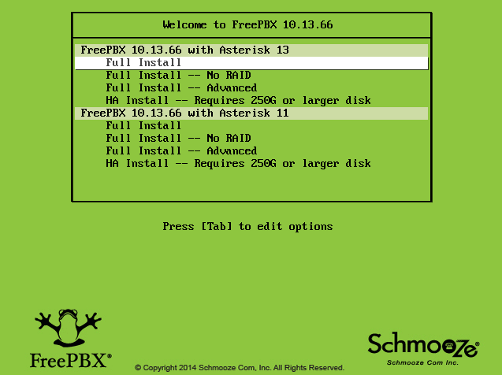
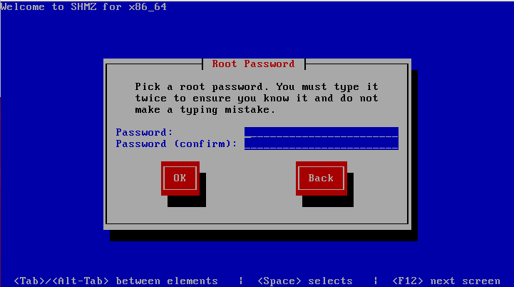
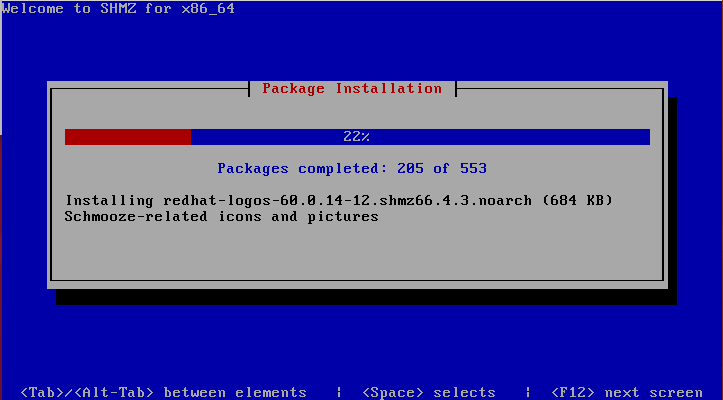
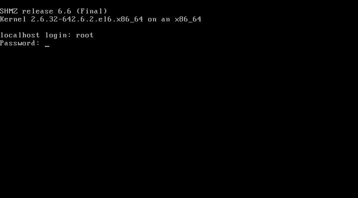
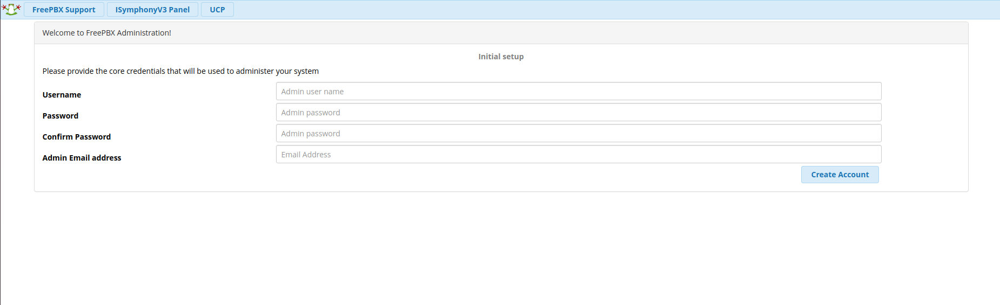
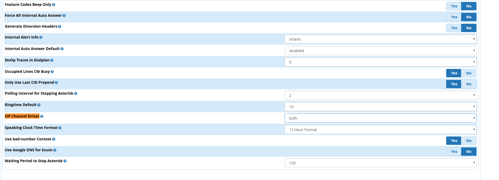
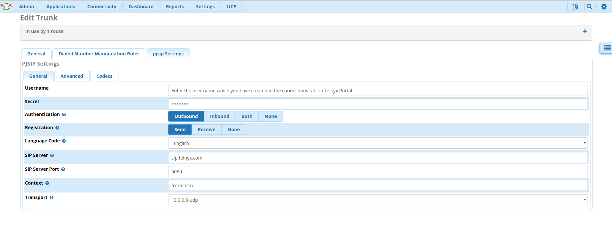
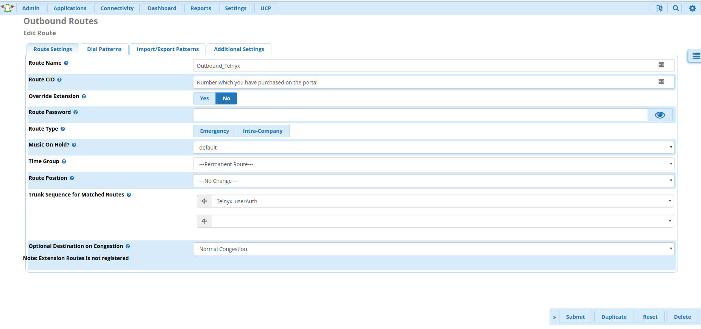
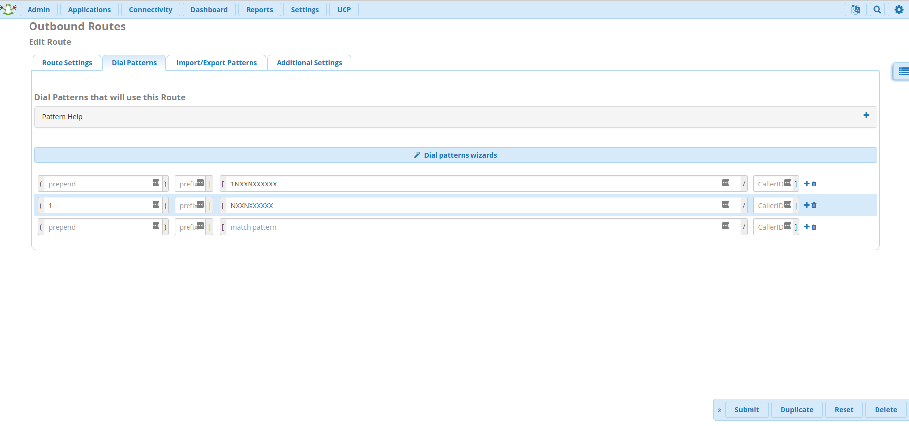
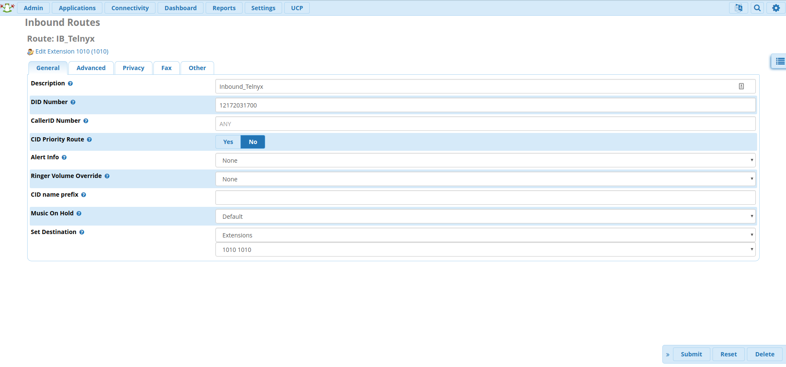

# FreePBX V13: PJSIP Credentials

In this article we will explain how to configure a FreePBX PJSIP V13 Credentials Trunk with Telnyx. See Telnyx guidance and requirements.

C

[Jump to Instructions](#instructions-to-configure-a-freepbx-pjsip-v13)

[FreePBX](https://www.freepbx.org/) is a web-based open source GUI (graphical user interface) that controls and manages Asterisk (PBX), an open source communication server. FreePBX is licensed under the GNU General Public License (GPL), an open source license. FreePBX can be installed manually or as part of the pre-configured FreePBX Distro that includes the system OS, Asterisk, FreePBX GUI and assorted dependencies.

You'll need to have created a [Credentials based connection](https://portal.telnyx.com/#/app/connections) on your Telnyx Mission Control Portal account, assigned this connection to a DID and outbound profile in order to make and receive calls.

Additional documentation and resources:

* [FreePBX documentation](https://wiki.freepbx.org/#all-updates) (This is useful for any configuration instructions that don't involve Telnyx and are maintained solely by FreePBX)
* [FreePBX community](https://community.freepbx.org/)
* [FreePBX support](https://www.freepbx.org/support/)
* [FreePBX videos](https://www.freepbx.org/videos/)

---

## Instructions to Configure a FreePBX PJSIP V13

In this activity you will:

1. [Install FreePBX](#h_34dbd49eeb) (You can also follow [instructions provided by FreePBX](https://www.freepbx.org/get-started/))
2. [Configure your SIP trunk](#chanpjsip-trunkconfiguration)
3. [Configure outbound routes](#h_87e6b8ee2f)
4. [Configure inbound routes](#h_979a5348af)

**Pre-requisites**

* [Set up and configure your Telnyx Mission Control Portal](https://support.telnyx.com/en/articles/5717957-zoiper-5-pro-telnyx-setup#h_dc5df9cfdf)
* Have created a [credentials based connection](https://portal.telnyx.com/#/app/connections) on your Telnyx Mission Control Portal account, assigned this connection to a DID and outbound profile in order to make and receive calls.
* [Download](https://www.freepbx.org/downloads/) and [install](https://www.freepbx.org/get-started/) FreePBX. You can also see [our installation guide](#h_34dbd49eeb) below.
* RECOMMENDED: [Enable TLS to encrypt your traffic](https://support.telnyx.com/en/articles/1130711-does-telnyx-encrypt-communication)

**Video walkthrough**

Setting up your Telnyx SIP portal account so you can make and receive calls:

|  |
| --- |
| ***Note:*** *Video walkthrough for FreePBX/Telnyx SIP trunking configuration coming soon. Check back as we update our docs.* |

## 1. Install FreePBX

Once you've loaded the FreePBX ISO onto your server or virtual machine, you'll have a few options to select for installation. We'll be doing a full install via asterisk 13. So go ahead and run the installer.

### Steps:

1. #### Select **Full Install**.

   
2. #### Confirm your network settings.

   
3. #### Confirm your **root** password.

   
4. #### Wait for all the necessary packages to be installed.

   
5. #### More modules will be updated after successful internet tests.

   
6. #### Enter **root** and the password you created from step 2.

   
7. #### You'll now be provided with the URL you need to use in order to access the FreePBX web interface.

   
8. #### You'll be brought to the initial setup and must enter in the username, password and admin email address in order to create your account.

   
9. #### Once you've created your account, you'll be brought to the dashboard. Select **FreePBX Administration** and enter your username and password.

   
10. #### Follow the process to activate your FreePBX V13.

    
11. #### Select your default locales.

    
12. #### You'll be presented with some firewall details and other suggestions. You are welcome to set this up based on your requirements.

[Back to Top](#instructions-to-configure-a-freepbx-pjsip-v13)

## 2. Configure your SIP trunk

The default behavior of FreePBX version 13 is to use chan\_pjsip for endpoints and trunks.

1. Make your way to **Settings > Asterisk SIP Settings** in order to confirm your network settings.
2. You'll want to ensure you populate the **external** and **local** network addresses under **General SIP Settings** and **Chan SIP Settings**.
3. Once you've completed this, click **Submit** and then **Apply Config.**

   
4. Now go to **Applications -> Extensions > Add Extension > Add New Chan SIP Extension.** The **Outbound CID** is the [number you purchased](https://portal.telnyx.com/#/app/numbers/my-numbers) from your Telnyx Mission Control Portal. The extensions secret may need to be populated under the **Other** tab.
   ​
   ​*Note that if you do not set an Outbound CID for your Extension, you must enable this on your trunk. See the [Pre-requisites](https://support.telnyx.com/en/articles/1130648-configuring-a-freepbx-v13-credentials-trunk#h_b67fe20e22) section.*
   ​
   ​*Note: This device uses CHAN\_SIP technology listening on Port 5160 (UDP - this is a NON STANDARD port).*
5. Click **Submit** and **Apply Config.**
6. Navigate to **Settings > Advanced Settings > Dialplan > Operational > SIP Channel Driver**.

   
7. Navigate to **Connectivity > Trunks** and click on **+Add Trunk** to expand its dropdown.
8. Select **Add SIP (chan\_pjsip)** from this menu.

   
9. Click on **General Settings** and provide the following details:

   1. **Trunk Name:** *Telnyx\_userAuth*
   2. **Outbound CallerID:** your\_Telnyx\_number
   3. **CID Options:** *Allow Any CID*

      
10. Click on the **Dialed Number Manipulation Rules** tab. You can leave this entire section in its default state, but you can also enter dial patterns here:

    1. **For US numbers:**

       * prepend:*1*; match pattern: *NXXNXXXXXX*
       * prepend: blank; match pattern: *1NXXNXXXXXX*
    2. **For international numbers:**

       * prepend: Country Dialing prefix; match pattern: *NXXNXXXXXX*
       * prepend:blank; match pattern: (Country Dialing prefix)*NXXNXXXXXX*

       
11. Click on the **PJSIP Settings** tab and on the **General** sub-tab.
    ​

    ### Provide the Following Properties:

    1. **Username :** Your Telnyx account username
    2. **Secret :** The password for your Telnyx trunk found under the connection → "show password" link in your Telnyx portal
    3. **Authentication :** *Outbound*
    4. **Registration :** *Send*
    5. **Language Code :** *English* (or the language you wish to conduct calls in)
    6. **SIP Server :** *[Sip.telnyx.com](https://sip.telnyx.com/)*
    7. **SIP Server Port :** *5060* if you have not enabled TLS encryption. If you have, choose *5061*.
    8. **Context :** *from-pstn*
    9. **Transport :** *UDP* or *TCP* if you have not enabled TLS encryption. If you have, choose *TLS/TCP*.

       
12. Open the **PJSIP Settings > Advanced** sub-tab and adjust the following:

    1. **From Domain:** *sip.telnyx.com*

       
13. Open the **PJSIP Settings > Codecs** sub-tab and adjust the following:

    1. Select *ulaw, alaw, gsm, g722, g729, Opus*. All other boxes should be unchecked, as these are the Telnyx-supported codecs.
    2. If you plan to do any video communication, Telnyx supports the H264 video codec.

       
14. Click **Submit**, then **Apply Config**.

[Back to Top](#instructions-to-configure-a-freepbx-pjsip-v13)

## 3. Configure outbound routes

Outbound routing is a set of rules that tells FreePBX which Telnyx trunk to use for any given outbound call. Having multiple trunks allows you to control cost by routing calls over the least costly trunk for a particular call. Outbound routes are used to specify what numbers are allowed to go out a particular route.

You will want to make sure you define routes for all types of calls. Not defining a route can leave your users frustrated when they need to make an important call.

1. Navigate to **Connectivity -> Outbound Routes.**
2. Create a new outbound route and provide the following on the **Route Settings** tab:

   1. **Route Name:** Something distinct that makes sense for your route purpose.
   2. **Trunk Sequence for Matched Routes:** Select the trunk you just created in [section 2](#chanpjsip-trunkconfiguration).
   3. **Route Name :** *Outbound\_Telnyx*
   4. **Route CID :**  Number you purchased on the Telnyx portal.
   5. **Trunk Sequence for Matched Routes :** Select the trunk you just created in [section 2](#chanpjsip-trunkconfiguration).

      
3. Now select the **Dial Patterns** tab to the right of the **Route Settings** tab and enter dial patterns exactly as you see in the following image. This pattern allows you to dial 10 Digits (U.S. Calling), 11 Digits (North American Calling).
   ​
   ​*If you need dial patterns for a region outside North America, please contact Telnyx support.*

   

   ***Note*** *that our current documentation portal shrinks screenshots, making some detail difficult to see. Right-click on the image above and select "Open image in new tab" from the context menu. This will open the image in a new tab and display it at its full size and resolution.*
   ​
4. Click **Submit**, then **Apply Config**.

[Back to Top](#instructions-to-configure-a-freepbx-pjsip-v13)

## 4. Configure inbound routes

When a call comes in from the outside, it'll need to be directed from sip.telnyx.com to the phone extension you ultimately want it to go, such as a user extension or an IVR extension.

In this section, we'll configure our own inbound routes.

1. Make your way to **Connectivity -> Inbound Routes** and open the **General** tab.
2. The following image demonstrates an inbound route that will send *ANY* call to a certain extension.
   ​
   To direct a specific number to a specific extension you would create a route and set the "[DID Number](https://telnyx.com/resources/sip-did)" field to your 11 digit DID with sip.telnyx.com (for instance : [12172031700](http://#)).

|  |
| --- |
| ***Note:*** *By default, when creating a SIP Connection in the Telnyx Mission Control Portal, the number formats for the ANI and DNIS will be set to E.164. This means Telnyx will send the dialled number in the SIP INVITE to your FreePBX system with 11 digits. As the DID number above is in 11 digit format, the call will be accepted and routed to the extension. However, you can control the number formats as you desire and can read more about it [here](https://support.telnyx.com/en/articles/1130706-sip-connection-number-formats).* |

That's it, you've now completed the configuration of FreePBX PJSIP V13 Credentials Trunk and can now make and receive calls by using Telnyx as your SIP provider.

[Back to Top](#instructions-to-configure-a-freepbx-pjsip-v13)

---

## Additional Resources

Review our [getting started with guide](https://support.telnyx.com/en/articles/1176636-get-started-with-a-mission-control-account) to make sure your Telnyx Mission Control Portal account is set up correctly.

Additionally, you can check out:

* [FreePBX documentation](https://wiki.freepbx.org/#all-updates)
* [FreePBX community](https://community.freepbx.org/)
* [FreePBX support](https://www.freepbx.org/support/)
* [FreePBX videos](https://www.freepbx.org/videos/)

---

---

Related Articles

[Configuring a FreePBX V13 Credentials Trunk](https://support.telnyx.com/en/articles/1130648-configuring-a-freepbx-v13-credentials-trunk)[FreePBX V14: Credentials - ChanSIP](https://support.telnyx.com/en/articles/3284752-freepbx-v14-credentials-chansip)[FreePBX V15 IP Trunk - ChanSIP Tutorial](https://support.telnyx.com/en/articles/5467232-freepbx-v15-ip-trunk-chansip-tutorial)[FreePBX V15: IP Trunk - PJSIP](https://support.telnyx.com/en/articles/5619595-freepbx-v15-ip-trunk-pjsip)[FreePBX V15: Credentials - PJSIP](https://support.telnyx.com/en/articles/5619597-freepbx-v15-credentials-pjsip)

Did this answer your question?

😞😐😃
