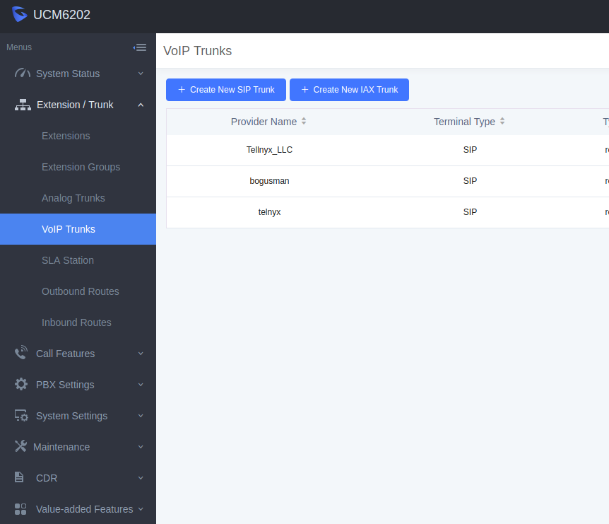
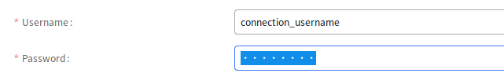
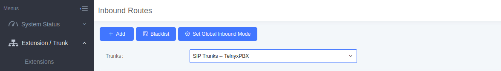
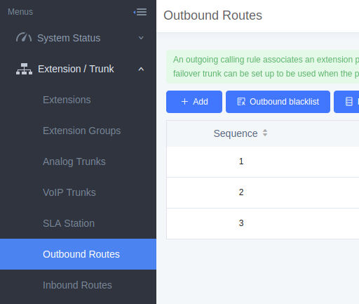
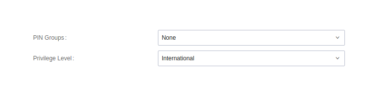
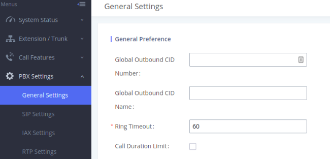

Grandstream UMC6202: Auth Setup | Telnyx Help Center

[Skip to main content](#main-content)

# Grandstream UMC6202: Auth Setup

This article will provide you steps for configuring your Grandstream UMC6202 with Telnyx phone service using Registration (user/pass).

C

Written by Customer Success

January 10, 2024

Table of contents

[Jump to Instructions](#h_ffb5e1a080)

[Grandstream](https://www.grandstream.com/) has been connecting the world since 2002 with SIP Unified Communications solutions that serve the small and medium business and enterprises markets and have been recognized throughout the world for their quality, reliability and innovation. Their open standard SIP-based products offer broad interoperability throughout the industry.

This article guides you on how to configure the [Granstream UMC 6202](https://www.grandstream.com/products/ip-pbxs/ucm-series-ip-pbxs/product/ucm6200-series) to make and receive calls over the internet through a next generation carrier like Telnyx!

Additional documentation and resources:

* [Product datasheet](https://www.grandstream.com/hubfs/Product_Documentation/datasheet_ucm6200_series_english.pdf?hsLang=en) (English)
* [Grandstream FAQ](https://blog.grandstream.com/faq)
* [Grandstream user forum](https://forums.grandstream.com/)
* [Grandstream Learning Center](https://www.grandstream.com/learning-center)
* [Grandstream firmware updates](https://www.grandstream.com/support/firmware)
* How-to guides for [UCM6200 series](https://www.grandstream.com/support/resources?title=UCM6200%20series) and [UCM6510 series](https://www.grandstream.com/support/resources?title=UCM6510)
* [Administrator's user manual](https://www.grandstream.com/hubfs/Product_Documentation/ucm62xx_usermanual.pdf)

---

# Configuring the Grandstream UMC 6202

In this activity you will:

1. [Log into your Grandstream web UI](#h_fd82e20d9b)
2. [Configure a SIP trunk](#h_37db4596e8)
3. [Create an inbound route](#h_b50bbadbbd)
4. [Create an outbound route](#h_822361b2c2)
5. [Configure an outbound caller ID](#h_9b1c8d58ae)

**Pre-requisites**

* Ensure that your [Telnyx Mission Command Portal is configured properly](https://support.telnyx.com/en/articles/1176636-get-started-with-a-mission-control-account)
* [Purchase a DID](https://portal.telnyx.com/#/app/numbers/search-numbers)
* [Set up your Telnyx SIP connection](https://portal.telnyx.com/#/app/connections)
* [Provision your number](https://portal.telnyx.com/#/app/numbers/my-numbers) (Assign it to a SIP connection)
* [Create an outbound voice profile](https://portal.telnyx.com/#/app/outbound)
* Create a [credentials connection](https://portal.telnyx.com/#/app/connections) on your Telnyx Mission Control Portal
* Ensure your Grandstream device is running [the latest firmware](https://www.grandstream.com/support/firmware)
* RECOMMENDED: [Enable TLS to encrypt your traffic](https://support.telnyx.com/en/articles/1130711-does-telnyx-encrypt-communication)

**Video Walkthrough**

Setting up your Telnyx SIP portal account so you can make and receive calls:

|  |
| --- |
| ***Note:*** *Video walkthrough for Grandstream GXP/Telnyx configuration coming soon. Check back as we update our docs.* |

## 1. Log into your Grandstream web UI

All the configuration you'll need to do will take place on the web UI, which acts as an interface between you and your Grandstream device. You can access the web UI via the device's IP address. We'll find that, then use it to log in.

1. The IP address used to access the web UI depends on where the user’s computer is connected.

   1. If the computer is connected to *the same switch/router that the UCM6200 series WAN port is connected*, then browse to the IP address that is displayed on the UCM6200 series LCD. This address is the *WAN IP*.
   2. If the computer is connected *to the LAN side of the UCM6200 series*, then users would browse to the default IP of the UCM6200 series which is *192.168.2.1*.
2. If connected successfully, the UCM6200 series login page. Out of the box, your device will have the following default credentials:

   1. **Username**: *admin*
   2. **Password**: *admin*  
      ​*HOWEVER: Units manufactured starting January 2017 have a unique random password printed on the sticker located on the back of the unit. It is highly recommended to change the default password after logging in for the first time. Older units have default password* admin*.*

[Back to Top](#h_ffb5e1a080)

## 2. Configure SIP trunk

1. In the left-hand navigation, expand **Extension/Trunk** and click **VoIP Trunks** in the sub-menu.

   
2. Click **Add SIP trunk** and fill in the required information:

   ### Required Fields:

   1. **Type:** *Register [SIP Trunk](https://telnyx.com/products/sip-trunks)*
   2. **Provider Name:** *Telnyx*
   3. **Select host Name:** *sip.telnyx.com*
   4. **Username:** Your Telnyx SIP username
   5. **Password:** Your Telnyx SIP password

      

      
3. Click **Save**.

|  |
| --- |
| ***Note:*** *If you have issues setting this up with a hostname you can always use our primary ip address 192.76.120.10.* |

[Back to Top](#h_ffb5e1a080)

## 3. Create an inbound route

When a call comes in from the outside, it'll need to be directed from sip.telnyx.com to the phone extension you ultimately want it to go, such as a user extension or an IVR extension.   
​

In this section, we'll configure our own inbound routes.  
​

### Steps:

1. #### In the left-hand navigation, expand "**Extension/Trunk"** and click "**Inbound Routes"** in the sub-menu.

   
2. #### Select the trunk and then click add on the left hand side of the screen underneath "**Inbound Routes"**.

   
3. #### Enter in the patterns which apply to this inbound rule. [This is a good article](https://www.voip-info.org/asterisk-dialplan-patterns/) to understand how to correctly format the pattern.

   
4. #### In default mode select your default destination as *Extension*.

   
5. #### Click "**Save"** in the top right-hand corner of the screen.

[Back to Top](#h_ffb5e1a080)

## 4. Create outbound route

Outbound routing is a set of rules that tells FreePBX which Telnyx trunk to use for any given outbound call. Having multiple trunks allows you to control cost by routing calls over the least costly trunk for a particular call. Outbound routes are used to specify what numbers are allowed to go out a particular route.

You will want to make sure you define routes for all types of calls. Not defining a route can leave your users frustrated when they need to make an important call.

### Steps:

1. #### In the left-hand navigation, expand "**Extension/Trunk"** and click "**Outbound Routes"** in the sub-menu.

   

   ####
2. #### Name the calling rule name to something of your choice and add the number pattern.

   
3. #### Set your privilege level to match the service plan in the outbound settings on your Telnyx portal.

   
4. #### Select your trunk in the use trunk section

   

[Back to Top](#h_ffb5e1a080)

## 5. Configure an outbound caller ID

Now let's configure your outbound caller ID. Grandstream offers many ways to configure a caller ID on your SIP trunk. This section will demonstrate 3 ways of doing this:

* Setting a single global outbound caller ID which will apply to every number on your trunk.
* Setting a unique caller ID for every extension on your trunk.
* Setting a unique caller ID for every outbound route you create (every extension associated with that route will have the same caller ID)

|  |
| --- |
| ***Note:*** *Before configuring an outbound caller ID, you should be aware of some of the naming conventions standard for caller ID creation:*  * *Your outbound Caller ID Name should be in **capital letters**. This will appears more clearly/visible on some devices.* * *You **must NOT use any special characters**, as they will not be displayed.* * *Some of regular **Canadian providers will not show more than 15 characters**. We suggest shrinking or adapt your caller ID.* * ***Spaces are allowed*** *in a caller id name.* * *Be familiar with [Telnyx's caller ID number policy](https://support.telnyx.com/en/articles/3546251-caller-id-number-policy)* |

1. To enable a global outbound CID:   
   From the left-hand navigation, expand **PBX Settings** and click **General Settings** in the sub-menu.

   
2. To enable caller IDs for each extension:  
   From the left-hand navigation, expand **Extension/Trunk** and click **Extensions** in the sub-menu.
3. Click on the extension you want to assign a caller ID and provide your caller ID in the **CallerID Number** field.

   
4. To enable a caller ID on the outbound route:  
   From the left-hand navigation, expand **Extension/Trunk** and click **Outbound Routes** in the sub-menu.
5. From here, you can set your caller ID for the entire route in the **Outbound Route CID** field.

   

That's it, you've now completed the configuration of Grandstream and can now make and receive calls by using Telnyx as your SIP provider!

[Back to Top](#h_ffb5e1a080)

---

## Additional Resources

Review our [getting started with guide](https://support.telnyx.com/en/articles/1176636-get-started-with-a-mission-control-account) to make sure your Telnyx Mission Control Portal account is set up correctly.

Additionally, you can check out:

* [Product datasheet](https://www.grandstream.com/hubfs/Product_Documentation/datasheet_ucm6200_series_english.pdf?hsLang=en) (English)
* [Grandstream FAQ](https://blog.grandstream.com/faq)
* [Grandstream user forum](https://forums.grandstream.com/)
* [Grandstream Learning Center](https://www.grandstream.com/learning-center)
* [Grandstream firmware updates](https://www.grandstream.com/support/firmware)
* How-to guides for [UCM6200 series](https://www.grandstream.com/support/resources?title=UCM6200%20series) and [UCM6510 series](https://www.grandstream.com/support/resources?title=UCM6510)
* [Administrator's user manual](https://www.grandstream.com/hubfs/Product_Documentation/ucm62xx_usermanual.pdf)

---

Related Articles

[Grandstream: IP Auth Setup](https://support.telnyx.com/en/articles/2950523-grandstream-ip-auth-setup)[Grandstream UCM6xxx: SIP Trunks](https://support.telnyx.com/en/articles/5748258-grandstream-ucm6xxx-sip-trunks)[Grandstream GRP260x: SIP Trunk](https://support.telnyx.com/en/articles/6169513-grandstream-grp260x-sip-trunk)[Grandstream GXP1700: SIP Trunk](https://support.telnyx.com/en/articles/6184520-grandstream-gxp1700-sip-trunk)[Grandstream GXV3370](https://support.telnyx.com/en/articles/6187576-grandstream-gxv3370)

Did this answer your question?

😞😐😃

Table of contents
