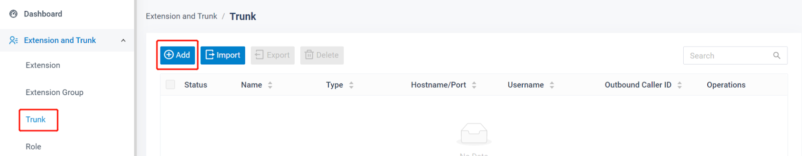
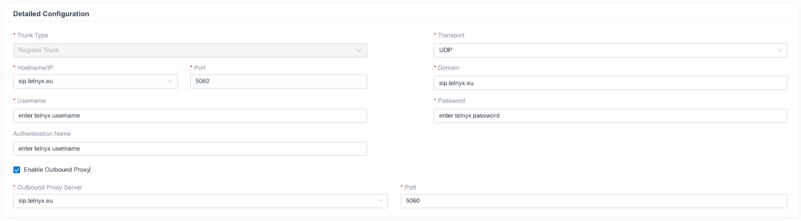
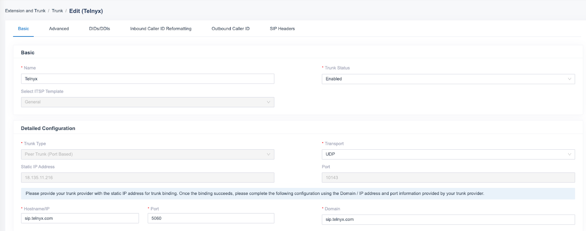

# How to configure Yeastar P-series

Learn how to configure both a Yeastar P-Series IP or Credentials trunk to work with your Telnyx Mission Control Portal. See Telnyx guidance and requirements.

There are two types of SIP trunks you can configure:

* A VoIP Register Trunk: Uses a credentials based authentication
* A VoIP Peer Trunk: Uses an IP address and PBX port based authentication

In this article we will:

1. [Set up a sip registration based trunk](#h_47c29b1298)
2. [Set up a peer/IP authentication trunk](#h_f620eb1582)
3. [Set up outgoing calls](#h_02ab83b3b2)
4. [Set up incoming calls](#h_0dae3ac15a)

​**Additional documentation**
​

* **Yeastar Cloud PBX(PCE):**
  ​[PBX server administrator guide](https://help.yeastar.com/en/p-series-cloud-edition/administrator-guide/about-this-guide.html)

  [Linkus server administrator guide](https://help.yeastar.com/en/p-series-linkus-cloud-edition/linkus-server-admin-guide/linkus-overview.html)
  ​
* **Yeastar P-Series Self-hosted PBX(PSE):**
  ​[Installation guide](https://help.yeastar.com/en/p-series-software-edition/software-installation-guide/about-this-guide.html)

  [PBX server administrator guide](https://help.yeastar.com/en/p-series-software-edition/administrator-guide/about-this-guide.html)

### **Pre-Requisites:**

* Have an active, and properly configured, Telnyx Mission Control Portal.
* Review our [getting started guide](https://support.telnyx.com/en/articles/1176636-get-started-with-a-mission-control-account) to make sure your Telnyx Mission Control Portal account is set up correctly.
  ​
* Have DIDs in your Mission Control Portal ready to use.
  ​
* Install Yeastar PBX and work through the first 3 sub-sections of the Yeastar Getting Started Guide.
  ​
* When you reach the Set up VoIP trunks section, return here and begin at step 1 below for a Telnyx-specific configuration.

## Set up a SIP registration based trunk

In this step, you'll add a peer SIP trunk in your Yeastar PBX.

Note: A register trunk uses a username/password combination (credentials) to authenticate.

1. **Add a SIP Trunk in P-Series PBX System**
   After you get the SIP trunk account, you need to add a SIP trunk in Yeastar P-Series PBX System. Go to Extension and Trunk > Trunk, click Add.
   ​

   

   ​
2. **Configure the trunk**
   ​

   Basic Configuration:
   ​
   - Name: Enter a name for the SIP trunk to help you identify
   ​
   - Telnyx is a Yeastar certified SIP trunk provider, so you can select "Select ITSP Template" from the drop-down list first and choose the countru of the ITSP. Then select the Telnyx "ITSP" name in the right box. All of the parameters are embedded except the account registration information
   ​
   - Make sure the trunk status is "Enabled"
   ​

   

   Detailed Configuration:
   ​
   The parameters of the certified ITSP template are embedded. You don’t have to figure out Trunk Type, Transport, Hostname, Port, Domain.
   ​
   However, if you need to change it you can refer to <https://sip.telnyx.com/> for information of Telnyx proxies, transport or port.

* Username: your Telnyx username.
* Password: your Telnyx password.
* Authentication Name: the same as the username.
* Enable Outbound Proxy: the same as hostname

3. **Check the Trunk status**

Click Save and Apply. Check if the trunk is conneced in Status, indicated by the checkmark.
asic Configuration:
​
- Name: Enter a name for the SIP trunk to help you identify
​
- Telnyx is a Yeastar certified SIP trunk provider, so you can select "Select ITSP Template" from the drop-down list first and choose the country of the ITSP. Then select the Telnyx "ITSP" name in the right box. All of the parameters are embedded except the account registration information
​
- Make sure the trunk status is "Enabled"

## **Set up a Peer/IP authentication trunk**

In this step, you'll add a peer SIP trunk into your Yeastar PBX. A peer trunk uses IP authentication.

1. Login to the PBX web portal, go to Extension and Trunk > Trunk, click Add.
   ​
2. In the Basic section, configure the following settings:
   ​**Name:** Enter a name to help you identify the trunk.
   ​**Trunk Status:** Select Enabled
   ​**Select ITSP Template:** Select General
   ​

In the Detailed Configuration section, select the trunk type and enter the SIP information that is provided by the ITSP.
​
​**Trunk Type:** Peer Trunk (Port Based)

The Static IP Address and Port of the PBX will be displayed on the web page. This needs to be added in the Telnyx Mission control portal under SIP Trunking> Edit the IP type connection> Authentication and routing> IP addresses.

**Transport:** UDP/ TCP/ TLS.

**Hostname/IP:** Enter the Telnyx domain name or IP address

**Port:** Enter the Telnyx SIP port.

**Domain:** Enter the domain in SIP URI of a specific header like From, To header same as Hostname/IP field.

​

## **Set up Outgoing Calls**

To make outbound calls via the newly created SIP trunk, you need to configure an outbound route for the trunk.

1. **Create an Outbound Route**
   Go to Call Control > Outbound Route, click Add.

   
2. **Configure the Outbound Route**

The system compares the number with the pattern that you have defined in your route 1. If it matches, it will initiate the call using the selected trunks. If it does not, it will compare the number with the pattern you have defined in route 2 and so on. The outbound route which is in a higher position will be matched firstly.

You can adjust the outbound route sequence by clicking these buttons:

* **Name:** give this outbound route a name to help you identify it.
  ​
* **Role:** select the role that can use this outbound route to make outbound calls.
  ​
* **Dial Patterns:** set the dial patterns. As the settings below, to make calls via the SIP trunk, you need to precede the number to be dialed with the prefix 8.
  ​
* **Dial Pattern:** 8.
  ​
* **Strip:** 1
  ​
* **Trunk:** select the Telnyx SIP trunk.
  ​
* **Outbound Route Password:** you can prompt users for a password before allowing calls to progress.
  ​
* **Extension/Extension Group:** select the extensions or extension groups that are allowed to make calls through the outbound route.
  ​
* **Time condition:** select time condition to allow this outbound route.

​

**3. Click Save and Apply**

Now you can make outbound calls through the SIP trunk. As the dial patterns configured above, you need to dial “8” before the destination number.

For example, to call the number “01234567”, you need to dial “801234567” on your phone.

## **Set up incoming calls**

In this step, you'll get Yeastar ready to take incoming calls by configuring an inbound route for the SIP trunk.

1. **Create an Inbound Route**
   Go to Call Control > Inbound Route, click Add.

   
2. **Configure the Inbound Route**

* **Name:** give this inbound route a name to help you identify it.
  ​
* **DID Pattern:** specify the did pattern to match and pass the incoming call through this inbound route.
  ​
* **Caller ID Pattern:** define the caller ID number that is allowed to call through this inbound route.
  ​
* **Trunk:** choose the Telnyx SIP trunk.
  ​
* **Default Destination:** select the default destination or set with Time Condition.

**3. Click Save and Apply**

When you call in the SIP trunk, the call will be routed to the destination configured on the inbound route.

You have now set up your SIP trunk in Yeastar PBX and configured it to work with Telnyx.

---

Related Articles

[Configuring an Elastix 4 PBX IP Trunk](https://support.telnyx.com/en/articles/1130622-configuring-an-elastix-4-pbx-ip-trunk)[How to configure a Thirdlane PBX](https://support.telnyx.com/en/articles/1130631-how-to-configure-a-thirdlane-pbx)[Configuring an Elastix 4 PBX Trunk](https://support.telnyx.com/en/articles/1130654-configuring-an-elastix-4-pbx-trunk)[Yeastar S-Series: Telnyx SIP](https://support.telnyx.com/en/articles/5748952-yeastar-s-series-telnyx-sip)[Xorcom PBX: SIP Trunk](https://support.telnyx.com/en/articles/5754127-xorcom-pbx-sip-trunk)

Did this answer your question?

😞😐😃
