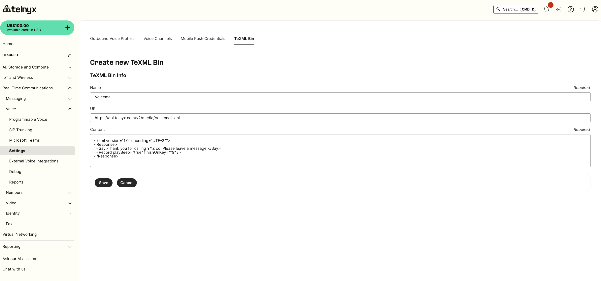
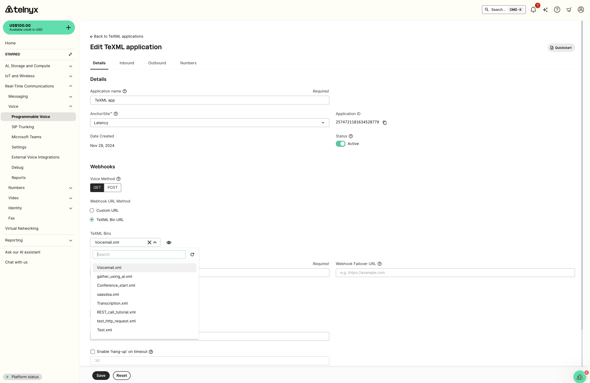
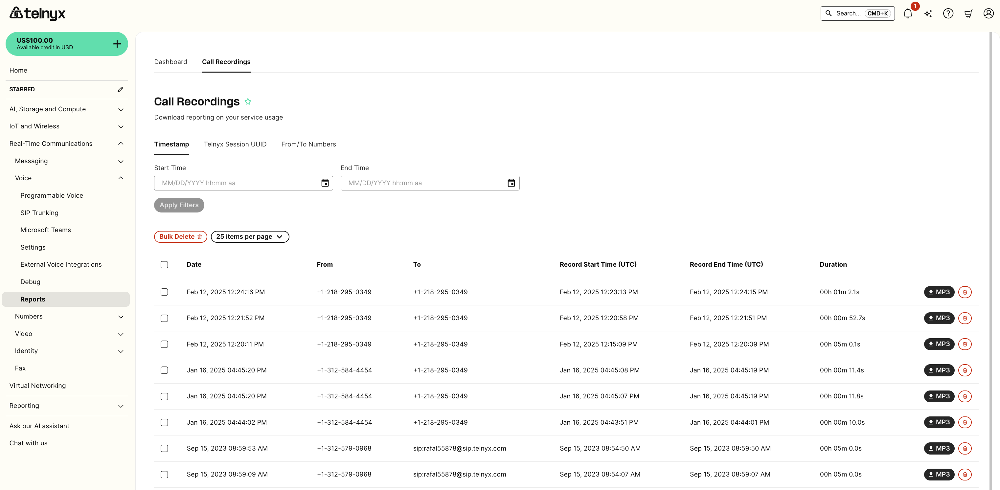

TeXML Bin Simple Voicemail and Call Forwarding | Telnyx Help Center

[Skip to main content](#main-content)

# TeXML Bin Simple Voicemail and Call Forwarding

Get started quickly with Telnyx Programmable Voice and the TexML Bin feature. Explore our comprehensive documentation, tutorials, and quickstart guide to effortlessly integrate TexML Bin into your voice applications.

Written by Telnyx Engineering

January 14, 2026

Table of contents

TeXML Bin allows users to upload TeXML files to storage and use it for call flows without having to code. Developers can quickly and easily add programmable voice features into applications without having to worry about setting up application servers.

TeXML is an XML-based data structure you can use to control calls with Telnyx and is the quickest way to get started with Programmable Voice using a simple .xml file, allowing you to specify call instructions in your file using commands called verbs and nouns. TeXML Translator starts at the top of your TeXML file and executes your TeXML commands sequentially in the order they are arranged in the file.

In this guide, you’ll learn how to start using TeXML Bin and configure a simple voicemail and call forwarding TeXML application using Telnyx’s Voice API.

This tutorial assumes you’ve already [set up your developer account and environment](https://developers.telnyx.com/development).

Let’s get started:

## **Step 1: Create your XML**

To create XML documents, you can use the new [TeXML editor](https://portal.telnyx.com/#/app/call-control/texml-bin) in the Mission Control Portal. You’ll find the TeXML editor by navigating to the Programmable Voice section on the left menu and selecting ‘TeXML Bin’.



*Set a simple voicemail with TeXML Bin*

### **Simple voicemail**

```
<?xml version="1.0" encoding="UTF-8"?>   
<Response>  
   <Say>Thank you for calling YYZ co. Please leave a message.</Say>  
   <Record playBeep="true" finishOnKey="*9" />   
</Response>
```

### **Simple call forward**

```
<?xml version="1.0" encoding="UTF-8"?>   
<Response>  
   <Dial>  
     <Sip>ext1@sip.xyzco.com</Sip>  
     <Sip>ext3@sip.xyzco.com</Sip>  
     <Sip>ext4@sip.xyzco.com</Sip>  
    </Dial>   
</Response>
```

## **Step 2: Set up your XML application in Mission Control**

You can set up your XML application to use the created script by selecting it from the drop-down list.



*Editing your TeXML application*

## **Step 3: Test your application**

Test your application by:

1. Assigning a phone number to the application


*Assigning a number to an application*

2. Dialing the number from the PSTN and leave a message

3. Retrieving your voicemail



*Retrieving your voicemail*

And that’s it! If you have any questions about this tutorial or any of our products, reach out to our support team through the chat in the bottom right-hand corner.

---

Related Articles

[Does Telnyx support conference calls?](https://support.telnyx.com/en/articles/1130677-does-telnyx-support-conference-calls)[TeXML and Telnyx Voice API compatibility](https://support.telnyx.com/en/articles/8118086-texml-and-telnyx-voice-api-compatibility)[Real-Time Transcription](https://support.telnyx.com/en/articles/8292490-real-time-transcription)[How External Call Transfers Work](https://support.telnyx.com/en/articles/13117410-how-external-call-transfers-work)[Twilio TwiML Conference on Telnyx](https://support.telnyx.com/en/articles/13389311-twilio-twiml-conference-on-telnyx)

Did this answer your question?

😞😐😃

Table of contents
