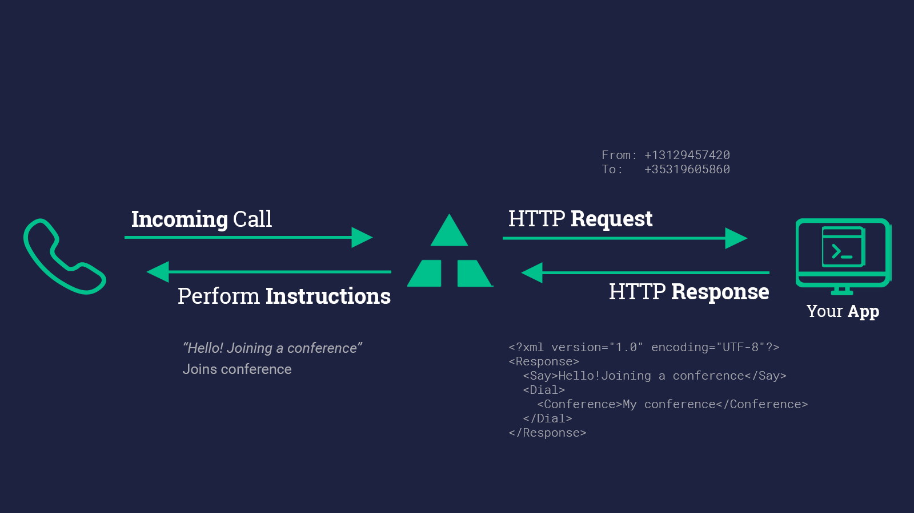
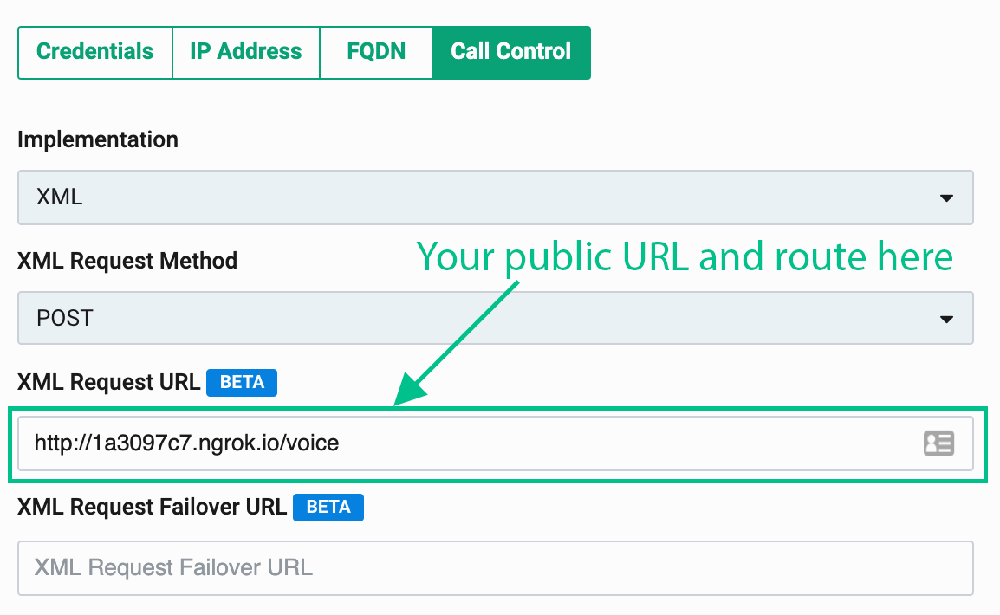

# Twilio TwiML Conference on Telnyx

Swap to Telnyx with your existing TwiML code and Twilio SDK. See Telnyx guidance and requirements Learn more about Twilio TwiML Conference on Telnyx with.


| [Python](#h_4f3a8892c9) | [PHP](#h_a619201a6a) | [Node](#h_c793c9b5f1) | [Java](#h_fcff0df0c8) | [.NET](#h_47d272618e) | [Ruby](#h_e42ecf4976) |

To follow the steps in this guide, you’ll need a Telnyx account. [Signing up takes less than a minute](https://telnyx.com/sign-up), and no credit card is required.

## **Python**

⏱ **15 minutes build time**

Swap to Telnyx with your existing TwiML code and Twilio SDK. By using Telnyx to execute your TwiML code, you will get a superior customer experience at a significantly lower cost!

In this tutorial, we’ll show you how to use the [Telnyx Voice API](https://telnyx.com/products/voice-api), previously called Call Control, to create and manage conference calls with your Python web application.

The code snippets in this guide are written using the Python language. We’re going to use the Twilio Python SDK to create code that can be interpreted by Telnyx, but we’ll show you that later. Ready to begin? Let’s get started!

## **​**

## **A simple Python conference call**

```
 <!-- A simple conference -->
<?xml version="1.0" encoding="UTF-8"?>
<Response>
   <Dial>
     <Conference>My superior Telnyx conference</Conference>
   </Dial>
</Response>
```

## **​**

## **Buy and configure a phone number and TeXML application**

In the [Telnyx Mission Control Portal](https://portal.telnyx.com/), you can search for and buy phone numbers in countries around the world. Numbers that have the Voice capability can make and receive voice phone calls from just about anywhere.

Once you purchase a number, you’ll need to configure that number to send a request to your web application. This callback mechanism is called a [webhook](https://en.wikipedia.org/wiki/Webhook). You will need to create a [TeXML Application](https://portal.telnyx.com/#/app/call-control/texml) and point that to your web application so that Telnyx can make an HTTP request when you receive a call. For the URL enter in your current TwiML application URL. If you don’t have an application URL yet, we will create one at a later step using [ngrok](https://ngrok.com/).

## **​Set up your Python web application**

Telnyx makes answering a phone call as easy as responding to an HTTP request. When a phone number you have bought through Telnyx receives an incoming call, Telnyx will send an HTTP request to your web application asking for instructions on how to handle the call. Your server will respond with an XML document containing TwiML that instructs Telnyx on what to do with the call. Those instructions can direct Telnyx to read out a message, play an MP3 file, make a recording and much more.

To start answering phone calls, you must:

1. Buy and configure a Telnyx-powered phone number capable of making and receiving phone calls, link it to a [TeXML Application](https://portal.telnyx.com/#/app/call-control/texml) and point it at your web application
2. Write a web application to tell Telnyx how to handle the incoming call using TwiML
3. Make your web application accessible on the Internet so Telnyx can make an HTTP request when you receive a call

## **​Dynamic Python conference calls with moderators**

Now comes the fun part - writing code that will handle an incoming HTTP request from Telnyx!

In this example we’ll use Python to respond to Telnyx’s request and we’ll use the existing Twilio (not Telnyx! Python SDK to generate our TwiML).

## **​Create a Python-moderated conference call**

```
"""Demonstration of setting up a conference call in Flask with Telnyx."""
from flask import Flask, request
from twilio.twiml.voice_response import VoiceResponse, Dial

app = Flask(__name__)

## Update with your own phone number in E.164 format
CONFERENCE_MODERATOR = '+13129457420'

@app.route("/voice", methods=['GET', 'POST'])
def call():
    """Return TwiML for a moderated conference call."""
## Start our TwiML/TeXML response
    response = VoiceResponse()

## Start with a <Dial> verb
    with Dial() as dial:
## If the caller is our CONFERENCE_MODERATOR, start conference on join and end when they leave
        if request.values.get('From') == CONFERENCE_MODERATOR:
            dial.conference(
                'My superior Telnyx conference',
                start_conference_on_enter=True,
                end_conference_on_exit=True)
        else:
## Else join as a regular participant
            dial.conference('My superior Telnyx conference', start_conference_on_enter=False)

    response.append(dial)
    return str(response)

if __name__ == "__main__":
    app.run(debug=True)
```

Use the `<Conference>` TeXML noun to create a conference that begins only when a moderator joins. In this example, we use a couple of advanced `<Conference>` features to allow one participant, our “moderator”, to better control the call:

* `startConferenceOnEnter` will keep all other callers on hold until the moderator joins
* `endConferenceOnExit` will cause Telnyx to end the call for everyone as soon as the moderator leaves. We use the “From” argument on Telnyx’s webhook request to identify whether the current caller should be the moderator or just a regular participant.

For the webhooks in this code sample to work, Telnyx must be able to send your web application an HTTP request over the Internet. Of course, that means your application needs to have a URL or IP address that Telnyx can reach.

In production, you have a public URL, but if you don’t during development, that’s where [ngrok](https://ngrok.com/) comes in. ngrok gives you a public URL for a local port on your development machine, which you can use to configure your Telnyx webhooks as described above.

Once ngrok is installed, you can use it at the command line to create a tunnel to whatever port your web application is running on. For example, this will create a public URL for a web application listening on port 3000.

```
ngrok http 3000
```

After executing that command, you will see that ngrok has given your application a public URL that you can use in your webhook connection configuration in the [Telnyx Mission Control Portal](https://portal.telnyx.com/). Please remember to append it with a path to a method that should handle new calls, for example: `http://<your ngrok subdomain>.ngrok.io/voice`

## **PHP**

⏱**15 minutes build time**

Swap to Telnyx with your existing TwiML code and Twilio SDK. By using Telnyx to execute your TwiML code, you will get a superior customer experience at a significantly lower cost!

In this tutorial, we’ll show you how to use the TeXML application to create and manage conference calls with your PHP web application.

The code snippets in this guide are written using the PHP language version 5.3 or higher. We’re going to use the Twilio PHP SDK to create code that can be interpreted by Telnyx, but we’ll show you that later.

Ready to begin? Let’s get started!

### **A simple PHP conference call**

```
<!-- A simple conference -->
<?xml version="1.0" encoding="UTF-8"?>
<Response>
  <Dial>
    <Conference>My superior Telnyx conference</Conference>
  </Dial>
</Response>
```

## **Buy and configure a Phone Number and TeXML Application**

In the [Telnyx Mission Control Portal](https://portal.telnyx.com/), you can search for and buy phone numbers in countries around the world. Numbers that have the Voice capability can make and receive voice phone calls from just about anywhere.

Once you purchase a number, you’ll need to configure that number to send a request to your web application. This callback mechanism is called a [webhook](https://en.wikipedia.org/wiki/Webhook). You will need to create a [TeXML Application](https://portal.telnyx.com/#/app/call-control/texml) and point that to your web application so that Telnyx can make an HTTP request when you receive a call. For the URL, enter your current TwiML application URL. If you don’t have an application URL yet, we will create one at a later step using [ngrok](https://ngrok.com/).

### **Set up your PHP web application**



Telnyx makes answering a phone call as easy as responding to an HTTP request. When a phone number you have bought through Telnyx receives an incoming call, Telnyx will send an HTTP request to your web application asking for instructions on how to handle the call. Your server will respond with an XML document containing TwiML that instructs Telnyx on what to do with the call. Those instructions can direct Telnyx to read out a message, play an MP3 file, make a recording, and much more.

To start answering phone calls, you must:

1. Buy and configure a Telnyx-powered phone number capable of making and receiving phone calls, link it to a [TeXML Application](https://portal.telnyx.com/#/app/call-control/texml), and point it at your web application
2. Write a web application to tell Telnyx how to handle the incoming call using TwiML
3. Make your web application accessible on the Internet so Telnyx can make an HTTP request when you receive a call

### **Dynamic PHP conference calls with moderators**

Now comes the fun part - writing code that will handle an incoming HTTP request from Telnyx!In this example, we’ll use PHP to respond to Telnyx’s request, and we’ll use the existing Twilio (not Telnyx! PHP SDK to generate our TwiML.

### **Create a PHP-moderated conference call**

```
<?php
// Get the PHP helper library from https://twilio.com/docs/libraries/php

// this line loads the library
require_once '/path/to/vendor/autoload.php';
use Twilio\TwiML;

// Update with your own phone number in E.164 format
$CONFERENCE_MODERATOR = '+13129457420';

$response = new TwiML;

// Start with a <Dial> verb
$dial = $response->dial();

// If the caller is our CONFERENCE_MODERATOR, start conference on join and end when they leave
if ($_REQUEST['From'] == $CONFERENCE_MODERATOR) {
  $dial->conference('My superior Telnyx conference', array(
                'startConferenceOnEnter' => True,
                'endConferenceOnExit' => True
                ));
} else {
  // Else join as a regular participant
  $dial->conference('My superior Telnyx conference', array(
                'startConferenceOnEnter' => False
                ));
}

print $response;
```

Use the `<Conference>` TeXML noun to create a conference that begins only when a moderator joins In this example we use a couple of advanced `<Conference>` features to allow one participant, our “moderator”, to better control the call:

* `startConferenceOnEnter` will keep all other callers on hold until the moderator joins
* `endConferenceOnExit` will cause Telnyx to end the call for everyone as soon as the moderator leaves. We use the “From” argument on Telnyx’s webhook request to identify whether the current caller should be the moderator or just a regular participant.

In order for the webhooks in this code sample to work, Telnyx must be able to send your web application an HTTP request over the Internet. Of course, that means your application needs to have a URL or IP address that Telnyx can reach.

In production, you have a public URL, but you probably don’t during development. That’s where [ngrok](https://ngrok.com/) comes in. ngrok gives you a public URL for a local port on your development machine, which you can use to configure your Telnyx webhooks as described above.

Once ngrok is installed, you can use it at the command line to create a tunnel to whatever port your web application is running on. For example, this will create a public URL for a web application listening on port 3000.

```
ngrok http 3000
```

After executing that command, you will see that ngrok has given your application a public URL that you can use in your webhook connection configuration in the [Telnyx Mission Control Portal](https://portal.telnyx.com/).


Grab your ngrok public URL and head back to the connection number you configured earlier. Now let’s set it to use your new ngrok URL. Don’t forget to append the URL path to your actual TwiML logic! (`http://<your ngrok subdomain>.ngrok.io/voice` for example)



You’re now ready to host dynamic conference calls with your PHP app. Grab some friends and give it a try!

## **Node**

⏱**15 minutes build time**

Swap to Telnyx with your existing TwiML code and Twilio SDK. By using Telnyx to execute your TwiML code, you will get the same great customer experience at a significantly lower cost. In this tutorial, we’ll show you how to use the TeXML application to create and manage conference calls with your Node.js web application.

The code snippets in this guide are written using modern JavaScript language features in Node.js version 6 or higher, and make use of the following modules:

* Express
* body-parser
* Twilio Node.js SDK

We’re going to use the Twilio Node.js SDK to create code that can be interpreted by Telnyx, but we’ll show you that later.

Ready to begin? Let’s get started!

### **​A simple Node conference call**

```
<!-- A simple conference -->
<?xml version="1.0" encoding="UTF-8"?>
<Response>
  <Dial>
    <Conference>My conference</Conference>
  </Dial>
</Response>
```

### **​Buy and configure a Phone Number and TeXML Application**

In the [Telnyx Mission Control Portal](https://portal.telnyx.com/), you can search for and buy phone numbers in countries around the world. Numbers that have the Voice capability can make and receive voice phone calls from anywhere.

Once you purchase a number, you’ll need to configure that number to send a request to your web application. This callback mechanism is called a [webhook](https://en.wikipedia.org/wiki/Webhook). You will need to create a [TeXML Application](https://portal.telnyx.com/#/app/call-control/texml) and point that to your web application so that Telnyx can make an HTTP request when you receive a call. For the URL, enter your current TwiML application URL. If you don’t have an application URL yet, we will create one at a later step using [ngrok](https://ngrok.com/).

### **​Set up your Node web application**


Telnyx makes answering a phone call as easy as responding to an HTTP request. When a phone number you have bought through Telnyx receives an incoming call, Telnyx will send an HTTP request to your web application asking for instructions on how to handle the call. Your server will respond with an XML document containing TwiML that instructs Telnyx on what to do with the call.

Those instructions can direct Telnyx to read out a message, play an MP3 file, make a recording, and much more.

To start answering phone calls, you must:

1. Buy and configure a Telnyx-powered phone number capable of making and receiving phone calls, link it to a [TeXML Application](https://portal.telnyx.com/#/app/call-control/texml), and point it at your web application
2. Write a web application to tell Telnyx how to handle the incoming call using TwiML
3. Make your web application accessible on the Internet so Telnyx can make an HTTP request when you receive a call

### **​Dynamic Node conference calls with moderators**

Now comes the fun part - writing code that will handle an incoming HTTP request from Telnyx!In this example we’ll use the [Express web framework](https://expressjs.com/) for Node.js to respond to Telnyx’s request and we’ll use the existing Twilio (not Telnyx!) Node.js SDK to generate our TwiML.

### **​Create a Node-moderated conference call**

```
import express from 'express';
import twilio from 'twilio';
import { urlencoded } from 'body-parser';

// Update with your own phone number in E.164 format
const CONFERENCE_MODERATOR = '+13129457420';

const app = express();

// Parse incoming POST params with Express middleware
app.use(urlencoded({ extended: false }));

// Create a route that will handle Telnyx webhook requests, sent as an
// HTTP POST to /voice in our application
app.post('/voice', (request, response) => {
  // Use the Twilio Node.js SDK to build an XML response
  const twiml = new twilio.TwimlResponse();

  // Start with a <Dial> verb
  twiml.dial(dialNode => {
    // If the caller is our CONFERENCE_MODERATOR, start conference on join and end when they leave
    if (request.body.From == CONFERENCE_MODERATOR) {
      dialNode.conference('My superior Telnyx conference', {
        startConferenceOnEnter: true,
        endConferenceOnExit: true,
      });
    } else {
      // Otherwise have the caller join as a regular participant
      dialNode.conference('My superior Telnyx conference', {
        startConferenceOnEnter: false,
      });
    }
  });

  // Render the response as XML in reply to the webhook request
  response.type('text/xml');
  response.send(twiml.toString());
});

// Create an HTTP server and listen for requests on port 3000
app.listen(3000);
```

Use the`<Conference>` TeXML noun to create a conference that begins only when a moderator joins. In this example, we use a couple advanced `<Conference>`features to allow one participant, our “moderator”, to better control the call:

* `startConferenceOnEnter` will keep all other callers on hold until the moderator joins
* `endConferenceOnExit` will cause Telnyx to end the call for everyone as soon as the moderator leaves. We use the “From” argument on Telnyx’s webhook request to identify whether the current caller should be the moderator or just a regular participant.

For the webhooks in this code sample to work, Telnyx must be able to send your web application an HTTP request over the Internet. Of course, that means your application needs to have a URL or IP address that Telnyx can reach.

In production, you have a public URL, but you probably don’t during development. That’s where [ngrok](https://ngrok.com/) comes in. ngrok gives you a public URL for a local port on your development machine, which you can use to configure your Telnyx webhooks as described above.

Once ngrok is installed, you can use it at the command line to create a tunnel to whatever port your web application is running on. For example, this will create a public URL for a web application listening on port 3000.

```
ngrok http 3000
```

After executing that command, you will see that ngrok has given your application a public URL that you can use in your webhook connection configuration in the [Telnyx Mission Control Portal](https://portal.telnyx.com/).


Grab your ngrok public URL and head back to the connection number you configured earlier. Now let’s set it to use your new ngrok URL. Don’t forget to append the URL path to your actual TwiML logic! (`http://<your ngrok subdomain>.ngrok.io/voice`for example)


You’re now ready to host dynamic conference calls with your Node.js app. Grab some friends and give it a try!

## **​Java**

⏱**15 minutes build time**

Swap to Telnyx with your existing TwiML code and Twilio SDK. By using Telnyx to execute your TwiML code, you will get the same great customer experience at a significantly lower cost.

In this tutorial, we’ll show you how to use the [Telnyx Voice API](https://telnyx.com/products/voice-api) to create and manage conference calls with your Java application.

The code snippets in this guide are written using Java servlets. We’re going to use the Twilio Java SDK to create code than can be interpreted by Telnyx, but we’ll show you that later.

Ready to begin? Let’s get started!

### **​A simple Java conference call**

```
<!-- A simple conference -->
<?xml version="1.0" encoding="UTF-8"?>
<Response>
  <Dial>
    <Conference>My conference</Conference>
  </Dial>
</Response>
```

### **​Buy and configure a Phone Number and TeXML Application**

In the [Telnyx Mission Control Portal](https://portal.telnyx.com/), you can search for and buy phone numbers in countries around the world. Numbers that have the Voice capability can make and receive voice phone calls from just about anywhere.

Once you purchase a number, you’ll need to configure that number to send a request to your web application. This callback mechanism is called a [webhook](https://en.wikipedia.org/wiki/Webhook). You will need to create a [TeXML Application](https://portal.telnyx.com/#/app/call-control/texml) and point that to your web application so that Telnyx can make a HTTP request when you receive a call. For the URL enter in your current TwiML application URL. If you don’t have an application URL yet, we will create one at a later step using [ngrok](https://ngrok.com/).

### **​Set up your Java web application**


Telnyx makes answering a phone call as easy as responding to an HTTP request. When a phone number you have bought through Telnyx receives an incoming call, Telnyx will send an HTTP request to your web application asking for instructions on how to handle the call. Your server will respond with an XML document containing TwiML that instructs Telnyx on what to do with the call. Those instructions can direct Telnyx to read out a message, play an MP3 file, make a recording, and much more.

To start answering phone calls, you must:

1. Buy and configure a Telnyx-powered phone number capable of making and receiving phone calls, link it to a [TeXML Application](https://portal.telnyx.com/#/app/call-control/texml), and point it at your web application
2. Write a web application to tell Telnyx how to handle the incoming call using TwiML
3. Make your web application accessible on the Internet so Telnyx can make an HTTP request when you receive a call

### **Dynamic Java conference calls with moderators**

Now comes the fun part - writing code that will handle an incoming HTTP request from Telnyx!

In this example, we’ll write a simple servlet to respond to Telnyx’s request, and we’ll use the existing Twilio (not Telnyx!) Java to generate our TeXML.

### **​Create a Java-moderated conference call**

```
import java.io.IOException;

import javax.servlet.ServletException;
import javax.servlet.annotation.WebServlet;
import javax.servlet.http.HttpServlet;
import javax.servlet.http.HttpServletRequest;
import javax.servlet.http.HttpServletResponse;

import com.twilio.twiml.voice.Conference;
import com.twilio.twiml.voice.Dial;
import com.twilio.twiml.TwiMLException;
import com.twilio.twiml.VoiceResponse;

@SuppressWarnings("serial")
@WebServlet("/voice")
public class IncomingCallServlet extends HttpServlet {

  // Update with your own phone number in E.164 format
  public static final String CONFERENCE_MODERATOR = "+13129457420";

  // Handle HTTP POST to /voice
  protected void doPost(HttpServletRequest request, HttpServletResponse response)
      throws ServletException, IOException {
    // Get the number of the incoming caller
    String fromNumber = request.getParameter("From");

    Conference.Builder conferenceBuilder = new Conference.Builder("'My superior Telnyx Conference'");
    // If the caller is our CONFERENCE_MODERATOR, start conference on join and end when they
    // Else join as a regular participant
    if (CONFERENCE_MODERATOR.equalsIgnoreCase(fromNumber)) {
      conferenceBuilder.startConferenceOnEnter(true);
      conferenceBuilder.endConferenceOnExit(true);
    } else {
      conferenceBuilder.endConferenceOnExit(false);
    }

    // Create a TwiML builder object
    VoiceResponse twiml = new VoiceResponse.Builder()
        .dial(new Dial.Builder()
              .conference(conferenceBuilder.build())
              .build()
        ).build();

    // Render TwiML as XML
    response.setContentType("text/xml");

    try {
      response.getWriter().print(twiml.toXml());
    } catch (TwiMLException e) {
      e.printStackTrace();
    }
  }
}
```

Use the `<Conference>` TeXML noun to create a conference that begins only when a moderator joins.

In this example, we use a couple of advanced `<Conference>` features to allow one participant, our “moderator”, to better control the call:

* `startConferenceOnEnter` will keep all other callers on hold until the moderator joins
* `endConferenceOnExit` will cause Telnyx to end the call for everyone as soon as the moderator leaves. We use the “From” argument on Telnyx’s webhook request to identify whether the current caller should be the moderator or just a regular participant.

For the webhooks in this code sample to work, Telnyx must be able to send your web application an HTTP request over the Internet. Of course, that means your application needs to have a URL or IP address that Telnyx can reach.

In production, you have a public URL, but you probably don’t during development. That’s where [ngrok](https://ngrok.com/) comes in. ngrok gives you a public URL for a local port on your development machine, which you can use to configure your Telnyx webhooks as described above.

Once ngrok is installed, you can use it at the command line to create a tunnel to whatever port your web application is running on. For example, this will create a public URL for a web application listening on port 3000.

```
ngrok http 3000
```

After executing that command, you will see that ngrok has given your application a public URL that you can use in your webhook connection configuration in the [Telnyx Mission Control Portal](https://portal.telnyx.com/).


Grab your ngrok public URL and head back to the connection number you configured earlier. Now let’s set it to use your new ngrok URL. Don’t forget to append the URL path to your actual TwiML logic! (`http://<your ngrok subdomain>.ngrok.io/voice`for example)


You’re now ready to host dynamic conference calls with your Java app.

Grab some friends and give it a try!

## **​.NET**

⏱**15 minutes build time**

Swap to Telnyx with your existing TwiML code and Twilio SDK. By using Telnyx to execute your TwiML code, you will get the same great customer experience at a significantly lower cost.In this tutorial, we’ll show you how to use the TeXML to create and manage conference calls with your ASP.NET web application.

The code snippets in this guide are written using modern C# language features and require the .NET Framework version 4.5 or higher. We’re going to use the Twilio C# SDK to create code than can be interpreted by Telnyx, but we’ll show you that later.

Ready to begin? Let’s get started!

### **​Simple C# Conference Call**

```
<!-- A simple conference -->
<?xml version="1.0" encoding="UTF-8"?>
<Response>
  <Dial>
    <Conference>My conference</Conference>
  </Dial>
</Response>
```

### **​Buy and configure a Phone Number and TeXML Application (C#)**

In the [Telnyx Mission Control Portal](https://portal.telnyx.com/), you can search for and buy phone numbers in countries around the world. Numbers that have the Voice capability can make and receive voice phone calls from just about anywhere.

Once you purchase a number, you’ll need to configure that number to send a request to your web application. This callback mechanism is called a [webhook](https://en.wikipedia.org/wiki/Webhook). You will need to create a [TeXML Application](https://portal.telnyx.com/#/app/call-control/texml) and point that to your web application so that Telnyx can make a HTTP request when you receive a call. For the URL enter in your current TwiML application URL. If you don’t have an application URL yet, we will create one at a later step using [ngrok](https://ngrok.com/).

### **​Set Up Your C# Web Application**


Telnyx makes answering a phone call as easy as responding to an HTTP request. When a phone number you have bought through Telnyx receives an incoming call, Telnyx will send an HTTP request to your web application asking for instructions on how to handle the call. Your server will respond with an XML document containing TwiML that instructs Telnyx on what to do with the call. Those instructions can direct Telnyx to read out a message, play an MP3 file, make a recording and much more.

To start answering phone calls, you must:

1. Buy and configure a Telnyx-powered phone number capable of making and receiving phone calls, link it to a [TeXML Application](https://portal.telnyx.com/#/app/call-control/texml), and point it at your web application
2. Write a web application to tell Telnyx how to handle the incoming call using TwiML
3. Make your web application accessible on the Internet so Telnyx can make an HTTP request when you receive a call

---

### **​Dynamic C# conference calls with moderators**

Now comes the fun part - writing code that will handle an incoming HTTP request from Telnyx!

In this examp,le we’ll use ASP.NET MVC to respond to Telnyx’s request and we’ll use the existing Twilio (not Telnyx!) C# / .NET SDK to generate our TexML.

### **​**

### **Create a C# moderated conference call**

```
// In Package Manager, run:
// Install-Package Twilio.AspNet.Mvc -DependencyVersion HighestMinor

using System.Web.Mvc;
using Twilio.AspNet.Mvc;
using Twilio.TwiML;

public class VoiceController : TwilioController
{
    private const string Conference_Moderator = "+13129457420";

    [HttpPost]
    public ActionResult Index(string from)
    {
        var response = new VoiceResponse();
        var dial = new Dial();

        // If the caller is our CONFERENCE_MODERATOR, start conference on join and end when they leave
        if (from == Conference_Moderator)
        {
            dial.Conference("My superior Telnyx conference",
                            startConferenceOnEnter: true,
                            endConferenceOnExit: true);
        }
        else
        {
            // Else join as a regular participant
            dial.Conference("My superior Telnyx conference",
                            startConferenceOnEnter: false);
        }

        response.Dial(dial);

        return TwiML(response);
    }
}
```

Use the `<Conference>` TwiML (TeXML) noun to create a conference that begins only when a moderator joins In this example we use a couple advanced `<Conference>` features to allow one participant, our “moderator”, to better control the call:

* `startConferenceOnEnter` will keep all other callers on hold until the moderator joins
* `endConferenceOnExit` will cause Telnyx to end the call for everyone as soon as the moderator leaves We use the “From” argument on Telnyx’s webhook request to identify whether the current caller should be the moderator or just a regular participant.

In order for the webhooks in this code sample to work, Telnyx must be able to send your web application an HTTP request over the Internet. Of course, that means your application needs to have a URL or IP address that Telnyx can reach.

In production, you have a public URL, but you probably don’t during development. That’s where [ngrok](https://ngrok.com/) comes in. ngrok gives you a public URL for a local port on your development machine, which you can use to configure your Telnyx webhooks as described above.

Once ngrok is installed, you can use it at the command line to create a tunnel to whatever port your web application is running on. For example, this will create a public URL for a web application listening on port 3000.

```
ngrok http 3000
```

After executing that command, you will see that ngrok has given your application a public URL that you can use in your webhook connection configuration in the [Telnyx Mission Control Portal](https://portal.telnyx.com/).


Grab your ngrok public URL and head back to the connection number you configured earlier. Now let’s set it to use your new ngrok URL. Don’t forget to append the URL path to your actual TwiML logic! (`http://<your ngrok subdomain>.ngrok.io/voice` for example)


You’re now ready to host dynamic conference calls with your ASP.NET MVC app. Grab some friends and give it a try!

## **​**

## **Ruby**

⏱**15 minutes build time**

Swap to Telnyx with your existing TwiML code and Twilio SDK. By using Telnyx to execute your TwiML code, you will get a superior customer experience at a significantly lower cost!

In this tutorial, we’ll show you how to use the TeXML to create and manage conference calls with your Ruby web application.

The code snippets in this guide are written using the Ruby language. We’re going to use the Twilio Ruby SDK to create code that can be interpreted by Telnyx, but we’ll show you that later.

Ready to begin? Let’s get started!

### **​A simple Ruby conference call**

```
 <!-- A simple conference -->
<?xml version="1.0" encoding="UTF-8"?>
<Response>
  <Dial>
    <Conference>My superior Telnyx conference</Conference>
  </Dial>
</Response>
```

### **​Buy and configure a Phone Number and TeXML Application**

In the [Telnyx Mission Control Portal](https://portal.telnyx.com/), you can search for and buy phone numbers in countries around the world. Numbers that have the Voice capability can make and receive voice phone calls from anywhere.

Once you purchase a number, you’ll need to configure that number to send a request to your web application. This callback mechanism is called a [webhook](https://en.wikipedia.org/wiki/Webhook). You will need to create a [TeXML Application](https://portal.telnyx.com/#/app/call-control/texml) and point that to your web application so that Telnyx can make a HTTP request when you receive a call. For the URL enter in your current TwiML application URL. If you don’t have an application URL yet, we will create one at a later step using [ngrok](https://ngrok.com/).

## **​**

### **Set up your Ruby web application**


Telnyx makes answering a phone call as easy as responding to an HTTP request. When a phone number you have bought through Telnyx receives an incoming call, Telnyx will send an HTTP request to your web application asking for instructions on how to handle the call. Your server will respond with an XML document containing TwiML that instructs Telnyx on what to do with the call. Those instructions can direct Telnyx to read out a message, play an MP3 file, make a recording and much more.

To start answering phone calls, you must:

1. Buy and configure a Telnyx-powered phone number capable of making and receiving phone calls, link it to a [TeXML Application](https://portal.telnyx.com/#/app/call-control/texml), and point it at your web application
2. Write a web application to tell Telnyx how to handle the incoming call using TwiML
3. Make your web application accessible on the Internet so Telnyx can make an HTTP request when you receive a call

### **​Dynamic Ruby conference calls with moderators**

Now comes the fun part - writing code that will handle an incoming HTTP request from Telnyx!

In this example, we’ll use Ruby to respond to Telnyx’s request, and we’ll use the existing Twilio (not Telnyx!)

Ruby SDK to generate our TeXML.

### **​Create a Ruby-moderated conference call**

```
## Get twilio-ruby from twilio.com/docs/ruby/install
require 'rubygems' # This line not needed for ruby > 1.8
require 'sinatra'
require 'twilio-ruby'

## Update with your own phone number in E.164 format
CONFERENCE_MODERATOR = '+13129457420'.freeze

post '/voice' do
## Start our TwiML/TeXML response
  Twilio::TwiML::VoiceResponse.new do |r|
## Start with a <Dial> verb
    r.dial do |d|
      if params['From'] == CONFERENCE_MODERATOR
## If the caller is our CONFERENCE_MODERATOR, start conference on join and end when they leave
        d.conference('My superior Telnyx conference',
                     startConferenceOnEnter: true,
                     endConferenceOnExit: true)
      else
## Else join as a regular participant
        d.conference('My superior Telnyx conference', startConferenceOnEnter: false)
      end
    end
  end.to_s
end
```

Use the `<Conference>` TeXML noun to create a conference that begins only when a moderator joins In this example we use a couple advanced `<Conference>` features to allow one participant, our “moderator”, to better control the call:

* `startConferenceOnEnter` will keep all other callers on hold until the moderator joins
* `endConferenceOnExit` will cause Telnyx to end the call for everyone as soon as the moderator leaves We use the “From” argument on Telnyx’s webhook request to identify whether the current caller should be the moderator or just a regular participant.

In order for the webhooks in this code sample to work, Telnyx must be able to send your web application an HTTP request over the Internet. Of course, that means your application needs to have a URL or IP address that Telnyx can reach.

In production, you have a public URL, but you probably don’t during development. That’s where [ngrok](https://ngrok.com/) comes in. ngrok gives you a public URL for a local port on your development machine, which you can use to configure your Telnyx webhooks as described above.

Once ngrok is installed, you can use it at the command line to create a tunnel to whatever port your web application is running on. For example, this will create a public URL for a web application listening on port 3000.

```
ngrok http 3000
```

After executing that command, you will see that ngrok has given your application a public URL that you can use in your webhook connection configuration in the [Telnyx Mission Control Portal](https://portal.telnyx.com/).


Grab your ngrok public URL and head back to the connection number you configured earlier. Now let’s set it to use your new ngrok URL. Don’t forget to append the URL path to your actual TwiML logic! (`http://<your ngrok subdomain>.ngrok.io/voice` for example)


You’re now ready to host dynamic conference calls with your Ruby app. Grab some friends and give it a try!

## **​**

---

Related Articles

[FreePBX Trunk Settings With Telnyx](https://support.telnyx.com/en/articles/1130620-freepbx-trunk-settings-with-telnyx)[Does Telnyx support conference calls?](https://support.telnyx.com/en/articles/1130677-does-telnyx-support-conference-calls)[Auth0 SSO Integration With Telnyx](https://support.telnyx.com/en/articles/5355953-auth0-sso-integration-with-telnyx)[Telnyx Verify: 2FA made easy](https://support.telnyx.com/en/articles/5701653-telnyx-verify-2fa-made-easy)[Vtech VCS754: Telnyx Setup](https://support.telnyx.com/en/articles/5822901-vtech-vcs754-telnyx-setup)

Did this answer your question?

😞😐😃
