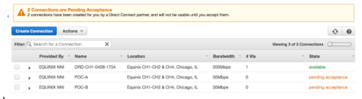

AWS: Virtual Cross Connect Setup | Telnyx Help Center

[Skip to main content](#main-content)

# AWS: Virtual Cross Connect Setup

Learn how to integrate an AWS VPC environment with the Telnyx network backbone.

C

Written by Customer Success

January 10, 2024

Table of contents

[Jump to Instructions](#h_d0dad697c3)

A virtual cross connect (VXC) is a private and direct connection between cloud providers that is faster and safer than a traditional public internet connection. Using this strategy allows you to bypass the internet and gain direct and private access to Telnyx, thereby eliminating hops and reducing the risk of packet loss and jitter. You’ll also benefit from the additional security of direct interconnection.

|  |
| --- |
| ***Note:*** *To protect against man in the middle attacks, we always recommend that you* [encrypt both signaling and media with TLS & Z/SRTP](https://support.telnyx.com/en/articles/1130711-does-telnyx-encrypt-communication). |

Further documentation:

* Amazon AWS [Direct Connect user guide](https://docs.aws.amazon.com/directconnect/latest/UserGuide/Welcome.html)
* Amazon AWS [Direct Connect virtual interfaces user guide](https://docs.aws.amazon.com/directconnect/latest/UserGuide/WorkingWithVirtualInterfaces.html)
* Amazon AWS [Virtual Private Cloud](https://docs.aws.amazon.com/vpc/)

---

# Instructions for integrating Telnyx and AWS through a VXC

In this document, you will:

1. [Provide Telnyx with VXC preferences](#h_fcf7710367)
2. [Create a Virtual Private Gateway (VGW)](#h_36d0c85d12)
3. [Accept pending Direct Connect connections](#h_1bea825e20)
4. [Create a virtual interface for each circuit](#h_89c79af892)
5. [Enable route propagation for VPC route tables](#h_c7aa419f27)

​**Pre-Requisites**

* Have set up an AWS Virtual Private Cloud (VPC)
* Have the following information ready:

  + 12-digit AWS VPC account number
  + AWS region
  + Bandwidth speed between you and your VPC
  + Network name

**Video Walkthrough**

Coming soon! Check back frequently as we are updating our documentation.

## 1. Provide Telnyx with VXC preferences

In this step, you'll provide Telnyx with the information we need to provision Direct Connect connections that you'll then be able to accept in your AWS console.

1. Log into your Telnyx Mission Control Portal.
2. Navigate to the **Networking** section.
3. Click on **Create a New VXC** and provide the following values in the new VXC form:

   1. the 12-digit AWS account number associated with your VPC
   2. AWS region
   3. Bandwidth speed
   4. Network name

After receiving the request, Telnyx will create 1 or 2 Direct Connect connections that you can accept from your AWS console.

|  |
| --- |
| ***Note:*** *This request will take 1-3 days for Telnyx to complete. Once you submit your preferences to Telnyx, you will not be able to change them without creating a new VXC. You can complete step 2 now, but step 3 cannot be completed until Telnyx finishes this task.* |

[Back to Top](#h_d0dad697c3)

## 2. Create a Virtual Private Gateway (VGW)

In this task, you'll set up a VGW, which is an intermediary between AWS Direct Connect and your AWS VPC. You will need to create 1 VGW in order to complete this setup.

First, create the VGW:

1. Open the [Amazon VPC console](https://console.aws.amazon.com/vpc/).
2. Click on Virtual **Private Gateways > Create Virtual Private Gateway**.
3. Name your gateway.
4. Use the default ASN.
5. Choose **Create Virtual Private Gateway**.

Next, associate the new VFG with your destination AWS VPC.

1. From your [Amazon VPC console](https://console.aws.amazon.com/vpc/), select the VWG you just created.
2. Click on the **Actions** button and choose **Attach to VPC**.
3. Select your VPC from the list and choose **Yes, Attach**.
4. You should see the following:

   

[Back to Top](#h_d0dad697c3)

## 3. Accepting pending Direct Connect connections

Once Telnyx finishes creating your new VGWs, they'll be waiting for permission to accept Direct Connect connections. In this step, you'll log into your AWS account. You should find your VGWs waiting for your authorization.

|  |
| --- |
| ***Note:*** *If you requested a backup link, you'll see 2 pending connections in this step. If you didn't, you'll see 1.* |

1. Open your [AWS Direct Connect console](https://console.aws.amazon.com/directconnect/).
2. Click **Connections** in the navigation pane.
3. You should see either 1 or 2 connections waiting for acceptance.

   
4. For each connection in this list, expand each connection and select **I understand that Direct Connect port charges apply once I click Accept Connection**, and then choose **Accept Connection**.

   
5. Once the connections are completed, your output should show each connection as available.

   

[Back to Top](#h_d0dad697c3)

## 4. Create a virtual interface for each circuit

In this step, you will be creating a private virtual interface. These are used to access a VPC using a private IP address. This is where all Layer 3 addressing and [BGP](https://telnyx.com/resources/what-is-bgp) (border gateway protocol) details will be completed.

|  |
| --- |
| ***Note:*** *Some of the information you'll need to supply in this step will have been provided to you in the Telnyx support email that should have come along with your new VGW(s). If you did not receive this, or you can't locate it, just reach out to Telnyx support and we'll sort it out for you!* |

1. Open your [AWS Direct Connect console](https://console.aws.amazon.com/directconnect/).
2. Click on **Connections** in the navigation pane.
3. Select the first connection on the list (that you configured in step 3) and choose **Actions > Create Virtual Interface**.
4. Fill out the form with the following information:

   1. **Public or Private:** Private
   2. **Virtual Interface Name:** Use the connection ID
   3. **Your router peer IP:** Use the Telnyx IP that was provided in the telnyx support email
   4. **Amazon router peer IP:** Use the customer IP that was provided in the Telnyx support email
   5. **BGP ASN:** You can find this in the Telnyx support email
   6. **BGP Authentication Key:** You can find this in the Telnyx support email

   
5. If you requested a redundant backup link, repeat steps 3 through 5 in this step for that connection as well.

[Back to Top](#h_d0dad697c3)

## 5. Enable route propagation for VPC route tables

Now that you have created virtual interfaces (Step 4), BGP sessions will form with Telnyx and routing will be in place on these connections. In this step, you'll ensure that route propagation is enabled for the VGW, which will allow it to automatically propagate routes to the route tables so you don't have to do it manually.

1. Open your [AWS Direct Connect console](https://console.aws.amazon.com/directconnect/).
2. Click the **Route Propagate** tab.
3. Choose **Edit**.
4. Select the **Propagate** checkbox next to your VGW.

Hit **Save**. The routing table should now display Telnyx prefixes routing to the VGW. When these are visible in the routing table, integration between Telnyx and AWS is complete and you can test IP reachability.

That's it, you've now integrated your AWS VPC and Telnyx though VXC.

[Back to Top](#h_d0dad697c3)

---

## Additional Resources

Review our [getting started guide](https://support.telnyx.com/en/articles/1176636-get-started-with-a-mission-control-account) to make sure your Telnyx Mission Control Portal account is set up correctly.

Additionally, see:

* Amazon AWS [Direct Connect user guide](https://docs.aws.amazon.com/directconnect/latest/UserGuide/Welcome.html)
* Amazon AWS [Direct Connect virtual interfaces user guide](https://docs.aws.amazon.com/directconnect/latest/UserGuide/WorkingWithVirtualInterfaces.html)
* Amazon AWS [Virtual Private Cloud](https://docs.aws.amazon.com/vpc/)

---

Related Articles

[Azure: Virtual Cross Connect](https://support.telnyx.com/en/articles/2239446-azure-virtual-cross-connect)[Google VPC: Telnyx Integration](https://support.telnyx.com/en/articles/2239449-google-vpc-telnyx-integration)[Megaport Configuration with TELNYX](https://support.telnyx.com/en/articles/2964210-megaport-configuration-with-telnyx)[Telnyx Networking on AWS Lightsail](https://support.telnyx.com/en/articles/8103288-telnyx-networking-on-aws-lightsail)[Telnyx Networking on AWS VPC](https://support.telnyx.com/en/articles/8104309-telnyx-networking-on-aws-vpc)

Did this answer your question?

😞😐😃

Table of contents
