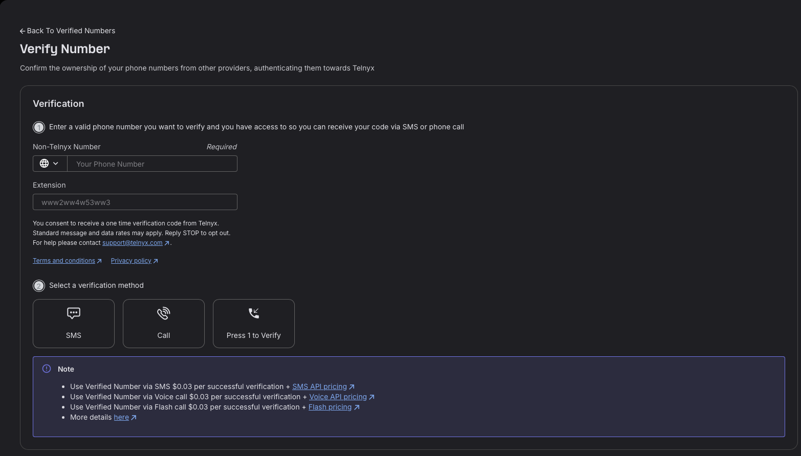

[BETA] How to Verify Phone Numbers Using DTMF (Press 1 to Verify) | Telnyx Help Center

[Skip to main content](#main-content)

# [BETA] How to Verify Phone Numbers Using DTMF (Press 1 to Verify)

Telnyx now supports DTMF-based phone number verification, which allows you to verify phone numbers by simply pressing 1 during a verification call.

Written by Telnyx Engineering

March 9, 2026

Table of contents

## **Overview**

Telnyx now supports DTMF-based phone number verification, which allows you to verify phone numbers by simply pressing 1 during a verification call. This feature simplifies the verification process by eliminating the need to receive and enter a verification code manually.

## **How It Works**

1. You trigger a verification call via the API using the DTMF method  
2. The person associated with the phone number receives a call  
3. They are prompted to press 1 to authorize the verification  
4. If they press 1, the number is verified to your account  
5. If they don't press 1, the verification fails and you can retry  
​

**Note:** The verification call does not mention Telnyx anywhere, maintaining privacy.

## **Single Number Verification**

​*API Request:*

```
POST /v2/verified_numbers {   "phone_number": "+1541234567",  
  "verification_method": "dtmf" }
```

​*cURL Example:*

```
curl --location 'https://api.telnyx.com/v2/verified_numbers'   
\ --header 'Content-Type: application/json'   
\ --header 'Authorization: Bearer YOUR_API_KEY'   
\ --data '{   "phone_number": "+1541234567",     
"verification_method": "dtmf" }'
```

## **Bulk Number Verification**

To verify multiple phone numbers at once, you can loop through your list of numbers and make individual API calls for each:  
​  
​*Python Example:*

```
import requests   
import time    
  
API_KEY = "YOUR_API_KEY"   
API_ENDPOINT = "https://api.telnyx.com/v2/verified_numbers"   
phone_numbers = ["+15412345678", "+15412345679", "+15412345680"]   
   
headers = {     "Content-Type": "application/json",     "Authorization": f"Bearer {API_KEY}" }   
  
for phone_number in phone_numbers:       
payload = {   "phone_number": phone_number,           
"verification_method": "dtmf"     }      
  
response = requests.post(API_ENDPOINT, json=payload, headers=headers)     print(f"Verification initiated for {phone_number}")      
time.sleep(1)  # Delay to avoid rate limiting
```

​*Bash Script (for CSV Input):*

```
#!/bin/bash API_KEY="YOUR_API_KEY"  
API_ENDPOINT="https://api.telnyx.com/v2/verified_numbers"    
  
while IFS= read -r phone_number; do      
curl -s --location "$API_ENDPOINT" \           
--header 'Content-Type: application/json' \           
--header "Authorization: Bearer $API_KEY" \           
--data '{"phone_number": "'$phone_number'", "verification_method": "dtmf"}'     sleep 1 done < phone_numbers.csv
```

## **Checking Verification Status**

```
curl --location 'https://api.telnyx.com/v2/verified_numbers/+1541234567'   
\ --header 'Authorization: Bearer YOUR_API_KEY'
```

## **Receiving Verification Events via Webhooks**

You can also register a webhook to receive verification events automatically, instead of polling the API for status. Simply include a `verification\_webhook\_url` in your request:  
​

```
POST /v2/verified_numbers  
{  
  "phone_number": "+1541234567",  
  "verification_method": "dtmf",  
  "verification_webhook_url": "https://your-api.com/api/verification_webhook"  
}
```

Verification events will be pushed to your webhook URL in the following format:

```
json  
{  
"data": {  
"event_type": "caller_id_verification.completed",  
"id": "evt_abcd-456-hijsk-123",  
"occurred_at": "YYYY-MM-DDT14:22:07.123456Z",  
"payload": {  
"phone_number": "+1245456784",  
"record_type": "caller_id_verification",  
"verification_method": "outbound_call",  
"verified_at": "YYYY-MM-DDT14:21:58.654321Z"  //verification date  
},  
"record_type": "event"  
}  
}
```

## ​Using the Mission Control Portal

To trigger Press 1 to verify using the Mission Control Portal, follow the following steps;  
1 - Login to your portal account and navigate to Numbers > Verify Numbers Section.  
2 - Add number you want to verify.  
3 - Click the "Press 1 to verify" button.   
​  
Target Number will receive the verification call and if they press 1, that number will be listed in the Verified Numbers Tab.  
​



​**Best Practices**

• Add delays between bulk verification requests to avoid rate limiting  
• Implement error handling for failed verification attempts  
• If a user doesn't answer or press 1, you can retry the verification call  
• Keep track of verification statuses for your records  
​  
​**Troubleshooting**

• *Verification call not received:* Verify the phone number is correct and can receive calls  
• *User didn't press 1 in time:* Retry the verification call  
• *Rate limit exceeded:* Add delays between requests  
• *Invalid phone number format:* Ensure phone numbers are in E.164 format (e.g., +15412345678)  
​

---

Related Articles

[Telnyx Verify: 2FA made easy](https://support.telnyx.com/en/articles/5701653-telnyx-verify-2fa-made-easy)[Verified Numbers](https://support.telnyx.com/en/articles/6988813-verified-numbers)[How to Verify Phone Numbers behind an IVR](https://support.telnyx.com/en/articles/12386088-how-to-verify-phone-numbers-behind-an-ivr)

Did this answer your question?

😞😐😃

Table of contents
