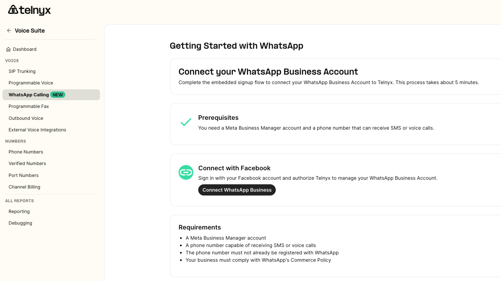
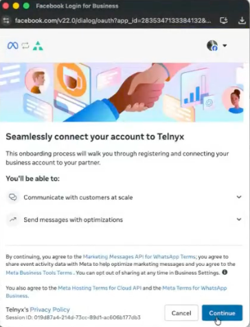
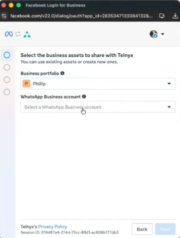
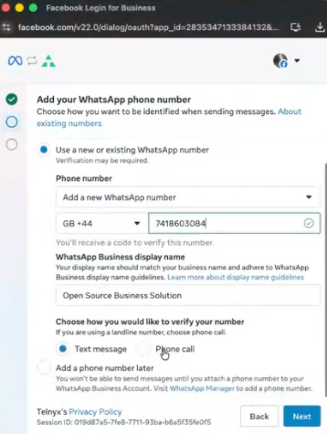
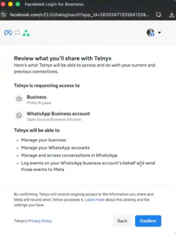
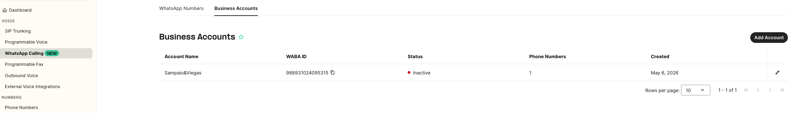
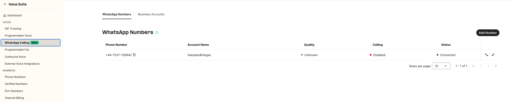
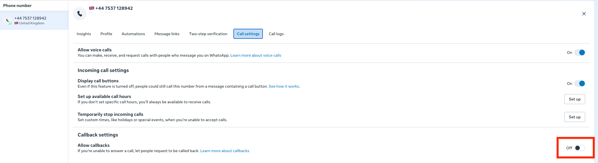
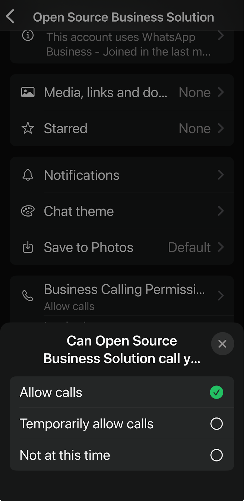

Enabling WhatsApp Business Calling on Telnyx Numbers | Telnyx Help Center

[Skip to main content](#main-content)

# Enabling WhatsApp Business Calling on Telnyx Numbers

Written by Telnyx Engineering

May 13, 2026

Table of contents

WhatsApp Business Calling lets your business receive and place voice calls with WhatsApp users using your Telnyx numbers.

Users can call directly from the WhatsApp app to your numbers and Telnyx will route these calls to your SIP connection or Programmable Voice application.

Similarly, you can initiate calls from your connection or application to WhatsApp numbers.

Rather than routing through the PSTN like traditional calls, WhatsApp Business Calls are routed directly and securely between Telnyx and Meta.

By enabling WhatsApp Calling through Telnyx, you can leverage Telnyx platform capabilities, including Programmable Voice, AI Assistants, call recording, and real-time analytics, all from Mission Control Portal or the API.

---

## **Who it's for**

Businesses already using WhatsApp for customer communication that want to extend their interactions to voice, on a secure, widely adopted channel, without building a separate integration or managing a different infrastructure.

---

## **Requirements**

* A WhatsApp Business Account (WABA)
* A Telnyx phone number that will be linked to your WABA

  + The Telnyx number used for WhatsApp Calling must belong to the same Telnyx account where the WhatsApp Calling configuration is being created
* A WhatsApp Business Account associated with a business/business portfolio that has a daily messaging limit of at least 2,000 unique recipients.

  + If this requirement is not met, Meta may reject Calling enablement with the error “Calling APIs cannot be enabled for this phone number.”

---

## **Availability**

|  |  |
| --- | --- |
| **Call Type** | **Availability** |
| User-initiated calls | Available wherever WhatsApp Business is available |
| Business-initiated calls | Not available for business numbers in: USA, Canada, Egypt, Vietnam, Nigeria (based on the phone number's country code).        ⚠️ **Important:** Before placing a call, you must obtain the user's calling permission. More details on how to obtain permission below. |

# **Enable Whatsapp Business Calling in Mission Control**

These instructions will help you enable Whatsapp Business Calling in Telnyx Mission Control Portal.

If you already have a Telnyx number configured in the portal for messaging purposes and you just need to enable Whatsapp calling you can skip to step 5.

#### **Step 1 - Connect Your WhatsApp Business Account**

1. In Mission Control, navigate to **Voice Suite → WhatsApp Calling**.  
   ​

   

   ​
2. Click **"Connect WhatsApp Business"** which will trigger the embedded signup windows for the integration with Meta.  
   ​

   

   ​
3. Select the **WhatsApp Business Account (WABA)** you want to associate with WhatsApp Calling.  
   ​  
   ​

   

**Step 2 - Associate your Telnyx number**

1. Select the Telnyx phone number you want to enable for WhatsApp Calling.  
   ​

   
2. Your Telnyx number must be active and able to receive calls or SMS (mobile numbers only) — Meta will send a verification code to confirm ownership.  
   ​

   
3. Enter the verification code once received.

#### **Step 3 - Confirm your configuration**

1. Review and confirm your WhatsApp configuration in Telnyx.  
   ​

   
2. You'll see a confirmation screen indicating your Meta account has been successfully connected to Telnyx.  
   ​

   
3. Navigate to **Voice Suite → WhatsApp Calling → Business Account** — your WABA should now appear with an **Active** status.

   ​

   

   You can view and edit account details and settings from here.   
   It can take up to 2 minutes for this information to show up.  
   ​

   

   ​

   #### **Step 4 — Enable WhatsApp Calling in Telnyx**

1. In Mission Control, navigate to **Voice Suite → WhatsApp Calling → WhatsApp Numbers**.  
   ​

   

   ​
2. Select your number — it should show a **Connected** status.  
   ​

   

   ​
3. Open the **Calling** tab and toggle **WhatsApp Calling** to enabled.

---

# **Place and Receive Calls**

## **User-Initiated Calls**

Once WhatsApp Calling is enabled on your number, your business is ready to receive calls from any WhatsApp user.

WhatsApp users can reach you in the following ways:

* **Call button in chat** — if enabled, a call icon appears directly in the WhatsApp chat interface with your business.
* **Click-to-call button** — via an interactive message or template you send to the user.
* **Deep link** — a call link you embed on your website, app, or QR code that launches a call directly.

Regardless of how the call is initiated, it connects through WhatsApp and is routed to your Telnyx number, handled by your existing SIP connection or Programmable Voice application, just like a regular inbound call. No additional setup is required.

## **Business-Initiated Calls**

You can initiate a call to any Whatsapp Number as long as you meet these requirements:

1. You’re initiating the call from one of your SIP connections or Programmable Voice applications
2. You’re using the Whatsapp Calling number as the From number
3. The user has granted permission for you to call them
4. Your Whatsapp Calling number is not from any of these countries: USA, Canada, Egypt, Vietnam, Nigeria

To place a call to a WhatsApp user from your Telnyx number, use the following dial string format:

`<destination_number>@whatsapp-<your_telnyx_number>.sip.telnyx.com`

Where:

* `<destination_number>` is the WhatsApp user's phone number in E.164 format (e.g. `+447911123456`)
* `<your_telnyx_number>` is your WhatsApp-enabled Telnyx number in E.164 format, without the leading +

**Example:** If your Telnyx number is `+447418613982` and you want to call `+447911123456,` the dial string is:

[`+447911123456@whatsapp-447418613982.sip.telnyx.com`](mailto:%2B447911123456@whatsapp-447418613982.sip.telnyx.com)

This SIP URI can be used as the destination when placing WhatsApp calls from SIP, Voice API, or TeXML workflows.

## **Obtaining calling permission**

You can obtain calling permission from a WhatsApp user in any of the following ways:

1. **Send a call permission request to the user** — Send a free-form or templated message requesting calling permission from the user. User has the option to choose between temporary or permanent.
2. **Callback permission is provided by the WhatsApp user** — The WhatsApp user automatically provides temporary call permissions by placing a call to the business. The [callback setting must be enabled](https://developers.facebook.com/documentation/business-messaging/whatsapp/calling/call-settings#configure-update-business-phone-number-calling-settings) on the business phone number.
3. **WhatsApp user provides call permission via Business Profile** — The WhatsApp user provides call permissions to the business through their business profile.

#### **Send a call permission request to the user**

Send a permission request to the WhatsUp user via the WhatsApp Cloud API, either as a template or free-form message   
Keep in mind the following rate limits:

* Maximum **1 request per 24 hours** per user
* Maximum **2 requests per 7 days** per user
* These limits **reset automatically** once a connected call (business- or user-initiated) takes place between you and the user.

1. **Wait for approval.** Once the user grants permission, you can place the outbound WhatsApp call from your configured Telnyx workflow.
2. **Understand permission duration.** Permissions can be:

   * **Temporary** — valid for 7 days
   * **Permanent** — granted by the user indefinitely

More details about the call permission request flow and sample message can be found [here](https://developers.facebook.com/documentation/business-messaging/whatsapp/calling/user-call-permissions#call-permission-request-flow-and-sample-messages)

**Callback permission is provided by the WhatsApp user**

Businesses can configure the phone number call setting to allow callbacks. When enabled, a temporary calling permission is automatically granted after a WhatsApp user calls the business profile.

Go to WhatAapp Manager>Phone on your Meta Business Suite, select your number, go to Call Settings and enable "Allow Callbacks"  
​  
​

#### **WhatsApp user provides call permission via Business Profile**

WhatsApp users can grant permission directly from your WhatsApp Business profile at any time by following these steps:

1. Save your Telnyx number as a WhatsApp contact
2. Open the contact — it will appear as a Business Profile
3. Tap **View Contact** → **Business Call Permission**
4. Select the desired permission option

#### **Important: Unanswered call behaviour**

WhatsApp monitors consecutive missed business-initiated calls on a per-user basis:

* After **2 consecutive unanswered calls**, WhatsApp sends the user a nudge notification.
* After **4 consecutive unanswered calls**, permission is **automatically revoked** and you'll need to request it again.

To avoid hitting this limit, only call users who are expecting to hear from you.

More information about Meta calling permissions can be found [here](https://developers.facebook.com/documentation/business-messaging/whatsapp/calling/user-call-permissions)

---

## **Troubleshooting**

* **Calling toggle** — Confirm "Calling" is enabled for the number in Mission Control.
* **Geo eligibility** — If business-initiated calling fails, check the business phone number's country code against the exclusions listed above.
* **Permission state** — For business-initiated calls, verify user permission (temporary or permanent). If absent, send a permission request first.
* **Still stuck?** — Confirm your number is a Telnyx number under your WABA.

---

## **Price**

A flat fee of **$0.0025/min** applies to both **user-initiated** and **business-initiated** WhatsApp calls.

Business-initiated calls are also subject to additional WhatsApp Calling charges based on the applicable rate deck.

To view your rates, check **My Pricing** in the portal or contact your account representative.

---

## **FAQs**

**Can I bridge WhatsApp calls to PSTN?** No. WhatsApp Calling is on-net to WhatsApp users only.

**Do calls count against messaging limits?** No. Calling has separate limits. However, Meta requires the WABA to have a ≥ 2,000 daily messaging limit to enable Calling.

**Is there a limit to how many calls I can receive at once?** Yes. Meta's maximum is 1,000 concurrent calls per business number.

**What's the difference between user-initiated and business-initiated calls?**

* **User-initiated:** The user calls your Telnyx number through WhatsApp, no special permission needed.
* **Business-initiated:** You call the user, but must first request their permission either through a template message or a free-form message during an active customer service window.
* **How do business-initiated calling permissions work?** Send a permission request (max 1 per 24 hours, 2 per 7 days per business+user). Temporary permission lasts 7 days; permanent permission is also supported. If 2 consecutive business-initiated calls go unanswered, WhatsApp notifies the user. After 4 consecutive unanswered calls, permission is auto-revoked.

**Why is my business-initiated call failing?**

Common causes include:

* The dial string is not properly formatted according to the integration requirements
* The WhatsApp user has not granted calling permission
* The user’s temporary calling permission has expired
* The calling permission was automatically revoked after repeated unanswered calls
* The WhatsApp calling number is not associated with the connection being used to place the call

Verify that the dial string matches the documented format, ensure the WhatsApp user has granted valid calling permissions, and confirm that the WhatsApp-enabled number is assigned to the same connection originating the call.

---

Related Articles

[What is WhatsApp Business Platform?](https://support.telnyx.com/en/articles/13986480-what-is-whatsapp-business-platform)[WhatsApp Pricing on Telnyx](https://support.telnyx.com/en/articles/13986484-whatsapp-pricing-on-telnyx)[How to Set Up WhatsApp on Telnyx](https://support.telnyx.com/en/articles/13986485-how-to-set-up-whatsapp-on-telnyx)[WhatsApp FAQ](https://support.telnyx.com/en/articles/13986488-whatsapp-faq)[WhatsApp Troubleshooting Guide](https://support.telnyx.com/en/articles/13986489-whatsapp-troubleshooting-guide)

Did this answer your question?

😞😐😃

Table of contents
