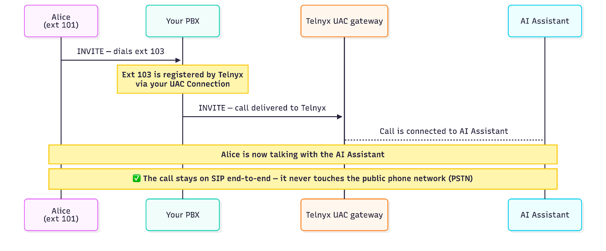
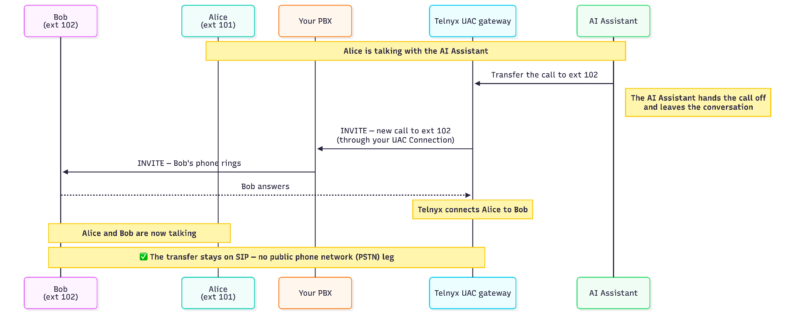

# UAC Call Transfer: AI Assistant to Live Agent

## Overview

A UAC (User Agent Client) connection is used by Telnyx to register as a SIP endpoint with your PBX, the same way an IP phone or softphone would, and lets you route PBX calls on that extension to any type of Telnyx connection or application.

For each SIP UAC connection you can define an **Internal SIP URI**, which defines the URI that will be dialed upon receiving a call from your PBX.

One possible application is to route calls to a Telnyx AI Assistant, so calls from any PBX extension can be connected to an AI Assistant.

After answering the call, the AI Assistant might need to transfer it to another PBX extension. This article walks through an AI Assistant transfer example.

The following parties are involved:

- **Caller**: a PBX user (e.g. Alice, ext 101)
- **Your PBX**: routes your extensions, and forwards calls for extensions it doesn't own to registered connections
- **Telnyx UAC gateway**: registers with your PBX as a single extension (e.g. ext 103), via a UAC Connection
- **AI Assistant**: an automated agent reachable at a fixed internal SIP URI on your Telnyx account
- **Callee**: another PBX user (e.g. Bob, ext 102)

The rest of this article walks through the two telephony legs: Alice calling in to the assistant, and the assistant transferring her to a live agent (Bob).

## Part 1: Alice reaches the AI Assistant

The extension `103@<pbx_domain>` is provisioned as the AI Assistant's line through a UAC connection.

Alice, on extension 101, dials extension 103 to reach the AI Assistant's line:

1. Alice's phone sends an INVITE to your PBX for ext 103.
2. Your PBX routes the call to the Telnyx UAC gateway, which was registered under that extension.
3. The Telnyx UAC gateway routes the call to the AI Assistant, using the preconfigured internal SIP URI (the assistant's dedicated Telnyx subdomain).
4. The call connects to the AI Assistant. Alice is now in a live conversation with it.

At every step the call stays on SIP. There is no PSTN leg. The UAC connection is a pure SIP trunk between your PBX and Telnyx.

## Part 2: The AI Assistant transfers Alice to Bob

When the assistant decides a human should take over, it initiates a Programmable Voice transfer to another PBX extension, in this example Bob's extension 102.

The proper transfer mechanism is to start a new call from the AI Assistant to Bob and then bridge that call to the existing call from Alice. Do not use SIP REFER as the transfer mechanism, as it's not supported.

5. The AI Assistant sends a Programmable Voice TeXML transfer command targeting `102@<uac_connection_sip_subdomain>.sip.telnyx.com`.
6. The assistant then leaves the call, and a new call towards the UAC gateway initiates.
7. The Telnyx UAC gateway receives the call and routes it back to your PBX as `102@<pbx_domain>`.
8. Your PBX receives the INVITE and rings Bob's extension (102), exactly as it would for any other inbound call to that extension.
9. Bob answers. Telnyx bridges the two legs, Alice's original leg and the new leg to Bob, so Alice and Bob are now talking directly.

This is a warm transfer: Telnyx dials Bob and bridges him onto the call once he answers, rather than a blind handoff. What Alice hears while Bob's phone is ringing, and what happens if he never answers, isn't shown in these diagrams (see the open question under Troubleshooting).

As with the inbound call, the transfer never drops to the PSTN: it's a second SIP INVITE through the same UAC connection, routed back to your PBX by extension number.

## Troubleshooting

If a call doesn't reach the assistant, or a transfer doesn't reach Bob, check these in order:

- **Extension registration**: confirm the extension (103 for the assistant, 102 for Bob) shows as registered by Telnyx on your PBX. If it isn't registered, the PBX has no route and the call fails immediately.
- **UAC Connection config**: verify the connection is pointed at the correct internal SIP URI for the AI Assistant, and that it's the same connection/subdomain the Programmable Voice transfer targets.
- **Programmable Voice transfer target format**: the subdomain in `102@<uac_connection_sip_subdomain>.sip.telnyx.com` must exactly match your UAC Connection's subdomain; a mismatch sends the transfer nowhere your PBX will recognize.
- **PBX routing for the target extension**: confirm 102 is mapped to Bob's actual device/endpoint, not just registered.
- **No-answer handling**: decide and confirm what happens if Bob doesn't pick up (voicemail, ring group, fallback extension), since the transfer as described here assumes Bob answers.
- **Using SIP REFER instead of Programmable Voice**: if your integration tries a SIP REFER ("cold transfer") instead of the Programmable Voice transfer described in Part 2, it will fail. UAC connections don't forward REFER messages to your PBX.
