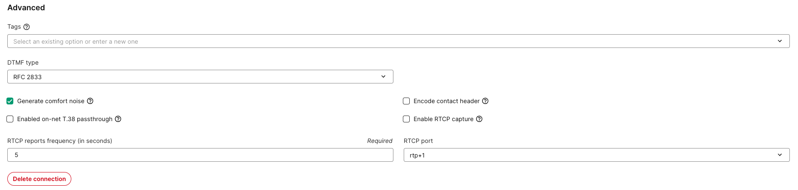

# Call Hold, Comfort Noise, and RTP Stream Generation

This article describes how Telnyx detects SIP call hold and handles RTP media, Music on Hold, comfort-noise packets, and opposite-leg media generation during hold states.

## Valid Hold Signaling

Regardless of whether the SIP user is on the A leg or B leg, Telnyx recognizes a SIP re-INVITE as a valid hold request when its SDP contains any of the following:

| SDP Attribute | Description |
| --- | --- |
| `a=sendonly` | The endpoint signals it will only send media (not receive). |
| `a=inactive` | The endpoint signals the media stream is temporarily inactive in both directions. |
| SDP media IP `0.0.0.0` | Legacy hold mechanism: the endpoint sets the connection IP to `0.0.0.0` to indicate hold. |

When Telnyx receives any of these signals, it accepts the hold request and responds with `200 OK`.

## Behavior During a Recognized Hold

When Telnyx recognizes a valid hold request, two things always happen:

1. **Telnyx does not enforce RTP timeout on the SIP user's leg.** The user's leg stays alive even if media stops flowing.
2. **Telnyx does not propagate the hold to the opposite leg.** The opposite leg is not placed on hold; it continues as an active call.

With **Generate Comfort Noise enabled** (the default), Telnyx handles the following media behaviors during hold:

### 1. No RTP media

If the user stops sending RTP entirely after signaling hold, Telnyx **generates a silent RTP stream** toward the opposite leg. This keeps the far side from detecting a media gap and ending the call due to RTP timeout.

### 2. RTP media continues (Music on Hold)

If the user continues sending RTP media during the hold (common when a PBX plays Music on Hold while signaling `a=sendonly`), **Telnyx bridges that media to the opposite leg** instead of generating its own silent RTP stream. The far side hears whatever the user is playing.

### 3. Comfort Noise packets (payload type 13)

If the user sends RTP Comfort Noise (CN) packets with payload type 13, Telnyx **generates a silent RTP stream** toward the opposite leg. The CN packets keep the user's leg alive, and Telnyx ensures the opposite leg also receives media to prevent timeout.

All three scenarios prevent the far side from ending the leg due to RTP timeout.

## Connection Setting: Generate Comfort Noise

The SIP Connection setting **Generate Comfort Noise** is available in the Mission Control Portal under **Advanced Settings** on your SIP Connection. This setting is **enabled (checked) by default**, and the default behavior is described above.

When this setting is disabled, Telnyx accepts the hold re-INVITE and responds with `200 OK`, but **does not generate a silent RTP stream** toward the opposite leg. The far side may terminate the leg if it enforces RTP timeout. This is especially common with termination carriers.

### When Generate Comfort Noise is disabled

| Media sent by your endpoint | Media sent to the opposite leg | RTP timeout risk |
| --- | --- | --- |
| No RTP | No silent RTP generated | Yes |
| Music on Hold (`a=sendonly`) | Your Music on Hold is bridged | No |
| Comfort Noise (PT 13) | No silent RTP generated | Yes |

## Unsignaled or Invalid Hold

Telnyx does **not** recognize a call as being on hold when the user stops sending media and either:

- Does not send a re-INVITE at all; or
- Sends a re-INVITE containing `a=sendrecv` (which is not a hold signal).

In this situation, Telnyx does **not** generate a silent RTP stream toward the opposite leg. The far side may terminate that leg if it enforces RTP timeout. This is especially common with termination carriers.

If the user sends RTP Comfort Noise packets (payload type 13) without a valid hold re-INVITE, Telnyx does not enforce RTP timeout on the user's leg, but still does not generate a silent RTP stream toward the opposite leg.

If the user cannot configure their SIP devices to send a valid recognized hold request to Telnyx and is experiencing RTP timeouts enforced by the opposite side, Telnyx can enable an experimental setting that generates a silent RTP stream **only** upon receiving RTP Comfort Noise packets (payload type 13).

This experimental setting is not exposed through the Telnyx Mission Control Portal or API. To request it, contact Telnyx Support with your account ID or connection ID and reference "comfort noise generation on CN packet receipt and no hold request."

## Quick Reference

### Valid hold request

| Media sent by your endpoint | Generate Comfort Noise | Media sent to the opposite leg | RTP timeout risk |
| --- | --- | --- | --- |
| No RTP | Enabled | Telnyx-generated silent RTP | No |
| No RTP | Disabled | No media generated | Yes |
| Music on Hold (`a=sendonly`) | Enabled or disabled | Your Music on Hold is bridged | No |
| Comfort Noise (PT 13) | Enabled | Telnyx-generated silent RTP | No |
| Comfort Noise (PT 13) | Disabled | No media generated | Yes |

### No valid hold request

| Signaling when your endpoint stops media | Media sent to the opposite leg | RTP timeout risk |
| --- | --- | --- |
| No re-INVITE | No media generated | Yes |
| re-INVITE with `a=sendrecv` | No media generated | Yes |

RTP timeout risk in these tables refers to the opposite leg.

## Related Articles

- [SIP Connection: Settings](https://support.telnyx.com/en/articles/4351104-sip-connection-settings)
- [SIP Connection Types](https://support.telnyx.com/en/articles/4245868-sip-connection-types)
- [Telnyx Debugging Tools](https://support.telnyx.com/en/articles/4304872-telnyx-debugging-tools)
