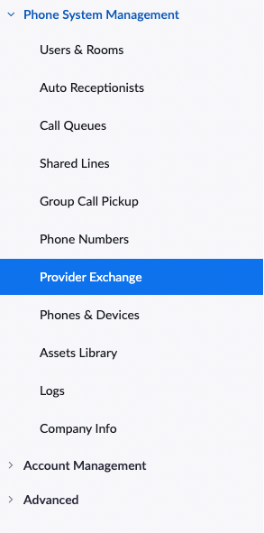
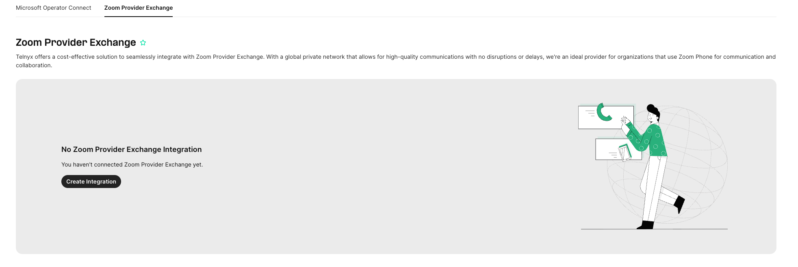
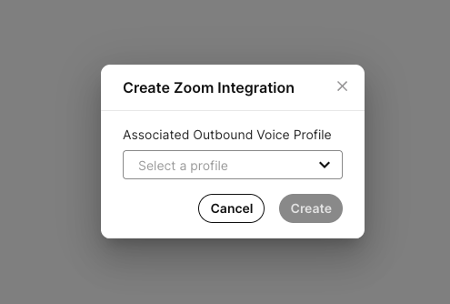
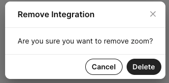

# Connect Telnyx to Zoom Phone with Provider Exchange

Use Zoom Provider Exchange to connect your Telnyx account to Zoom Phone, associate Telnyx phone numbers with the integration, and assign those numbers to Zoom users. This guide also explains how to unassign numbers and remove the integration.

## Before you begin

You need:

- A Zoom account with **Zoom Phone enabled** and access to **Phone System Management**.
- A Telnyx account. You can sign in to an existing account or create one during setup.
- An **Outbound Voice Profile** to select when creating the integration.
- Telnyx phone numbers that are not already assigned to a SIP Connection, or the option to purchase new numbers during setup.

You can manage the integration from [External Voice Integration in the Telnyx portal](https://portal.telnyx.com/#/app/connections/external-voice-integration).

## 1. Select Telnyx in Zoom Provider Exchange

1. [Sign in to Zoom](https://zoom.us/signin).
2. Go to **Phone System Management > Provider Exchange**.
3. Search for **Telnyx** in the provider list.
4. Select **Connect**. Zoom redirects you to the Telnyx portal.

If your Zoom account is already connected to Telnyx, the provider status displays **Connected** with a green checkmark.

## 2. Sign in to Telnyx

Sign in to your existing Telnyx account. If you do not have an account, complete the **Create a free account** form.

After signing in, you are redirected to the **External Voice Integration** screen.

## 3. Create and authorize the integration

1. Select **Create Integration** in the Telnyx portal. You are redirected to Zoom.
2. Sign in to Zoom if prompted.
3. Review the authorization request and allow the Telnyx app to access your Zoom account.
4. After Zoom redirects you back to Telnyx, select an **Outbound Voice Profile** from the list.
5. Select **Create**.

Selecting an Outbound Voice Profile is required. Explicitly select the default profile or another profile you have created. See [More About Outbound Voice Profiles](https://support.telnyx.com/en/articles/4320411-more-about-outbound-voice-profiles) for configuration details.

Zoom normally presents the authorization request once, unless you revoke the app's authorization in Zoom.

## 4. Associate Telnyx numbers with the integration

You can associate existing numbers or purchase new ones.

### Use existing numbers

1. Open the Zoom integration's **Numbers** tab in the Telnyx portal.
2. Select **Add Numbers**.
3. Search for and select the numbers you want to associate.
4. Confirm the association.
5. Verify that the numbers appear in the integration's number list with an **Active** status.

Only numbers that are not already assigned to a SIP Connection are available for selection.

### Buy new numbers

Select **Buy Numbers** to open the **Search & Buy Numbers** screen in the Telnyx portal. Purchase the numbers you need, then associate them with the Zoom integration.

See [Search and Buy Numbers](https://support.telnyx.com/en/articles/4380325-search-and-buy-numbers) for purchasing instructions.

## 5. Assign a number to a Zoom user

Associating a number with the Telnyx integration makes it available in Zoom. You must also assign it to a Zoom user.

1. In the Zoom portal, go to **Phone System Management > Phone Numbers**.
2. Select the **Unassigned** tab.
3. Find the Telnyx number you associated with the integration.
4. Select **Assign To**.
5. Select the user and choose **OK**.
6. Verify that the number and user appear in the **Assigned** tab.

## Unassign a number from a Zoom user

Unassign the number in Zoom before removing it from the Telnyx integration.

1. In the Zoom portal, go to **Phone System Management > Phone Numbers**.
2. Open the **Assigned** tab and select the Telnyx number.
3. Select **Unbind** and confirm.
4. Verify that the number no longer appears in the assigned-number list.

## Remove a number or the integration

Complete the following actions in order when removing the entire integration:

| Action | Required first |
| --- | --- |
| Remove a number from the Telnyx integration | Unassign the number from its Zoom user. |
| Disable the Zoom integration | Remove all numbers associated with the integration. |
| Delete the Zoom integration | Disable the integration. |

### Remove a number from the Telnyx integration

1. Unassign the number from its Zoom user as described above.
2. In the Telnyx portal, open **External Voice Integration**.
3. For the Zoom integration, select **Actions > Edit Integration**.
4. Open the **Numbers** tab.
5. Select the bin icon next to the number and confirm removal.
6. Verify that the number no longer appears in the integration's number list.

**Removing a number from the integration does not delete it from your Telnyx account.** You can reuse it for another purpose or add it back to the Zoom integration. See [My Numbers Page](https://support.telnyx.com/en/articles/4349113-my-numbers-page) for number-management details.

### Disable the Zoom integration

You can disable the integration only after removing all associated numbers.

1. Open **External Voice Integration** in the Telnyx portal.
2. Select **Actions > Edit Integration** for the Zoom integration.
3. Open the **Settings** tab.
4. Turn off **Enable Connection** and save the change.

### Delete the Zoom integration

You can delete the integration only after disabling it.

1. Return to **External Voice Integration**.
2. For the Zoom integration, select **Actions > Remove Integration**.
3. Confirm the removal by selecting **Delete**.

The Zoom External Voice Integration is removed from your Telnyx account.
