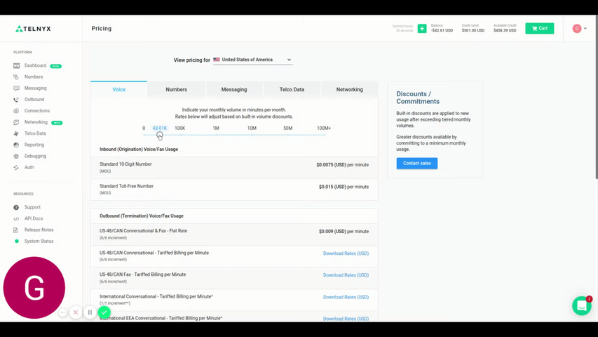

# Where can I see Pricing options?

In this article we will explain how to find our pricing options and adjust them for your account. See Telnyx guidance and requirements.

C

If you would like to see our current Pricing options, please navigate to the Pricing page under your account's icon (top right) within your Portal. On our Pricing page you will be able to search through 5 different tabs (Voice, Numbers, Messaging, Telco Data and Networking).

## **Toggle Use**

On each tab, there is a toggle which will indicate the pricing based on your desired usage; pricing rates will adjust based on the toggled volume.

1. **Voice**: toggle between the bucketed monthly minutes volume for Inbound (Origination) Voice/Fax usage for both Standard DID's and Toll-Free DID's
2. **Numbers**: toggle between the required amount of numbers per month
3. **Messaging**: toggle between the bucketed monthly message volume per month
4. **Telco Data**: CNAM, LRN and Switch Data pricing
5. **Networking**: select different bandwidth options for Mbps per month

Please see an example below for navigating our Pricing page:

