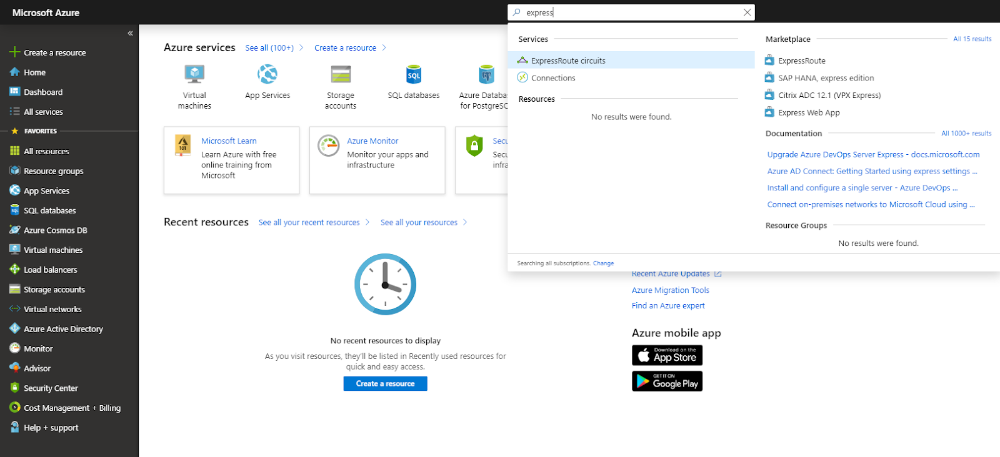
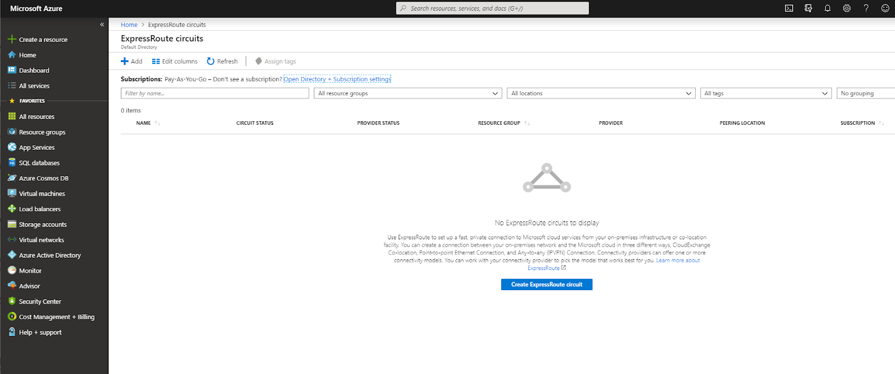
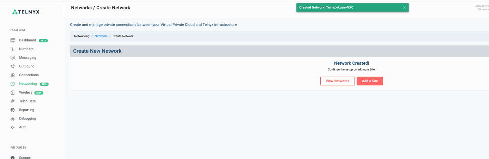
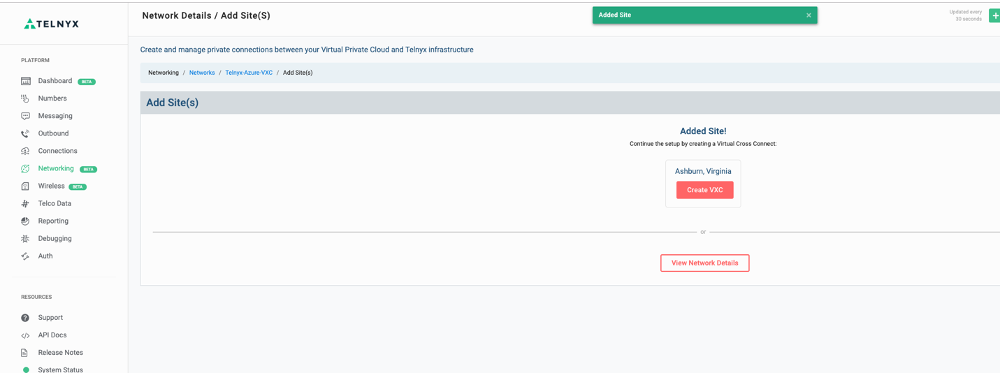
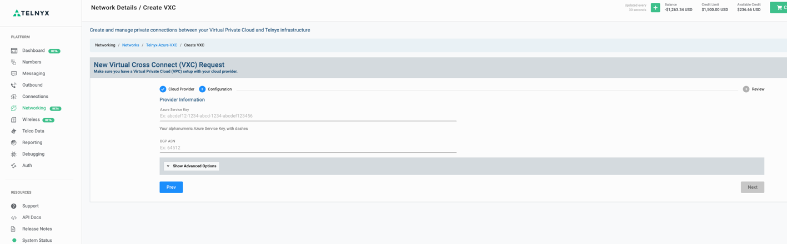
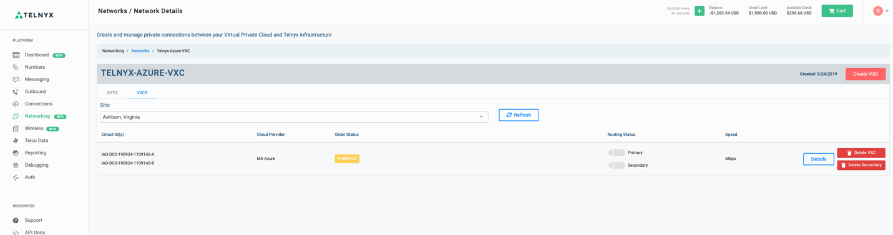
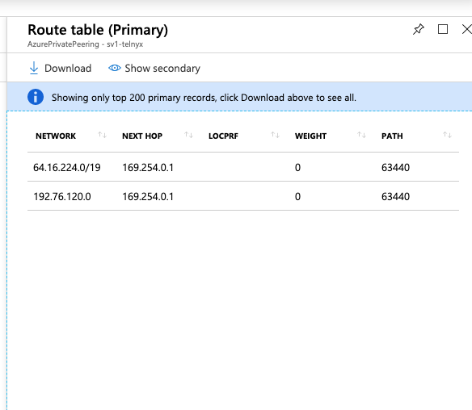

Azure: Virtual Cross Connect | Telnyx Help Center

[Skip to main content](#main-content)

# Azure: Virtual Cross Connect

This document will provide instructions and guidelines for integrating an Azure VPC environment with the Telnyx network backbone.

C

Written by Customer Success

January 10, 2024

Table of contents

[Jump to Instructions](#h_c4436070ec)

This document will provide instructions, technical details and guidelines for integrating a [Microsoft Azure Cloud](https://azure.microsoft.com/en-us/) environment with the Telnyx network backbone. A virtual cross connect (VXC) is a private and direct connection between cloud providers that is faster and safer than a traditional public internet connection. Using this strategy allows you to bypass the internet and gain direct and private access to Telnyx, thereby eliminating hops and reducing the risk of packet loss and jitter. You’ll also benefit from the additional security of direct interconnection.

Additional documentation:

* [Microsoft Azure technical documentation](https://learn.microsoft.com/en-us/)

---

# Instructions for integrating Azure VPC with Telnyx

In this activity you will:

1. [Prepare your Microsoft account for an Azure Express Route](#h_1dd7eadf26)
2. [Set up a VXC in your Telnyx Mission Control Portal](#h_d1bbf97e8d)
3. [Turn up routing and NAT configuration](#h_ac858b4624)

**Pre-requisites**

* Have a Microsoft Azure cloud environment

**Video Walkthrough**

Coming soon! Check back frequently as we are updating our documentation.

## 1. Prepare Microsoft account for Azure Express Route.

1. ### **Log into your [Azure Portal](https://portal.azure.com/#home).**

   
2. ### **Perform a search for *express route* and click on *Express Route Circuits.***

   
3. ### **Click on Add -> Provider. This provider *must* be *Equinix*, *do \*NOT\** select *Allow Classic Operations*. Rename other fields at your discretion.**

   

   
4. ### **Click OK.**
5. ### **Once the deployment completes, you will see your newly-provisioned Azure Express Route.**

   

[Back to Top](#h_c4436070ec)

## 2. Set up the VXC in your Telnyx Mission Control Portal

1. ### **Log into your [Telnyx Mission Control Portal](https://portal.telnyx.com).**
2. ### **Click on "Networking" in the left-hand menu**

   
3. ### **Click on the "Create New Network" button on the top-right.**

   
4. ### **Give your network a name and click on the "Create Network" button**

   
5. ### **Once the Network is Created, Next step is to add the site. Click on the "Add a Site" button.**

   
6. ### **Choose the Telnyx Backbone Network you want to peer with.**

   
7. ### **Add the VXC, by clicking on "Create VXC".**

   
8. ### **Create an Azure Express Route.**

   #### Note that in order to complete this section, Stage 1 needs to have been completed.

   

   ​
9. ### **Key in Azure Service Key and Microsoft Azure ASN. Typically it is 12076**

   

   #### **You can see a sample Service Key and ASN Displayed Below**

   
10. ### **Now create your VXC and submit it to Telnyx Network team.**

    

    #### Connection acceptance will be TELNYX Network Team.

    

|  |
| --- |
| ***IMPORTANT:*** *Do NOT Enable Routing status via the slider, this step has to be coordinated in sync with Telnyx Network Team, as enabling this without Backend configuration may blackhole your voice traffic.* |

[Back to Top](#h_c4436070ec)

## 3. Turning up Routing and NAT configuration

1. Arrange a Maintenance activity and co-ordinate with TELNYX Network engineering to turn on the Routing. Please [contact our Support Team](https://telnyx.com/contact-us) to assist with this.   
   ​  
   ​***Note:*** *This activity has to be co-ordinate with the Network team to complete Back-end configuration during the Maintenance window.*
2. Once you enable the circuit using the Routing Status slider, you should see a routing table in Express Route similar to the following:

   

### **Once enabled with Routing, you'll see Telnyx public ranges via Express Route Circuit. This will ensure that these are preferred over the Internet Routing Table.**

That's it, you've now integrated your Google VPC and Telnyx though VXC.

[Back to Top](#h_c4436070ec)

---

## Additional Resources

Review our [getting started guide](https://support.telnyx.com/en/articles/1176636-get-started-with-a-mission-control-account) to make sure your Telnyx Mission Control Portal account is set up correctly.

Additionally, see:

* [Microsoft Azure technical documentation](https://learn.microsoft.com/en-us/)

---

Related Articles

[AWS: Virtual Cross Connect Setup](https://support.telnyx.com/en/articles/1371411-aws-virtual-cross-connect-setup)[Google VPC: Telnyx Integration](https://support.telnyx.com/en/articles/2239449-google-vpc-telnyx-integration)[Configuring Telnyx with Microsoft Teams Direct Routing](https://support.telnyx.com/en/articles/5253876-configuring-telnyx-with-microsoft-teams-direct-routing)[Azure AD: SAML Identity Setup](https://support.telnyx.com/en/articles/5355800-azure-ad-saml-identity-setup)[Telnyx Networking on Azure Linux VMs](https://support.telnyx.com/en/articles/8104343-telnyx-networking-on-azure-linux-vms)

Did this answer your question?

😞😐😃

Table of contents
