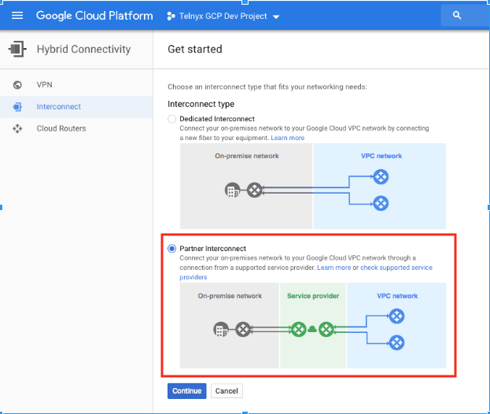
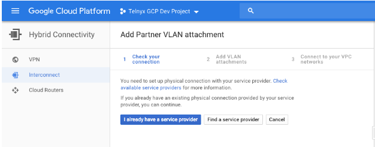
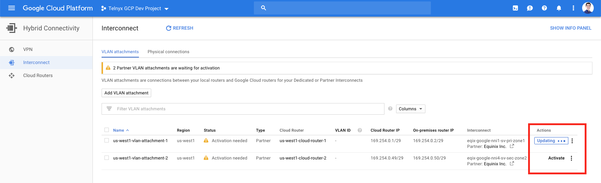
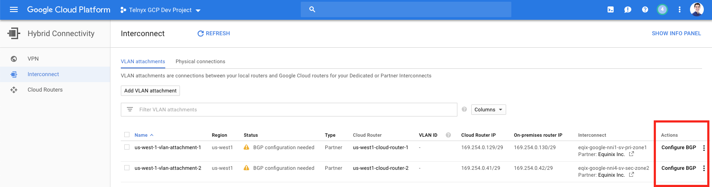
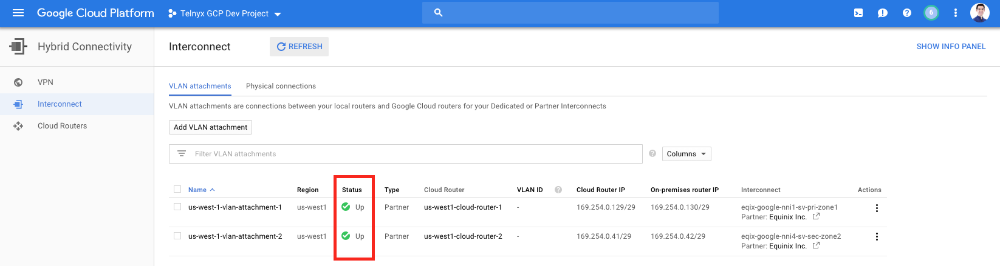
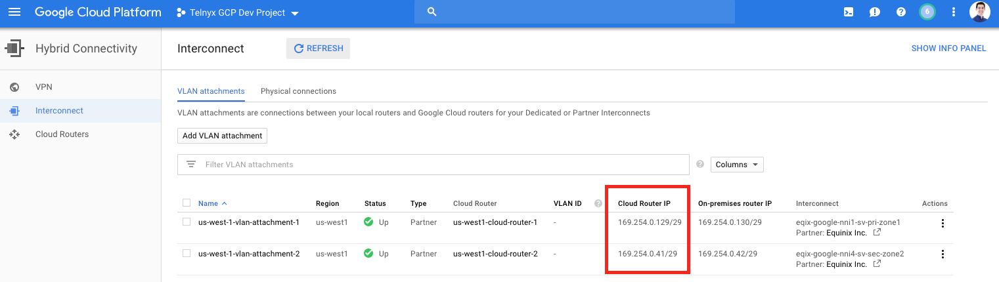

# Google VPC: Telnyx Integration

This document will provide instructions and guidelines for integrating a Google Cloud environment with the Telnyx… See Telnyx guidance and requirements.

C

[Jump to Instructions](#h_691dca3fcb)

This document will provide instructions, technical details and guidelines for integrating a [Google Cloud](https://cloud.google.com/) environment with the Telnyx network backbone. A virtual cross connect (VXC) is a private and direct connection between cloud providers that is faster and safer than a traditional public internet connection. Using this strategy allows you to bypass the internet and gain direct and private access to Telnyx, thereby eliminating hops and reducing the risk of packet loss and jitter. You’ll also benefit from the additional security of direct interconnection.

|  |
| --- |
| ***Note:*** *To protect against man in the middle attacks, we always recommend that you* [encrypt both signaling and media with TLS & Z/SRTP](https://support.telnyx.com/en/articles/1130711-does-telnyx-encrypt-communication). |

Further documentation:

* [Google VPC documentation](https://cloud.google.com/vpc#section-4)
* [VLAN attachments documentation](https://cloud.google.com/network-connectivity/docs/interconnect/how-to/partner/creating-vlan-attachments)

---

## Instructions for integrating Google VPC with Telnyx

In this activity you will:

1. [Create a GCP Partner Interconnect and VLAN attachments](#1-create-a-gpc-partner-interconnect-and-vlan-attachments)
2. [Provide Telnyx with your VXC preferences](#2-provide-telnyx-with-vxc-preferences)
3. [Activate the Virtual Cross Connect in Google Cloud Console](#h_4971b62ecb)
4. [Complete your order in Telnyx](#h_64718b336b)

**Pre-requisites**

* GCP Virtual Private Cloud (VPC) network
* For optimal performance, your VPC needs to be located in the same region where you plan to build a Virtual Cross Connect (VXC)

**Video Walkthrough**

Coming soon! Check back frequently as we are updating our documentation.

## 1. Create a GPC Partner Interconnect and VLAN attachments

In this step, you'll create a GPC partner interconnect, which will connect your Google Cloud VPC to the Telnyx network. You will then create VLAN attachments which are connections between your local routers and Google Cloud's routers used by your partner interconnect.

1. Open the [Google Cloud Platform VPC](https://console.cloud.google.com/hybrid/interconnects/).
2. Choose **Interconnect Type -> Partner Interconnect**

   
3. Under **Add Partner VLAN Attachment -> Check your connection**, choose *I already have a service provider.*

   
4. Under **Add VLAN attachments**, fill in the following:

   1. **Redundancy:** Telnyx recommends selecting *Create a redundant pair of VLAN attachments**.*** See pricing for each Virtual Cross Connect [here](https://telnyx.com).Note that a redundant pair of VLAN attachments requires two VXCs.**)**
   2. **VPC network:** *default*
   3. **Region:**  The region should be the same region where you’re running the software application.
   4. **Cloud Router:**  The router will be created in the same region as your VPC Network.
   5. **Name the VLAN attachment(s):** Consider a naming convention similar to us-east-4-vlan-attachment-1 (i.e.: country-region-etc)

      
5. Click **Create**.
6. Now select **OK** to connect your VPC networks.
7. Click on VLAN Attachment Detail and copy your pairing key(s). You will need them

[Back to Top](#h_691dca3fcb)

## 2. Provide Telnyx with VXC Preferences

In this step, you'll let Telnyx know your VXC preferences for a network and a site. The network uses virtual routing and forwarding technology to provide you with a unique routing table within Telnyx's routers. A site is a Telnyx Point of Presence (PoP) where we house our network gear.

1. Log into your Telnyx Mission Control Portal.
2. Go to the **Networking** section.
3. Click **Create New Network** to create a new one.

   1. If you have one you want to use, click **View Details** for this network.
4. Find the **Site Detail** section of your network and click **Add Site(s)**, then **Create VXC** to create a new site.

   1. If you have a site you want to use, click **Create VXC** on an existing site.

   Note that you should select sites that are local to your Google Cloud region(s). See a [list of Telnyx sites and their corresponding local Google Cloud regions](https://telnyx.com/).
5. Select **Google Cloud** as your Cloud Provider.
6. Click **Next.**
7. Select Bandwidth Speed.
8. Click **Next.**
9. Input your **Google Pairing Key** for you primary VLAN attachment. (i.e., the last number of the pairing key should be "1")  You can retrieve this from <https://console.cloud.google.com/hybrid/interconnects,> and by viewing **VLAN Attachment Detail.**They key will be in the format *<random>/<vlan-attachment-region>/<edge-availability-domain*>
10. If you created a redundant link, click **Secondary Link** and input your **Google Pairing Key** from the secondary **VLAN Attachment** (i.e., the last number of the pairing key should be "2")
11. Review **New Virtual Cross Connect (VXC) Request.**Click **Create VXC.**

[Back to Top](#h_691dca3fcb)

## 3.  Activate the Virtual Cross Connect in Google Cloud

Now that everything is configured, let's activate your VXC in Google Cloud.

1. Open the Google Cloud Platform VPC at <https://console.cloud.google.com/hybrid/interconnects/>.
2. For each VLAN Attachment under Actions, Click **Activate.** (This option may take up to 5 minutes to appear.)  ThenClick **Accept**

   
3. For each VLAN Attachment under Actions, Click **Configure [BGP](https://telnyx.com/resources/what-is-bgp).**

   
4. In EDIT BGP session, in the **Peer ASN** field, input **63440**.   Click **Save and Continue.**

   
5. Click **Refresh.**Status should say **Up.**

   
6. Copy the **Cloud Router IP** for each VLAN Attachment.  You will need this in the next step.

   

[Back to Top](#h_691dca3fcb)

## 4.  Complete your Order in Telnyx

1. Copy the **Cloud Router IP** for the first VLAN Attachment.  Click **Save.**If you have a redundant link, copy the **Cloud Router IP** for the second VLAN Attachment.  Click **Save.**

   
2. Telnyx will approve your request (this may take up to 3 hours).  Order Status will change from **Pending** to **Active** to **Complete.**Once an **Order Status** is complete, the BGP session between Telnyx and Google Cloud will be active.
3. To receive traffic from Telnyx, your cloud hosts must have public IP addresses configured. Consult your Telnyx representative before clicking 'Enable' if you need assistance.
4. Under routing status, click the button to enable.  Doing this will transition packet delivery from your Cloud Provider's Internet transit to the private Virtual Cross Connect resulting in a brief traffic disruption.
   ​

   

That's it, you've now integrated your Google VPC and Telnyx though VXC.

[Back to Top](#h_691dca3fcb)

---

## Additional Resources

Review our [getting started guide](https://support.telnyx.com/en/articles/1176636-get-started-with-a-mission-control-account) to make sure your Telnyx Mission Control Portal account is set up correctly.

Additionally, see:

* [Google VPC documentation](https://cloud.google.com/vpc#section-4)
* [VLAN attachments documentation](https://cloud.google.com/network-connectivity/docs/interconnect/how-to/partner/creating-vlan-attachments)

---

Related Articles

[AWS: Virtual Cross Connect Setup](https://support.telnyx.com/en/articles/1371411-aws-virtual-cross-connect-setup)[Azure: Virtual Cross Connect](https://support.telnyx.com/en/articles/2239446-azure-virtual-cross-connect)[Use NetDrive3 with Telnyx Storage](https://support.telnyx.com/en/articles/8048024-use-netdrive3-with-telnyx-storage)[Intro to Telnyx Edge Router](https://support.telnyx.com/en/articles/8126141-intro-to-telnyx-edge-router)[BYOC: Telnyx & Genesys](https://support.telnyx.com/en/articles/8268122-byoc-telnyx-genesys)

Did this answer your question?

😞😐😃
