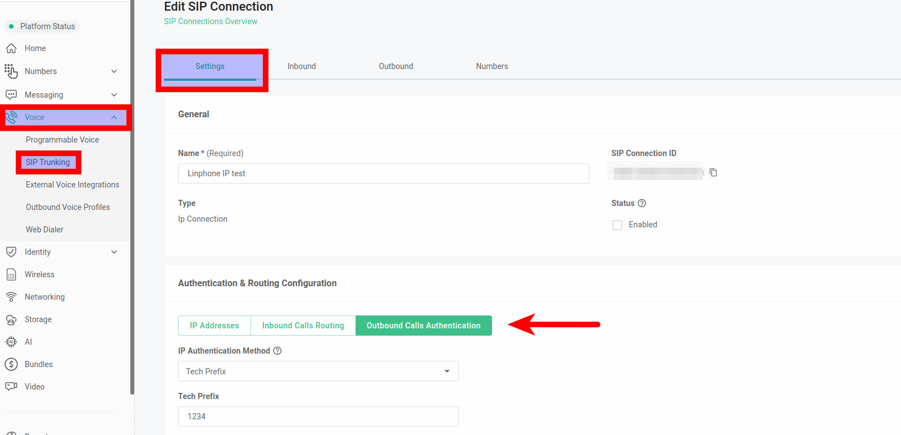

# IP Authentication with Tech Prefix

In this article we will explain IP authentication with tech prefixes and when to use them. See Telnyx guidance and requirements.

The tech prefix setting can be found under the settings tab of your [SIP Connections](https://portal.telnyx.com/#/app/connections) Authentication & Routing Configuration section.

## Why are tech prefixes beneficial?

In environments where a single IP address is used for multiple outbound voice profiles, it is vital to distinguish each client's traffic uniquely. Telnyx supports this requirement by allowing multiple IP connections to share the same IP.

To differentiate each client, simply apply a unique 4-digit tech prefix to each connection. It's important to remember that for your outbound calls sent to Telnyx, this tech prefix must be included; otherwise, the call will not be recognized, leading to a SIP 407 Proxy Authentication response and call rejection.

## **What exactly is a tech prefix?**

A tech prefix is a simple yet powerful 4-digit number prefixed to the number you are dialing. For example, if you have a tech prefix of "1234" and wish to dial "18005678912", you would dial "123418005678912". This prefix does not need to be manually entered each time; your phone system's outbound settings can be configured to automatically prepend the tech prefix to all calls.

## Do you support tech prefixes at the number level settings?

Yes, Telnyx supports the application of tech prefixes at the [number level](https://support.telnyx.com/en/articles/4349113-my-numbers-page#h_d4c4ba170f). For guidance on setting this up, please refer to the comprehensive article on enabling tech prefix settings for your numbers. This functionality allows for a more granular control of call routing and identification, ensuring that each client's traffic is properly managed and authenticated.

## "Termination Endpoint" Error and Its Implications:

It is important to note that while connections can share the same IP address, they must be uniquely identified to avoid the "[Termination Endpoint](https://support.telnyx.com/en/articles/4320411-more-about-outbound-voice-profiles#h_8af1e9166d)" error. This error occurs when another connection with the same IP address is already assigned to an outbound voice profile. To prevent this, ensure each connection has a unique combination, achieved through a tech prefix, token or p charge info.

​
​
