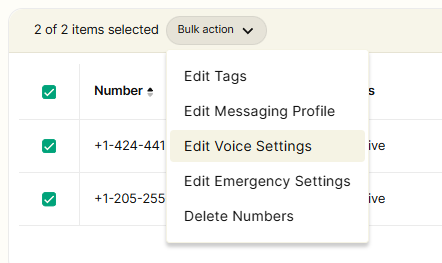
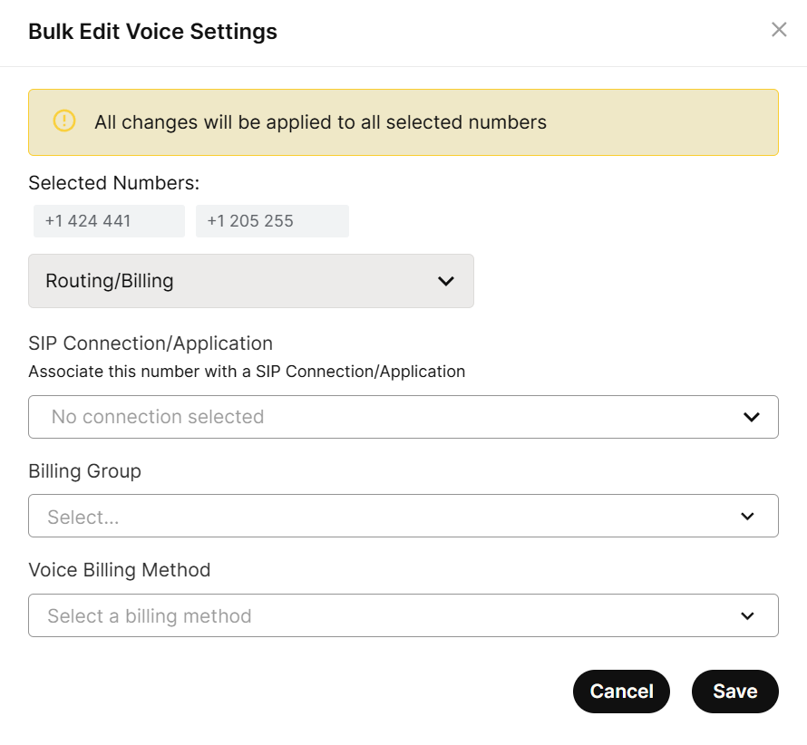
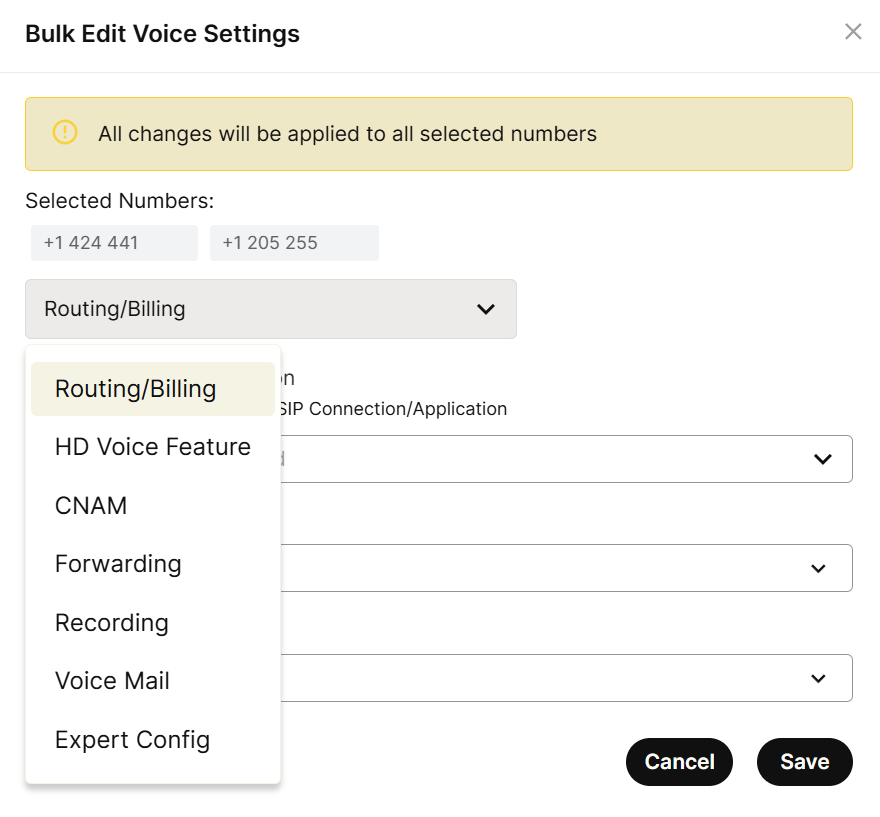
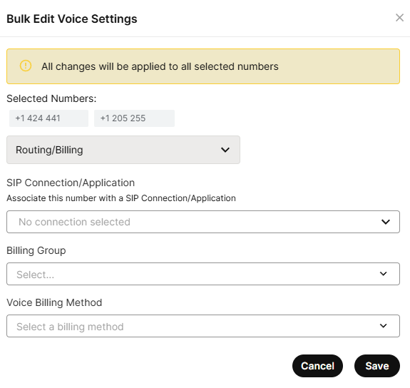
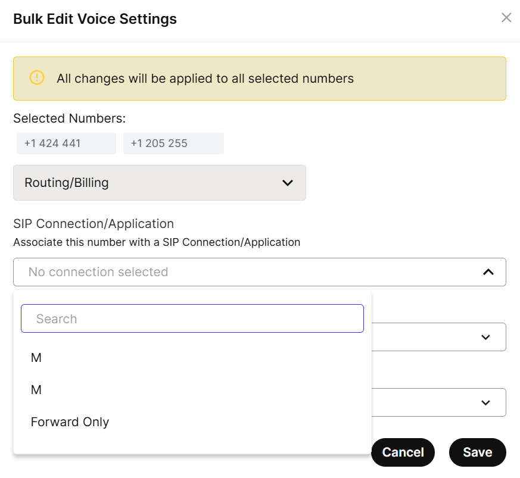
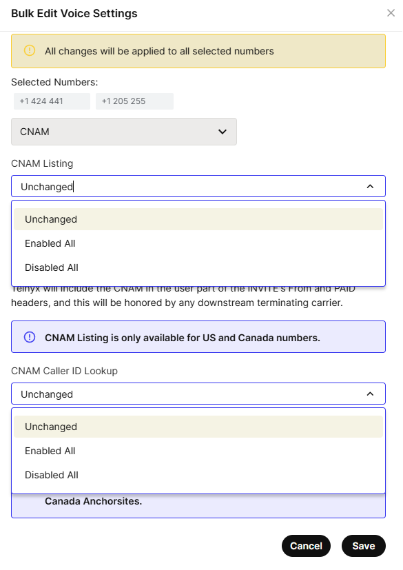
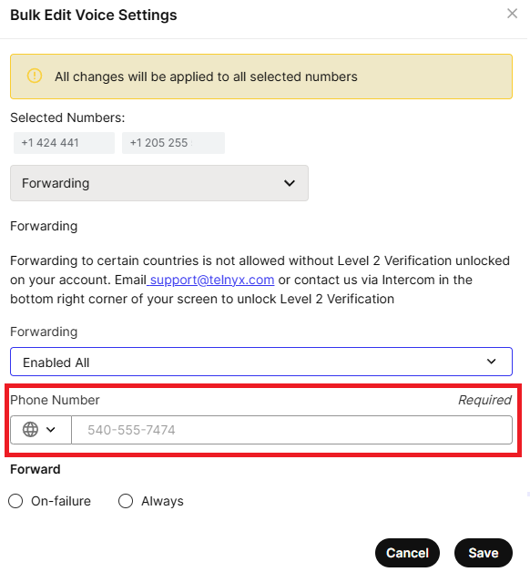
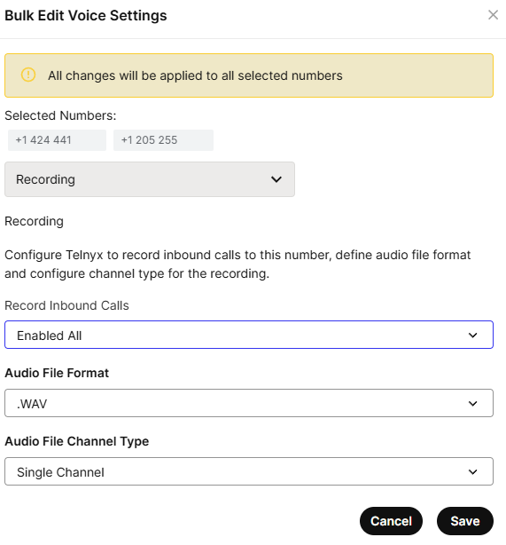
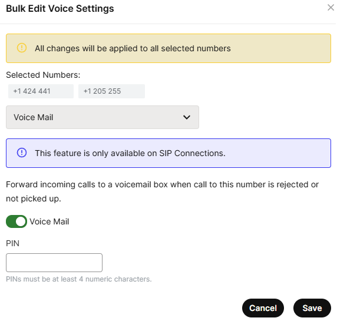
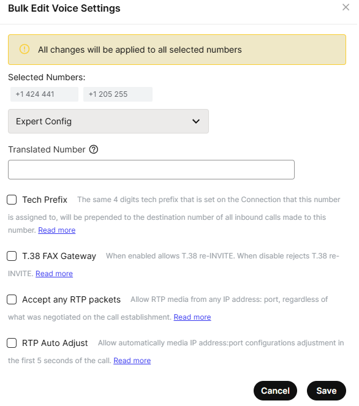

# Bulk Edit Numbers - Voice Settings

Master bulk number editing with Telnyx Mission Control - Save time and edit in bulk. See Telnyx guidance and requirements.

## **A step-by-step guide to bulk edit Voice Settings of Selected Numbers**

## **Step 1**

Log in to your Telnyx Mission Control account and click on the NUMBERS on the top left side of the page.

## **Step 2**

Click on the [MY NUMBERS](https://portal.telnyx.com/#/app/numbers/my-numbers) tab.

## **Step 3**

Select the numbers by selecting checkboxes in front of the numbers you'd like to edit.

## **Step 4**

You can also select all the numbers displayed on the page by using the checkbox above the top number (highlighted in red).

**Note - You can expand the selection by increasing the Row count of the displayed page ranging from 10-100 numbers displayed on the page.**

## **Step 6**

Once you have selected your desired numbers, click on the Bulk Actions dropdown and select edit voice settings.

## **Step 7**

A new window will pop up with the heading **Bulk Edit Voice Settings.**

Here you should be able to preview all the selected numbers to which the changes will be applied.

**Under Bulk Edit Voice Settings you will see multiple tabs and we will go through them one by one.**

## **Step 8**

Below the list of the numbers where these changes will be applied, you'll find a dropdown menu with the options that you changed in bulk. You'll find "Routing/Billing", "HD Voice Feature", "CNAM", "Forwarding", "Recording", "Voicemail", and "Expert Config."

## **Step 9 Routing Billing**

In the Routing/Billing section, there are 3 selections:

### **SIP Connections / Applications**

This area provides a drop-down showcasing all your created [SIP Trunk Connections](https://portal.telnyx.com/#/app/connections). You should be able to select your connection and your selection will be applied to all the selected numbers once saved. You can also bulk-remove any SIP connection from selected numbers by selecting No Connection in the drop-down and saving the settings.
​

### **Billing Group**

You can associate/de-associate bulk numbers to a particular billing profile. To know more about the billing profile, visit [here](https://support.telnyx.com/en/articles/4280500-billing-setup-billing-groups).

### **Voice Billing Method**

You can associate/de-associate bulk numbers to either [Channel Billing](https://support.telnyx.com/en/articles/1130678-channel-billing-and-how-to-use-it) or [Pay-per-minute Billing](https://support.telnyx.com/en/articles/1130659-billing-increments) which follow regular billing increments.

---

## **Step 10 CNAM**

In this section, there are 2 CNAM selections

### **CNAM Listing**

You can enable/disable CNAM listing for multiple selected numbers here. You can get more information about CNAM [here](https://support.telnyx.com/en/articles/1130720-caller-id-outbound-vs-cnam)

### **CNAM Caller ID Lookup**

You can enable/disable caller id lookup for all inbound calls associated with the multiple selected numbers. You can get more information about Caller ID [here](https://support.telnyx.com/en/articles/1130720-caller-id-outbound-vs-cnam?q=forwarding)

---

## **Step 11 Forwarding**

You can set a call forwarding to your selected numbers here. Once the Phone Number is set up and the forward option is selected (On-Failure/Always) then all the inbound calls coming to selected numbers will be forwarded accordingly.

You can learn more about call forwarding [here](https://support.telnyx.com/en/articles/1130657-call-forwarding).

---

## **Step 12 Recording**

You can set a call recording to your selected numbers here. Once the Phone Number is set up and the forward option is selected (On-Failure/Always) then all the inbound calls coming to selected numbers will be forwarded accordingly.

You can learn more about call recording [here](https://support.telnyx.com/en/articles/5377454-call-recording).

---

## **Step 13 Voice Mail**

To enable the voice mail option on multiple selected numbers, just toggle the voice mail button to enable and enter the pin as shown in the screenshot.

You can learn more about Voice Mail [here](https://support.telnyx.com/en/articles/5989560-setting-up-telnyx-voicemail).

---

## **Step 14 Expert Config**

You can enable Translated Number, Tech Prefix, T.38FAX gateway, Accept any RTP Packets, and RTP Auto Adjust settings on multiple selected numbers in this section.

You can learn more about these expert configurations [here](https://support.telnyx.com/en/articles/4349113-my-numbers-page).

---

Related Articles

[Caller ID Outbound vs CNAM](https://support.telnyx.com/en/articles/1130720-caller-id-outbound-vs-cnam)[How To Setup A DID to SIP Connection](https://support.telnyx.com/en/articles/1177115-how-to-setup-a-did-to-sip-connection)[My Numbers Page](https://support.telnyx.com/en/articles/4349113-my-numbers-page)[Your Number Lookup Guide](https://support.telnyx.com/en/articles/4366901-your-number-lookup-guide)[HD Voice - Number Feature](https://support.telnyx.com/en/articles/8394071-hd-voice-number-feature)

Did this answer your question?

😞😐😃
