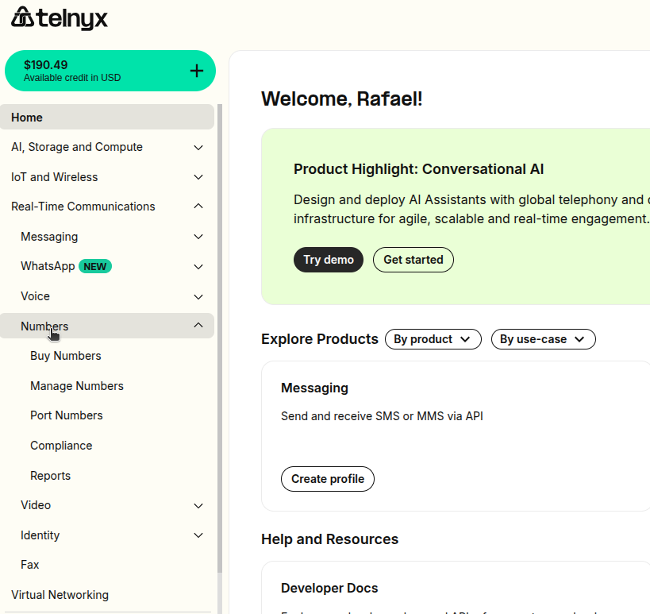
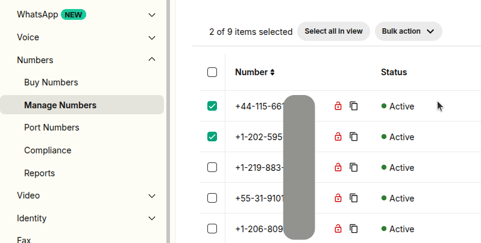
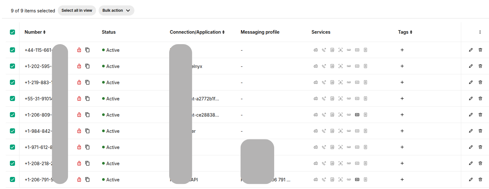
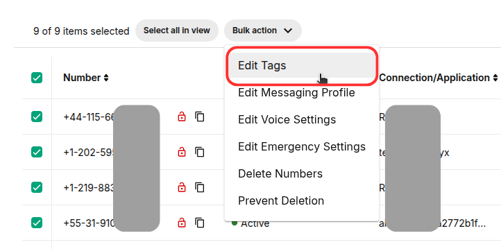
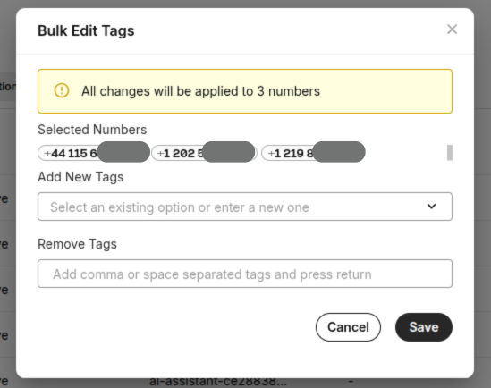
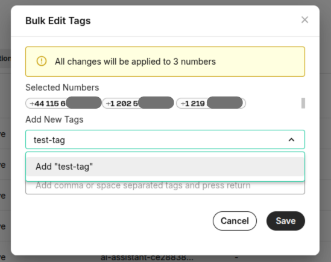
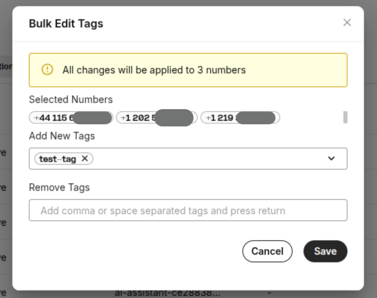
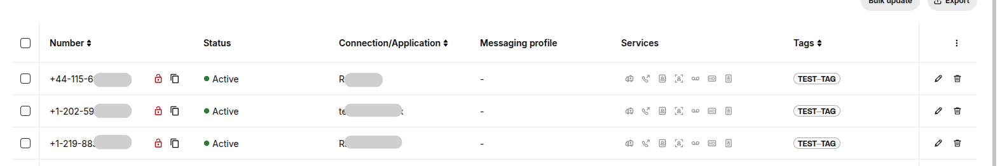
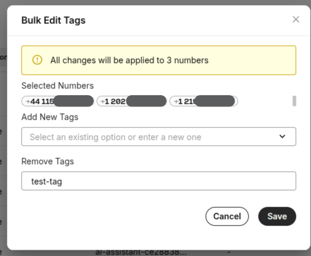

# Bulk Edit Numbers - Assigning tags

Editing numbers should be easy, in this article we will explain how to assign tags in bulk. See Telnyx guidance and requirements.

## Guide to Assigning Tags in Bulk

**A step-by-step guide to bulk edit Tags settings of selected numbers**

## **Step 1**

Log in to your Telnyx Mission Control account and click on the Real-Time Communications option and after click on Numbers option on the left side of the page.

## **Step 2**

Click on the [Manage Numbers](https://portal.telnyx.com/#/numbers/my-numbers) option

## **Step 3**

Select the numbers by selecting checkboxes in front of the numbers you'd like to edit.

## **Step 4**

You can also select all the numbers displayed on the page by using the checkbox above the top number.

**Note - You can expand the selection by increasing the Row count of the displayed page ranging from 10-100 numbers displayed on the page.**
​

## **Step 5**

Once you have selected your desired numbers, click on the Bulk Actions dropdown and select Edit Tags.

## **Step 6**

After clicking **Edit Tags**, a new window will appear where you can select an existing tag that has already been created, or create a new tag by entering a name, such as **test-tag**, as shown in the screenshot.

Once you have defined a tag, you can hit save it and it will be applied to the bulk selected numbers.

## **Step 7**

You can also remove tags in bulk from the selected numbers. Just follow step 5 to access the **Bulk Edit Tags** option.

Write the tag name that you would like to remove from selected numbers and then save it.

Now tag name "test-tag" is removed from selected numbers as shown in the screenshot on step 6.

---

Related Articles

[SIP Connection: Number Formats](https://support.telnyx.com/en/articles/1130706-sip-connection-number-formats)[Bulk Edit Numbers - Voice Settings](https://support.telnyx.com/en/articles/2807846-bulk-edit-numbers-voice-settings)[Bulk Edit Numbers - Emergency Services](https://support.telnyx.com/en/articles/2819213-bulk-edit-numbers-emergency-services)[Bulk Edit Numbers - Delete Numbers](https://support.telnyx.com/en/articles/2819236-bulk-edit-numbers-delete-numbers)[Bulk Edit Numbers - Messaging Profile](https://support.telnyx.com/en/articles/2819238-bulk-edit-numbers-messaging-profile)

Did this answer your question?

😞😐😃
