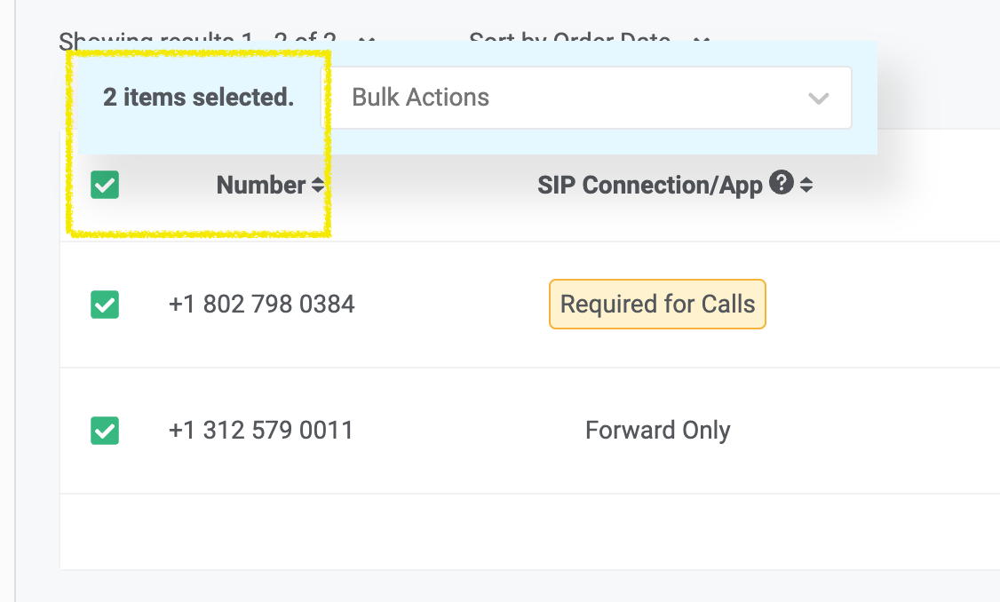
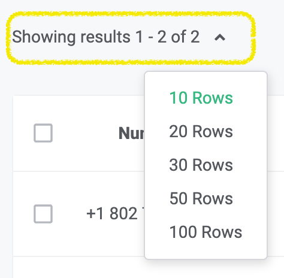
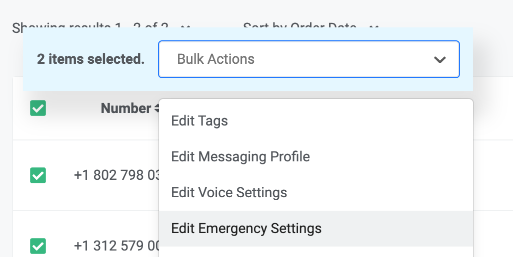
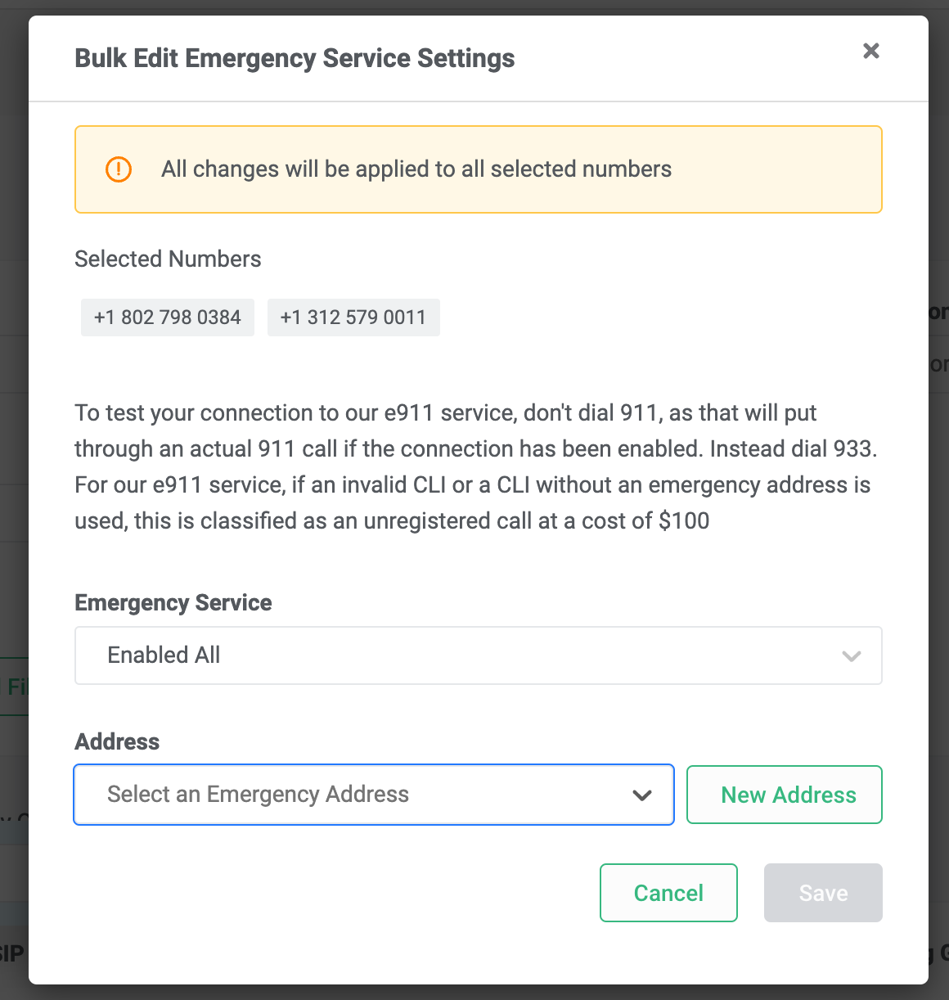

Bulk Edit Numbers - Emergency Services | Telnyx Help Center

[Skip to main content](#main-content)

# Bulk Edit Numbers - Emergency Services

Guide to assigning emergency address to numbers in Bulk. Start building on Telnyx today.

Written by Shubam

June 26, 2024

Table of contents

# **A step-by-step guide to bulk edit Emergency Address of selected numbers**

**NOTE: Failure to register an address and enable emergency services with the address on numbers that make emergency calls, will be considered unregistered, and will incur a penalty of $100.**

## **Step 1**

Log in to your Telnyx Mission Control account and click on the NUMBERS on the top left side of the page.

## **Step 2**

Click on the [MY NUMBERS](https://portal.telnyx.com/#/app/numbers/my-numbers) tab.

## **Step 3**

Select the numbers by selecting check-boxes in front of the numbers you'd like to edit.

## **Step 4**

You can also select all the numbers displayed on the page by using the checkbox above the top number (highlighted in yellow).

**Note - You can expand the selection by increasing the Row count of the displayed page ranging from 10-100 numbers displayed on the page.**  
​

## **Step 5**

Once you have selected your desired numbers, click on the Bulk Actions dropdown and select Edit Emergency Settings.  
​

​

## **Step 6**

Once you click on "Edit Emergency Settings" a new window will open, allowing you to choose if you want to Enable All, Disable All, or Unchanged Emergency Settings Status.

Once you've chosen "Enable All," you'll have the option to either select an address from your existing saved addresses or add a new address. To add a new address, simply click the "New Address" button located next to the address field.  
​

Upon saving the address, emergency service will be enabled for all the initially selected numbers.  
​

---

Related Articles

[Bulk Edit Numbers - Voice Settings](https://support.telnyx.com/en/articles/2807846-bulk-edit-numbers-voice-settings)[Bulk Edit Numbers - Assigning tags](https://support.telnyx.com/en/articles/2807910-bulk-edit-numbers-assigning-tags)[Bulk Edit Numbers - Delete Numbers](https://support.telnyx.com/en/articles/2819236-bulk-edit-numbers-delete-numbers)[Dialing Emergency Services](https://support.telnyx.com/en/articles/8712528-dialing-emergency-services)[Emergency Services and IPND in Australia](https://support.telnyx.com/en/articles/9039036-emergency-services-and-ipnd-in-australia)

Did this answer your question?

😞😐😃

Table of contents
