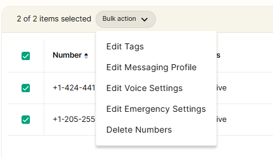
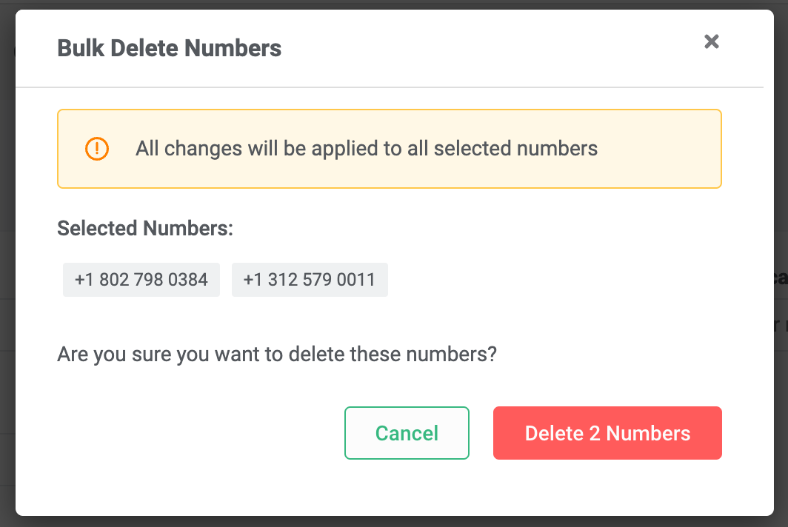

# Bulk Edit Numbers - Delete Numbers

Navigate Telnyx's porting policies and procedures with ease, ensuring a smooth number porting experience. See Telnyx guidance and requirements.

Guide to delete to numbers in Bulk

## **A step-by-step guide to bulk delete numbers** on your portal

## **Step 1**

Log in to your Telnyx Mission Control account and click on the NUMBERS on the top left side of the page.

## **Step 2**

Click on the [MY NUMBERS](https://portal.telnyx.com/#/app/numbers/my-numbers) tab

## **Step 3**

Select the numbers by selecting the check-boxes in front of the numbers you'd like to edit.

## **Step 4**

You can also select all the numbers displayed on the page by using the checkbox above the top number (highlighted in red).

**Note - You can expand the selection by increasing the Row count of the displayed page ranging from 10-100 numbers displayed on the page.**
​

## **Step 5**

Once you have selected your desired numbers, click on the Bulk Actions dropdown and select Delete Numbers.
​

## **Step 6**

Once you click on "Delete Numbers" a new window will open to display the numbers you will be deleting.

Once you've clicked on the Delete Numbers button (in red) the numbers will be permanently deleted from your account.
​
​**Note - This is an irreversible action. If the numbers are deleted from the portal and you wish to recover them, you can repurchase them within 15 days from the deletion date. After this period, the number will become available in our number pool for others to purchase.**

---

Related Articles

[Porting Policy & Procedure](https://support.telnyx.com/en/articles/1130630-porting-policy-procedure)[Bulk Edit Numbers - Voice Settings](https://support.telnyx.com/en/articles/2807846-bulk-edit-numbers-voice-settings)[Bulk Edit Numbers - Emergency Services](https://support.telnyx.com/en/articles/2819213-bulk-edit-numbers-emergency-services)[Bulk Edit Numbers - Messaging Profile](https://support.telnyx.com/en/articles/2819238-bulk-edit-numbers-messaging-profile)[Search and Buy Numbers](https://support.telnyx.com/en/articles/4380325-search-and-buy-numbers)

Did this answer your question?

😞😐😃
