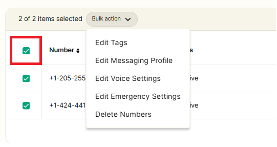
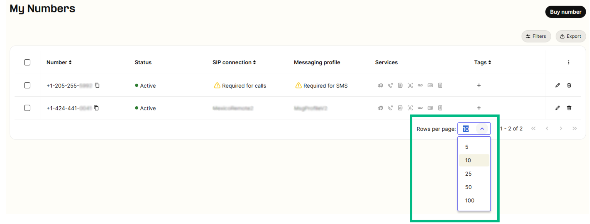
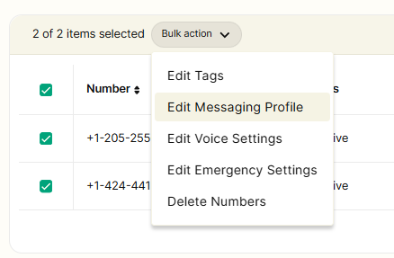
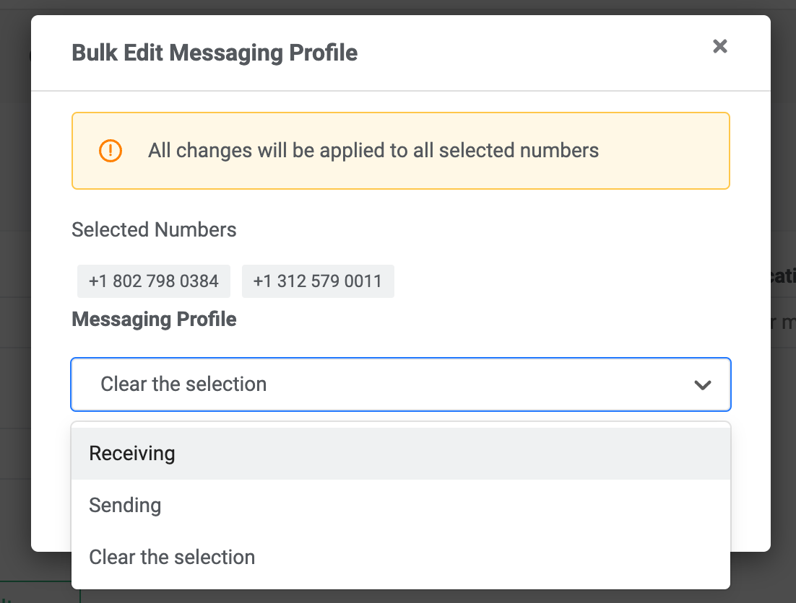
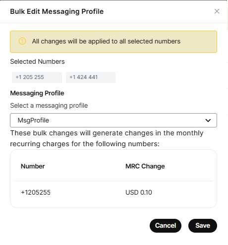

Bulk Edit Numbers - Messaging Profile | Telnyx Help Center

[Skip to main content](#main-content)

# Bulk Edit Numbers - Messaging Profile

Simplify your messaging campaigns with Telnyx's bulk edit feature for messaging profiles, ensuring cohesive and effective communication.

Written by Shubam

December 26, 2024

Table of contents

# Guide to assigning messaging profile in Bulk

A step-by-step guide to bulk edit Messaging Profile settings of selected numbers.  
​

## **Step 1**

Log in to your Telnyx Mission Control account and click on the NUMBERS on the top left side of the page.

## **Step 2**

Click on the [MY NUMBERS](https://portal.telnyx.com/#/app/numbers/my-numbers) tab

## **Step 3**

Select the numbers by selecting checkboxes in front of the numbers you'd like to edit.

## **Step 4**

You can also select all the numbers displayed on the page by using the checkbox above the top number (highlighted in red).

**Note - You can expand the selection by increasing the Row count of the displayed page ranging from 10-100 numbers displayed on the page.**  
​

## **Step 5**

Once you have selected your desired numbers, click on the Bulk Actions dropdown and select Edit Messaging Profile.  
​

​

## **Step 6**

Once you click on "Edit Messaging Profile," a new window will open, allowing you to choose the desired messaging profile from the dropdown menu.

Upon selecting a profile, you will see a message regarding the MRC charge for assigning a messaging profile to a number. To proceed, you must accept these charges and then save your selection. The chosen messaging profile will then be applied to the bulk selected numbers.

Once you click "Save," you will notice that all the bulk-selected numbers have been updated with the chosen messaging profile.

---

Related Articles

[Bulk Edit Numbers - Voice Settings](https://support.telnyx.com/en/articles/2807846-bulk-edit-numbers-voice-settings)[Bulk Edit Numbers - Emergency Services](https://support.telnyx.com/en/articles/2819213-bulk-edit-numbers-emergency-services)[Bulk Edit Numbers - Delete Numbers](https://support.telnyx.com/en/articles/2819236-bulk-edit-numbers-delete-numbers)[Setting Up a Messaging Profile](https://support.telnyx.com/en/articles/3562059-setting-up-a-messaging-profile)[Bulk Messaging with Sheets](https://support.telnyx.com/en/articles/8268223-bulk-messaging-with-sheets)

Did this answer your question?

😞😐😃

Table of contents
