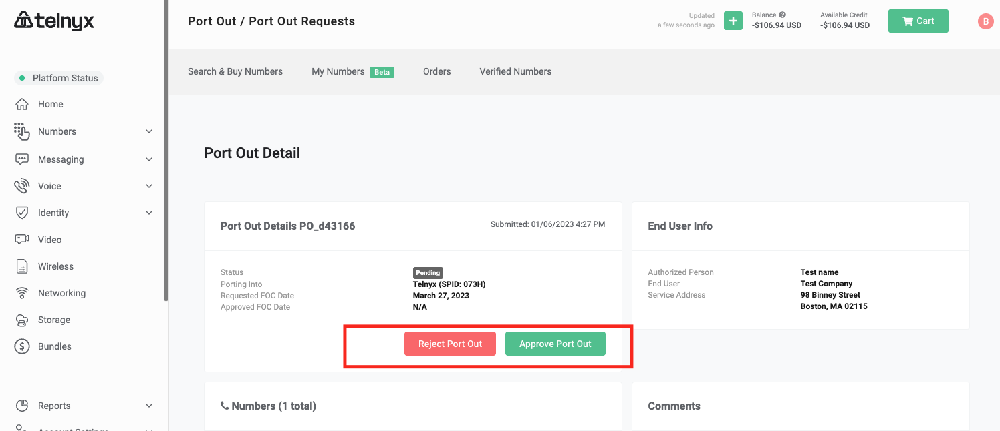

Port Out Tracking | Telnyx Help Center

[Skip to main content](#main-content)

# Port Out Tracking

Learn how to manage your traceable port-outs all from within your Mission Control Portal!

Written by Paul Cross

October 20, 2023

Table of contents

When we receive a port-out request, we will send you an email notification with a link to the particular request. The emails will go to the Account owner by default.

If you expect to see port-out requests and you do not, please ensure you have access to view and/or modify Port Outs assigned to your permission set.  
Please see [Groups and Permission sets](https://support.telnyx.com/en/articles/1618776-porting-error-messages) for instructions on how to set this up.

Once you navigate to your Port Out tab you will see a list of all Port Out requests. At a glance, you can see information such as the status, FOC date, Total TNs in the request along with the request details and winning carrier name.

You can filter by status: `complete` or `incomplete`  
You can also search by telephone number or Request # (ie. PO\_a24719)

You can click on a particular request in the list to view additional details for that request.

You will see information such as:

* The information submitted
* Status
* Winning carrier (where applicable)
* Requested FOC date
* TNs in request

## Accepting the request

Once you have reviewed all of the information within the request you will have the ability to Accept or Reject the request.

If you accept the request, you will notice that the status will go from `Pending`  to `Authorized`. Our team will notify the gaining carrier when an order has been approved.  
​

## Rejecting the request

If you reject the request, you will need to give a valid reason for the rejection.  
​  
You must provide a valid and reasonable reason to reject the port. If the reason is deemed invalid, the number will be ported out and you will be notified of this.

NOTE: You cannot purposely withhold a customer's number without proper authority or for billing/payment issues. If we do not receive a valid rejection reason, we may be forced to provide FOC to the gaining carrier.

## No acknowledgment of Port Out request.

If a port-out request is not acknowledged with an approval or rejection, the port will automatically be approved and notice will be given to the gaining carrier.

## Change in FOC date

You will receive [a webhook notification](https://developers.telnyx.com/) if the gaining carrier requests a FOC date change on the port-out request.

NOTE: the gaining carrier is allotted a grace period of 10 days. Which means the gaining carrier can port the phone number at any point between the FOC date listed and the following 10 days. Although most port out orders will occur on the listed FOC date, there is no guarantee that it will.

# Completed Port Outs

Once we have confirmed that the number(s) have ported out the corresponding port out request will show with a status of `Ported Out`.

Once a number has been marked as `Ported Out` it will be removed from your account immediately.  
​

## Port Out Charges

Once the port-out has been confirmed, you will be billed the port-out fee at that time. To view your port out charges, please see the [Pricing](https://portal.telnyx.com/#/app/pricing) section.

If you have any questions about port-out fees, please contact [sales@telnyx.com](mailto:sales@telnyx.com).

---

Related Articles

[Porting Policy & Procedure](https://support.telnyx.com/en/articles/1130630-porting-policy-procedure)[Porting Error Messages](https://support.telnyx.com/en/articles/1618776-porting-error-messages)[I Received a Port-Out Notification](https://support.telnyx.com/en/articles/2030667-i-received-a-port-out-notification)[Port-In Best Practices](https://support.telnyx.com/en/articles/2030770-port-in-best-practices)[Port Request Statuses](https://support.telnyx.com/en/articles/3284588-port-request-statuses)

Did this answer your question?

😞😐😃

Table of contents
