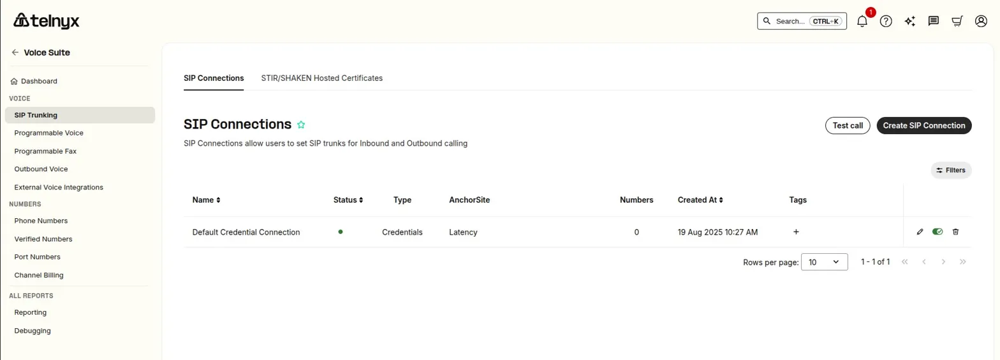
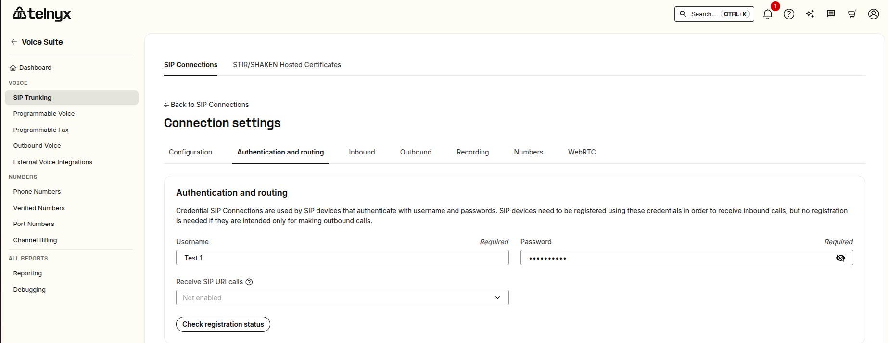

SIP URI Calling | Telnyx Help Center

[Skip to main content](#main-content)

# SIP URI Calling

This article demonstrates SIP URI functionality for making inbound calls to SIP Connection.

Written by Shubam

April 27, 2026

Table of contents

# **What is SIP URI Calling?**

This feature allows you to receive inbound calls directly to your SIP URI on connections using "credential auth". When SIP URI calling is enabled, callers can reach you by dialing your connection's username, removing the need for a phone number.

To use this feature, you'll need a SIP device or softphone registered with the credentials set on the connection. SIP URI calling is disabled by default and can be enabled per connection.

**How to enable SIP URI Calling**

1. From the Telnyx portal, navigate to **Voice Suite → SIP Trunking**.
2. From the **SIP Connections** list, click the **edit** icon next to the connection you want to configure.
3. Open the **Authentication and routing** tab.
4. Under **Receive SIP URI calls**, select your preferred option from the dropdown (e.g., *From anyone* or *Only from my Connections*). *[Screenshot 2: Authentication and routing tab]*

**Note:** This setting was previously located under the **Inbound** tab but has since moved to **Authentication and routing**.  
​





**Choosing who can call your SIP URI**

You can control who is allowed to call your SIP URI directly by selecting one of the following options:

1. **From Anyone (unrestricted)** — Allows calls from other Telnyx accounts as well as anyone on the public internet. With this option selected, anyone who knows your SIP URI (`your-username@sip.telnyx.com`) can reach your SIP endpoint.
2. **Only from my SIP Connections (internal)** — Restricts inbound calls to those originating from connections on the same Telnyx account.

This setting can also be configured through the Telnyx API:

```
PUT https://api.telnyx.com/security/connections/{connection_id}
```

Set the `sip_uri_calling_preference` field to one of: `"disabled"`, `"unrestricted"`, or `"internal"`.

---

**Billing for SIP URI Calls**

* SIP URI calls are billed at **$0.002 per minute**, charged to the owner of the connection that receives the call. This rate applies to any call originating from a source that Telnyx cannot identify.
* If the source matches a Telnyx SIP Connection, the call is treated as an **On-Net call** and billed according to your Telnyx rate deck.
* As a fraud-prevention measure against number spoofing, only SIP usernames beginning with a **non-numeric character** are considered valid.

---

Related Articles

[SIP Connection: Number Formats](https://support.telnyx.com/en/articles/1130706-sip-connection-number-formats)[SIP Registration](https://support.telnyx.com/en/articles/4363904-sip-registration)[Telnyx SIP Response Codes](https://support.telnyx.com/en/articles/4409457-telnyx-sip-response-codes)[How Telnyx Handles SRV Records for SIP Calls](https://support.telnyx.com/en/articles/10666839-how-telnyx-handles-srv-records-for-sip-calls)[How to Configure SIP Attach using a UAC Connection](https://support.telnyx.com/en/articles/14805261-how-to-configure-sip-attach-using-a-uac-connection)

Did this answer your question?

😞😐😃

Table of contents
