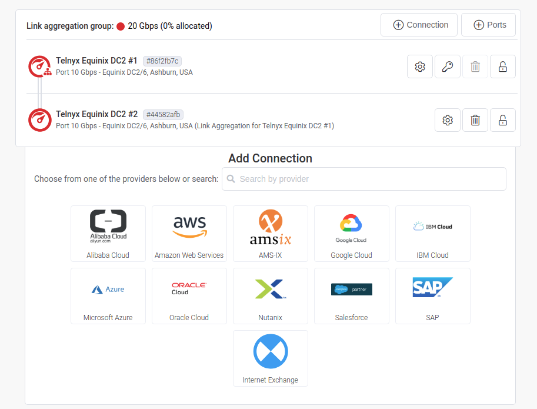
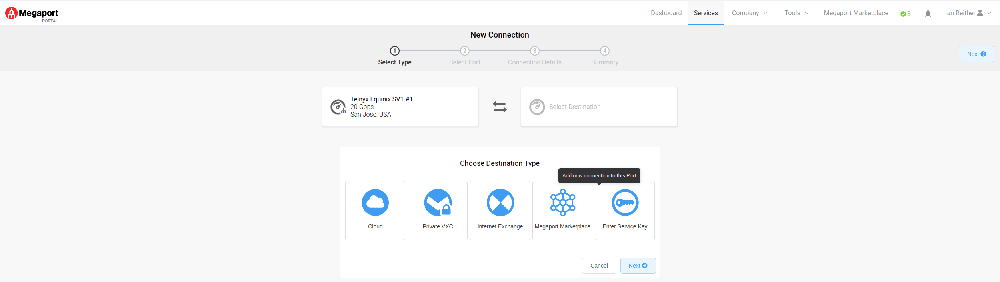
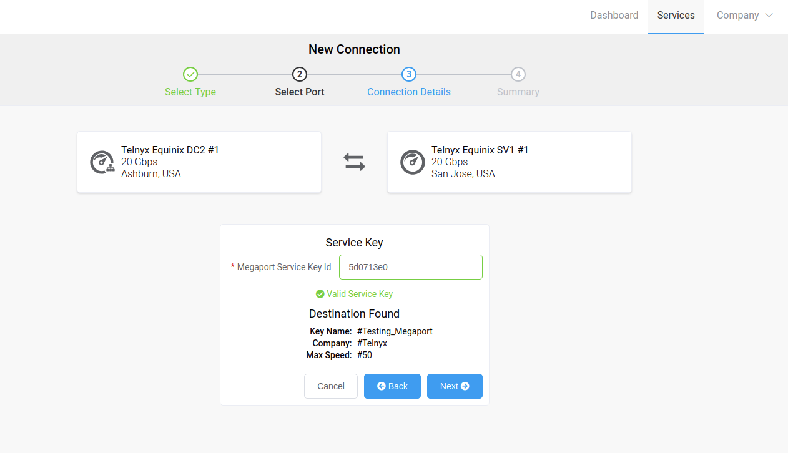

# Megaport Configuration with TELNYX

In this article we will explain how to configure Megaport with Telnyx. See Telnyx guidance and requirements.

C

[Jump to Instructions](#h_931a5218c3)

[Megaport](https://www.megaport.com/) is a global leading Network as a Service provider transforming the way businesses connect to AWS Cloud <https://www.megaport.com/services/amazon-web-services/>. Our SDN and easy-to-use Portal enable users to provision instant and dedicated access to AWS Direct Connect across hundreds of global locations.

Additional resources:

* [Megaport documentation](https://docs.megaport.com/)
* [Megaport support](https://docs.megaport.com/support/contact/)
* [Megaport resource center](https://www.megaport.com/resources/)

---

## Instructions for configuring Megaport with Telnyx

In this activity you will:

1. [Create a connection between Telnyx and your Megaport portal](#h_2463bf030a)

**Pre-requisites:**

* Ensure that your [Telnyx Mission Command Portal is configured properly](https://support.telnyx.com/en/articles/1176636-get-started-with-a-mission-control-account)
* RECOMMENDED: [Enable TLS to encrypt your traffic](https://support.telnyx.com/en/articles/1130711-does-telnyx-encrypt-communication)
* Megaport ports must be live on both ends

**Video Walkthrough**

Setting up your Telnyx SIP portal account so you can make and receive calls:

|  |
| --- |
| ***Note:*** *Video walkthrough for Megaport/Telnyx configuration coming soon. Check back as we update our docs.* |

## 1. Create a connection between Telnyx and the Megaport portal

In this section, you'll set up a configuration from the customer side to connect Telnyx to your Megaport portal. This needs to be done in order to use the service key provided by Telnyx.

1. Log into your Megaport portal account.
2. Click **+ Connection**.
3. Click **Enter Service Key**.

   

   
4. Provide the following information:

   1. **Megaport Service Key ID:** Enter the service key provided by Telnyx. The data from this key will populate. If you did not receive a service key, or are unsure, contact Telnyx Support.

      
5. Once you've entered your service key, you'll notice that the details have updated on your screen.

   
6. Click **Next**.
7. You'll be taken to a form where you'll need to confirm the following auto-filled details:

   1. **Name your connection:** You can name this anything you like. We recommend something that can help you easily identify your connection and its purpose.
   2. **Rate limit:** This limits network traffic and puts a cap on how often someone can repeat an action within a certain timeframe – for instance, trying to log in to an account. Rate limiting can help stop certain kinds of malicious bot activity.
   3. **Preferred A-End VLAN:** Each VXC is delivered as a separate VLAN on your Port. This must be a unique VLAN ID on this Port and can range from 2 to 4093. If you specify a VLAN ID that is already in use, the system displays the next available VLAN number. The VLAN ID must be unique to proceed with the order. If you don’t specify a value, Megaport will assign one.

      
8. Click **Next**.
9. Once you've confirmed all your details, click **Add VXC** to update your ordering cart.

   
10. When you're ready, view your cart and click on **Order**. This will send an email to Telnyx for approval. Once Telnyx approves your connection, this creates the VXC between your Megaport setup and Telnyx.

    

That's it! You've finished configuring Megaport with Telnyx.

[Back to Top](#h_931a5218c3)

---

## Additional Resources

Review our [getting started with guide](https://support.telnyx.com/en/articles/1176636-get-started-with-a-mission-control-account) to make sure your Telnyx Mission Control Portal account is setup correctly!

Additionally, check out:

* [Megaport documentation](https://docs.megaport.com/)
* [Megaport support](https://docs.megaport.com/support/contact/)
* [Megaport resource center](https://www.megaport.com/resources/)

---

Related Articles

[Configuring an AVAYA IP trunk with Telnyx](https://support.telnyx.com/en/articles/1130627-configuring-an-avaya-ip-trunk-with-telnyx)[Configuring a Vicidial IP trunk with Telnyx](https://support.telnyx.com/en/articles/1130632-configuring-a-vicidial-ip-trunk-with-telnyx)[Configuring Grandstream GXP16XX with Telnyx](https://support.telnyx.com/en/articles/1130660-configuring-grandstream-gxp16xx-with-telnyx)[Google VPC: Telnyx Integration](https://support.telnyx.com/en/articles/2239449-google-vpc-telnyx-integration)[Flyingvoice: Telnyx Setup](https://support.telnyx.com/en/articles/5810663-flyingvoice-telnyx-setup)

Did this answer your question?

😞😐😃
