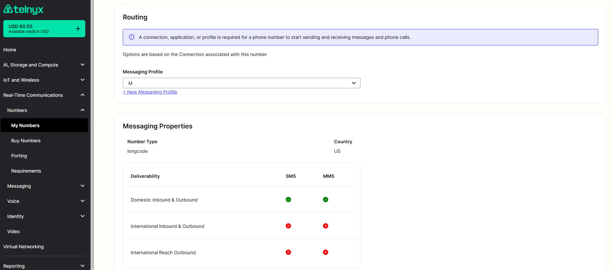

# MMS Sending and Receiving

In this article we will explain how to send and receive MMS messages using Telnyx API. See Telnyx guidance and requirements.


## **Efficient MMS Messaging with Telnyx APIs**

Telnyx offers robust solutions for both sending and receiving MMS messages through its API V1 and API V2. To facilitate a smooth setup, comprehensive quick start guides are available in our developer documentation:

* [Sending SMS and MMS Quick Start Guide](https://developers.telnyx.com/docs/messaging/messages/send-message)
* [Receiving SMS and MMS Quick Start Guide](https://developers.telnyx.com/docs/messaging/messages/receive-message)

## **How to Send MMS with Telnyx API**

#### **Sample API V1 curl request:**

```
curl --request POST 'https://sms.telnyx.com/messages' \
--header 'Accept: application/json' \
--header 'x-profile-secret: v1 messaging profile secret' \
--header 'Content-Type: application/json' \
--data-raw '{
  "from": "+your purchased number",
  "to": "+the number you want to message",
  "body": {
  "delivery_status_webhook_url": "your webhook url",
  "text": "Did you get this image?",
     "subject": "Bear Picture",
     "media_urls" : [
        {"img": "https://placebear.com/802/503.jpg"}
      ]
   }
}'
```

#### **Sample API V2 curl request:**

```
curl --request POST 'https://api.telnyx.com/v2/messages' \
--header 'Accept: application/json' \
--header 'Authorization: Bearer API V2 KEY' \
--header 'Content-Type: application/json' \
--data-raw '{
  "from": "+your purchased number",
  "to": "+the number you want to message",
  "webhook_url": "your webhook url",
  "text": "Did you get this image?",
  "subject": "Bear Picture",
  "media_urls" : ["https://placebear.com/802/503.jpg"]
}'
```

## **Supported MMS File Types and Sizes** Telnyx supports a wide range of file types for MMS, including

* text/plain
* text/vcard
* image/jpeg
* image/png
* image/gif
* video/3gpp
* video/mp4

## The maximum file size for MMS attachments varies based on the carrier

* Tier 1 Carriers (Verizon, T-Mobile, AT&T, Sprint): Up to 1 MB
* Tier 2 Carriers: Up to 600 KB
* Tier 3 Carriers: Up to 300 KB

**Note:** Currently, by default, accounts are limited to 1 MMS message per second. Should you wish to have this increased, please contact our sales team via [sales@telnyx.com](mailto:sales@telnyx.com).

To discover the carrier a phone number belongs to, you may utilize the [number lookup service](https://developers.telnyx.com/docs/identity).

## **Receiving MMS with the Telnyx API**

Your DID's settings will determine if the number is SMS or MMS capable with a checkmark.



Please note that currently it is up to the user to distinguish MMS and SMS messages arriving at the webhook. One way to distinguish them is to check the Content-Type header (it will be multipart/form-data for MMS).
